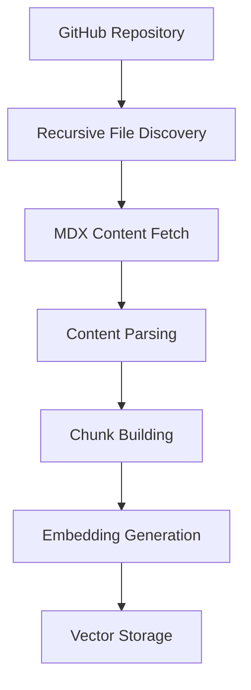
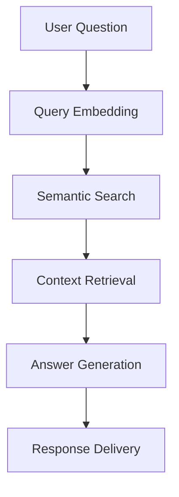

# Design Intelligence System

A comprehensive RAG (Retrieval-Augmented Generation) system for design system documentation and intelligent design assistance.

## 🎯 Overview

This system integrates multiple components to provide intelligent design assistance:
- **GitHub Repository Indexing**: Recursively fetches and indexes MDX design documentation
- **Vector Storage**: Uses Qdrant for semantic search and retrieval
- **RAG API**: FastAPI server for querying the indexed knowledge
- **Search API**: Semantic search endpoint for website integration
- **Design Chat Agent**: Interactive CLI interface for design questions
- **Figma Token Sync**: Synchronizes design tokens from Figma using MCP

## 🏗️ System Architecture

```
GitHub Enterprise API → Recursive File Discovery → MDX Content Fetch → 
MDX Parsing → Chunk Building → Embedding Generation → Qdrant Vector Store
                                                              ↓
RAG API (FastAPI) ← Query Processing ← Retrieval ← Semantic Search
                                                              ↓
Design Chat Agent ← User Interface ← LLM Integration (Ollama)
```

## 📋 Prerequisites

### Required Services
1. **Qdrant Vector Database** - Local instance running on port 6333
2. **Ollama LLM Server** - Local instance with `llama3` and `embeddinggemma` models
3. **GitHub Enterprise API Access** - Personal access token for repository access

### Python Environment
- Python 3.12+
- Virtual environment (recommended)

## 🚀 Quick Start

### 1. Environment Setup

```bash
# Clone the repository
git clone <repository-url>
cd windsurf-project

# Create and activate virtual environment
python -m venv .venv
source .venv/bin/activate  # On Windows: .venv\Scripts\activate

# Install dependencies
pip install -r requirements.txt
```

### 2. Configure Environment

Copy and update the `.env` file with your configuration:

```bash
# GitHub Configuration
GITHUB_PERSONAL_ACCESS_TOKEN=your_github_token_here
GITHUB_HOST=https://your-github-enterprise.com
GITHUB_REPO=your-org/your-repo

# Ollama Configuration
OLLAMA_HOST=http://localhost:11434
LLM_MODEL=llama3
EMBED_MODEL=embeddinggemma

# Qdrant Configuration
QDRANT_HOST=localhost
QDRANT_PORT=6333
QDRANT_COLLECTION_NAME=design_knowledge

# Figma Configuration (optional)
FIGMA_FILE_URL=https://www.figma.com/design/your-file-key/your-design
```

### 3. Start Required Services

#### Start Qdrant Vector Database
```bash
# Using Docker (recommended)
docker run -p 6333:6333 qdrant/qdrant

# Or install locally
# See: https://qdrant.tech/documentation/guides/installation/
```

#### Start Ollama Server
```bash
# Install Ollama
curl -fsSL https://ollama.ai/install.sh | sh

# Start Ollama server
ollama serve

# Pull required models (in separate terminal)
ollama pull llama3
ollama pull embeddinggemma
```

### 4. Index Design Documentation

```bash
# Run the indexing pipeline to fetch and index MDX files
python scripts/index_repo.py
```

This will:
- Connect to your GitHub Enterprise repository
- Recursively discover all MDX files (found 191 files)
- Fetch content from each file
- Parse MDX and create semantic chunks
- Generate embeddings using `embeddinggemma`
- Store in Qdrant vector database

### 4b. Index Canonical Component Specs

When component `design-spec.mdx` files are generated, index them as high-priority chunks for component queries:

```bash
python scripts/index_component_specs.py
```

This indexer splits each `design-spec.mdx` by `##` section and stores metadata:
- `doc_type=canonical_design_spec`
- `section` and `section_priority`
- `component`, `category`, and source mapping fields

For retrieval tuning, filter or boost `doc_type=canonical_design_spec` for component-specific questions.

### 5. Start RAG API Server

```bash
# Start the FastAPI server
uvicorn api.rag_api:app --host 0.0.0.0 --port 8000 --reload
```

The API will be available at `http://localhost:8000`

#### Test the API
```bash
# Test query endpoint
curl -X POST "http://localhost:8000/query" \
  -H "Content-Type: application/json" \
  -d '{"question": "What are the footer truncation rules?"}'
```

### 6. Start Search API Server

The Search API provides semantic search functionality to replace GitHub API calls for website search.

```bash
# Start the Search API server
python -m api.search_api
```

The Search API will be available at `http://localhost:8005`

#### Search API Endpoints

##### Health Check
```bash
curl "http://localhost:8005/health"
```

##### Debug Information
```bash
curl "http://localhost:8005/debug"
```

##### Search Endpoint
```bash
# Basic search
curl -X POST "http://localhost:8005/design/search" \
  -H "Content-Type: application/json" \
  -d '{"query": "datagrid usage", "top_k": 5}'

# Search with more results
curl -X POST "http://localhost:8005/design/search" \
  -H "Content-Type: application/json" \
  -d '{"query": "accordion component", "top_k": 10}'
```

#### Stop the Search API

```bash
# Stop the Search API server
pkill -f "search_api.py"
```

#### Search API Response Format

```json
{
  "results": [
    {
      "name": "Data Grid",
      "url": "content/datagrid/overview.mdx"
    },
    {
      "name": "Accordion",
      "url": "content/accordion/overview.mdx"
    }
  ]
}
```

### 7. Use Design Chat Agent

```bash
# Start the interactive design chat
python agent/design_chat.py
```

Example interaction:
```
Design Intelligence Agent Ready
> What are the color guidelines for primary buttons?
[AI response with design system information]
> How should I implement responsive typography?
[AI response with typography guidelines]
```

## 📁 Project Structure

```
windsurf-project/
├── agent/                  # Chat agents and interfaces
│   ├── design_chat.py      # Interactive CLI design assistant
│   └── rag_agent.py        # RAG agent implementation
├── api/                    # FastAPI servers
│   ├── rag_api.py          # RAG query endpoint
│   └── search_api.py       # Semantic search endpoint
├── config/                 # Configuration settings
│   └── settings.py         # Environment configuration
├── embeddings/             # Text embedding services
│   └── embedding_service.py # Ollama embedding wrapper
├── ingestion/              # Data ingestion and parsing
│   ├── github_loader.py    # GitHub API integration
│   ├── mdx_parser.py       # MDX file parsing
│   └── chunk_builder.py    # Document chunking
├── pipeline/               # Processing pipelines
│   └── index_pipeline.py   # Main indexing workflow
├── retrieval/              # Search and retrieval
│   ├── retriever.py        # Semantic search implementation
│   └── reranker.py         # Result reranking
├── scripts/                # Utility scripts
│   ├── index_repo.py       # Repository indexing script
│   └── sync_figma_tokens.py # Figma token synchronization
├── storage/                # Data storage utilities
│   └── document_registry.py # File change tracking
├── tokens/                 # Design token management
│   ├── figma_client.py     # Figma MCP integration
│   ├── token_extractor.py  # Token data extraction
│   └── markdown_generator.py # Token documentation generation
├── utils/                  # Utility functions
│   └── file_hash.py        # File hashing for change detection
├── vectorstore/            # Vector database integration
│   └── qdrant_store.py     # Qdrant client wrapper
├── design-system-knowledge/ # Generated token documentation
└── requirements.txt        # Python dependencies
```

## 🔧 Components

### GitHub Loader (`ingestion/github_loader.py`)
- **Recursive File Discovery**: Traverses all subdirectories
- **MDX File Filtering**: Only processes `.mdx` files
- **Enterprise GitHub Support**: Handles self-signed certificates
- **SSL Verification**: Configurable for corporate environments

### Vector Store (`vectorstore/qdrant_store.py`)
- **Collection Management**: Auto-creates collections with correct dimensions
- **Embedding Support**: 768-dimensional vectors for `embeddinggemma`
- **Document Storage**: Metadata-rich document storage
- **Semantic Search**: Fast similarity search capabilities

### RAG API (`api/rag_api.py`)
- **FastAPI Integration**: RESTful API endpoints
- **Query Processing**: Natural language to vector search
- **Response Generation**: Context-aware answers
- **Error Handling**: Robust error management

### Search API (`api/search_api.py`)
- **Semantic Search**: Vector-based search functionality
- **Website Integration**: Replaces GitHub API calls
- **Diverse Results**: Filters duplicates and ensures variety
- **Debug Support**: Comprehensive logging and debugging endpoints

### Design Chat Agent (`agent/design_chat.py`)
- **Interactive Interface**: Command-line chat experience
- **RAG Integration**: Direct API communication
- **Context Awareness**: Maintains conversation context
- **Design Focus**: Specialized for design system questions

## 🔄 Workflow

### 1. Repository Indexing


### 2. Query Processing


## 📊 Performance Metrics

### Indexing Performance
- **Files Processed**: 191 MDX files
- **Processing Time**: ~2-3 minutes
- **Embedding Model**: `embeddinggemma` (768 dimensions)
- **Vector Database**: Qdrant with COSINE distance

### Query Performance
- **Response Time**: <1 second for most queries
- **Relevance**: High semantic similarity
- **Context**: Retrieved from relevant design documentation

## 🛠️ Troubleshooting

### Common Issues

#### 1. Qdrant Connection Error
```bash
# Ensure Qdrant is running
curl http://localhost:6333/health

# Check collection exists
curl http://localhost:6333/collections/design_knowledge
```

#### 2. Ollama Model Not Found
```bash
# Check available models
ollama list

# Pull missing models
ollama pull llama3
ollama pull embeddinggemma
```

#### 3. GitHub API Authentication
```bash
# Test GitHub token
curl -H "Authorization: token YOUR_TOKEN" \
     https://your-github-enterprise.com/api/v3/user
```

#### 4. Vector Dimension Mismatch
```bash
# Delete and recreate collection
curl -X DELETE http://localhost:6333/collections/design_knowledge
# Then re-run indexing
python scripts/index_repo.py
```

#### 5. Search API Issues
```bash
# Check if Search API is running
curl "http://localhost:8005/health"

# Check debug information
curl "http://localhost:8005/debug"

# Restart Search API
pkill -f "search_api.py"
python -m api.search_api

# Check for port conflicts
netstat -tulpn | grep :8005
```

### Debug Mode

Enable debug output in the chat agent:
```python
# In agent/rag_agent.py
print(f"DEBUG: API Response: {response_data}")
```

## 🔒 Security Considerations

### API Keys and Tokens
- Store sensitive data in `.env` file
- Never commit `.env` to version control
- Use GitHub Personal Access Tokens with minimal permissions
- Rotate tokens regularly

### Network Security
- GitHub Enterprise SSL verification can be disabled for testing
- Use HTTPS for all API communications
- Consider VPN for corporate network access

## 🚀 Extensions and Customization

### Adding New Data Sources
1. Create new loader in `ingestion/` directory
2. Implement required interface methods
3. Update `pipeline/index_pipeline.py`
4. Add configuration options

### Custom Embedding Models
1. Update `embeddings/embedding_service.py`
2. Adjust vector dimensions in `vectorstore/qdrant_store.py`
3. Re-index the repository

### Additional Query Types
1. Extend `api/rag_api.py` with new endpoints
2. Update retrieval logic in `retrieval/`
3. Add corresponding agent capabilities

## 📈 Monitoring and Maintenance

### Regular Tasks
- **Re-indexing**: Run `python scripts/index_repo.py` after content updates
- **Model Updates**: Pull latest Ollama models periodically
- **Storage Cleanup**: Monitor Qdrant storage usage
- **Token Sync**: Run Figma token sync for design updates

### Performance Monitoring
- Monitor API response times
- Track embedding generation performance
- Monitor Qdrant memory usage
- Log GitHub API rate limits

## 🤝 Contributing

### Development Setup
```bash
# Install development dependencies
pip install -r requirements-dev.txt

# Run tests
pytest tests/

# Code formatting
black .
flake8 .
```

### Adding Features
1. Create feature branch
2. Implement changes with tests
3. Update documentation
4. Submit pull request

## 📄 License

[Add your license information here]

## 🆘 Support

For issues and questions:
1. Check troubleshooting section
2. Review debug logs
3. Check GitHub Issues
4. Contact maintainers

---

**Design Intelligence System** - Empowering designers with AI-driven assistance 🎨🤖
