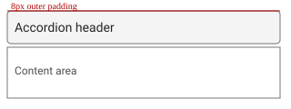

# Accordion documentation images

Place component-specific diagrams here. Images are ingested relative to this file; headings control which section of `design-spec.md` they enrich.

## Anatomy

Labeled structure for the accordion pattern.

## Layout & Measurements

Spacing and redlines reference.

## Behavior & Guidelines

**Dos and Don'ts** (example section title routing).

