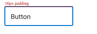

# Button documentation images

Local companion to GitHub `ids-content`. Images are merged into `design-spec.md` via Ollama vision.

## Anatomy

Primary control structure.

## Layout & Measurements

Spacing reference.

## Related Links

Further reading (routing test).

