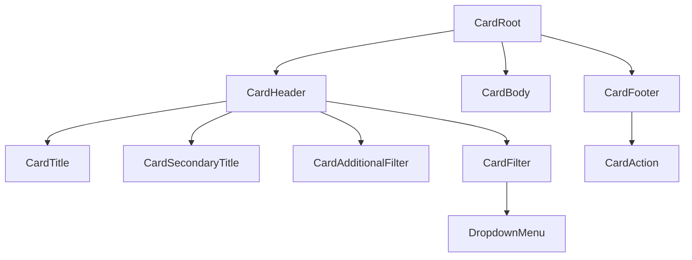

# Card Design Spec

## Metadata

| Property | Value |
|---|---|
| Component | Card |
| Design system | IDS |
| Spec pattern | `ids-native` |
| Category | Patterns |
| Status | draft |
| Version | 2.1.0 |
| Description | Surface container with required header (title + optional filters) and body; optional footer actions. Header kebab opens a Dropdown of **per-card user-defined** options. Border color and body divider seams are tokenized (`--card-border-color`) and gated by `showDivider` (see **Border & divider contract**). |
| Theme CSS | `components/ids-theme.css` |
| Updated | 2026-07-14 — border token cascade + `showDivider` / Dashboard `showDividerInCard` anti-drift |
| File key | `0bHk3XhrjFhowgFkz9yLr4` |
| Main (`Card-Main`) | https://www.figma.com/design/0bHk3XhrjFhowgFkz9yLr4/IDS-Design-Library?node-id=8381-14051&m=dev — **`8381:14051`** |
| Element overflow (kebab / Filter Menu) | https://www.figma.com/design/0bHk3XhrjFhowgFkz9yLr4/IDS-Design-Library?node-id=15718-197531&m=dev — **`15718:197531`** (`Filter Menu=Hide` closed trigger) |
| Element content | https://www.figma.com/design/0bHk3XhrjFhowgFkz9yLr4/IDS-Design-Library?node-id=15718-220135&m=dev — **`15718:220135`** (`.Card-Element-Content`) |
| Validated variant nodes | **`8381:14245`** (Buttons=Yes, Overflow=Yes), **`8381:14305`** (Buttons=Yes, Overflow=No), **`15718:197984`** (Buttons=No, Overflow=Yes), **`15718:197994`** (Buttons=No, Overflow=No), **`15718:219736`** (Content Type=Text), **`15718:220110`** (Content Type=Key Value Pair) |
| Verification method | Figma MCP (`get_screenshot`, `get_metadata`, `get_design_context`, `get_variable_defs`) — **2026-07-14** |
| Storybook | `storybook-generated/ids/src/components/Card.stories.tsx` — title **`Spec Generated/IDS/Card`**, story **`Spec Accurate Design`** |
| Reference implementation | `storybook/src/components/Card.tsx`, `Card.module.css`, `CardHeaderMenu.tsx` |
| Deterministic generator | `generation/deterministic_storybook/ids/card.py` (registry key `("ids", "card")`) |
| Composition dependencies | IDS Button (footer actions), IDS Dropdown menu / overlay pattern (kebab options), optional consumer Dropdown in `CardAdditionalFilter`, optional Key-value table instance in body |

### Parent composition

Card is a **page-level / panel surface**. Parents compose one or more Cards; each Card owns its own `menuOptions` list (options are **not** shared across cards).

When hosted inside [`Dashboard`](../dashboard/design-spec.md):

1. Dashboard sets CSS custom property `--card-border-color: var(--color-border-light)` on `DashboardRoot` (inherited by nested Cards).
2. Dashboard prop `showDividerInCard` (default `true`) is **injected** onto each nested Card as `showDivider` (overrides the Card’s own `showDivider` when rendered as a Dashboard child).
3. See Card **Border & divider contract** and Dashboard design-spec for the full cascade.

## Anatomy

Render order (locked to Figma + intake composition):

1. `CardRoot` — **single wrapper** for header + body + footer; owns the outer border (square, no radius). Internal regions do **not** draw separate box frames.
2. `CardHeader` — required row (`Card Title` **`8381:14246`** / Dashboard-Element-Card **`14093:123117`**)
   1. `CardTitle` — Header 6 alone (Card-Main) **or** Body 1 when paired with secondary (Dashboard card **`14093:123119`**)
   2. `CardTitleDivider` — optional `\|` when secondary present (**`14093:123120`**)
   3. `CardSecondaryTitle` — **optional** inline Body 1 / `var(--color-text-neutral)` (**`14093:123121`**)
   4. `headerMeta` — **optional** trailing Body 2 (e.g. “Last 24 Hours”)
   5. `CardAdditionalFilter` — **optional**
   6. `CardFilter` — **optional** kebab
3. `CardBody` — required content region (`Card Content` **`14978:28002`**); `size` `span-1`\|`span-2`\|`span-3` for Dashboard grid
   - Body may host **Text** content (**`15718:219736`**), **Key Value Pair** table instance (**`15718:220110`**), or arbitrary consumer children
4. `CardFooter` — **optional** (`Card Footer` **`8381:14252`** when `showButtons=true`)
   1. `CardAction` — **one or more** action controls (Figma sample: tertiary/link-style Buttons labeled “Action”)

**Explicit inventory count (primary variant `8381:14245`):** `CardRoot` + `CardHeader` + `CardTitle` + `CardFilter` + `CardBody` + `CardFooter` + `CardAction`×N (≥1 when footer shown) = **7+** slots in render tree. Design-time “Swap content” placeholder inside body is **not** a runtime slot — delete / replace in production.



## Layout & Measurements

| Region | Figma evidence | Runtime |
|---|---|---|
| Main board | `Card-Main` **`945×662`** (`8381:14051`) | Documentation board only |
| Card sample frame | **`430×313`** (with footer) / **`430×258`** (no footer) | Preferred **`min-width: min(100%, var(--card-min-width))`** → `430px` at large hosts for default `span-1`; never exceed parent (responsive). Token changeable later. `width: 100%`; height content-driven |
| CardRoot stack | One wrapper: `flex-direction: column`; **single outer border**; **`border-radius: 0`**. Header/body/footer are inner regions only. Seam: **`CardBody` `border-top` when `showDivider` (default `true`)** (header‖body). **`CardBody` `border-bottom` only when footer is present and `showDivider`** (body‖footer). `showDivider={false}` → body borders `none`. Without footer, root border is the bottom edge — do not double it. (Figma uses overlapping frames + −1px; CSS uses single-shell.) | One card outline, not three stacked boxes |
| CardHeader | `padding: 12px 8px 12px 24px` (`py-12`, `pl-24`, `pr-8`); `gap: 8px`; items center | Title grows; filters shrink-0 on the trailing side |
| CardTitle | height sample **32px**; Header 6 **18/25** | `min-width: 0`; ellipsis when overflowing |
| CardFilter trigger button | padding `8px 16px`; icon **16×16**; button radius **2px** (`15718:197453`) | Kebab uses `overflow-menu-dots` (vertical ellipsis) |
| CardBody | `padding: 16px 24px`; column; `gap: 10px`; `flex: 1` | Hosts children / content templates |
| CardFooter | `padding: 16px 24px`; action group `gap: 8px` | Omit entirely when no actions |
| Content Text | stack `gap: 4px`; section title Body 1 **16/24**; body Body 2 **14/20** (`15718:219736`) | Sample width ~390px — runtime `100%` |
| Content Key Value | hosts `Table - key value pair` instance (`15718:220110` / **`11677:161723`**) | Compose existing table pattern; do not re-implement cells in Card |

### Slot geometry (Figma-verified)

| Slot / layer | Property | Token / contract | Figma node | Live evidence |
| --- | --- | --- | --- | --- |
| `CardRoot` outer shell | `border-radius` | **`0`** / `var(--corner-radius-radius-none)` / `var(--card-control-radius)` → none | `8381:14245` (+ section nodes) | MCP `get_variable_defs` → `Corner Radius/radius-none` = 0 on header/body/footer |
| `CardRoot` outer shell | `border` | `var(--border-width-border-default)` × `var(--color-border-accessible)` (standalone); inside Dashboard → `var(--color-border-light)` via `--card-border-color` | `8381:14245` | Single wrapper border (runtime alternative to Figma’s per-section frames) |
| `CardBody` fill | `background` | `var(--color-background-surface-2)` → `#ffffff` (light) | `14978:28002` | MCP `get_design_context` / `get_variable_defs` on Card Content |
| Header ‖ body seam | divider | `border-top` on `CardBody` when `showDivider` — `accessible` standalone / `light` inside Dashboard via `--card-border-color` | `14978:28002` | Default on; `showDivider={false}` → `none` |
| Body ‖ footer seam | divider | `border-bottom` on `CardBody` when footer **and** `showDivider` — same `--card-border-color` rule | `14978:28002` / `8381:14252` | Omit when no footer or `showDivider={false}` |
| `CardFilter` trigger button | `border-radius` | `var(--corner-radius-radius-2)` → **2px** | `15718:197453` | MCP `get_variable_defs` → `Corner Radius/radius-2` = 2 |

**Geometry authoring rules (mandatory):**
- Document **each** interactive shell separately: field/control, focus ring, menu/panel, inner action wrappers.
- Values must come from **live Figma** on the cited node (`get_variable_defs` preferred for radius bindings). Do **not** infer from `ids-theme.css`, sibling components, or programme fork tables alone.
- When Figma binds `Corner Radius/radius-none` (0px), record **0px / square**.
- Theme aliases document **implementation wiring** only after the Figma value is verified; alias resolved value must match the table.

## Tokens

### Typography

| Slot | Style / tokens | Evidence |
|---|---|---|
| `CardTitle` alone (Card-Main) | Header 6 — `var(--font-size-header-6)` / `var(--font-line-height-line-height-25)`, `var(--color-text-neutral-strong)` | `8381:14247` |
| `CardTitle` + `CardSecondaryTitle` (Dashboard card) | Body 1 — `var(--font-size-body-1)` / `var(--font-line-height-line-height-24)`, strong | `14093:123119` |
| `\|` divider | Body 1 — `var(--color-text-neutral-strong)` | `14093:123120` |
| `CardSecondaryTitle` | Body 1 — `var(--color-text-neutral)` `#4d4d4d` | `14093:123121` |
| `headerMeta` (e.g. Last 24 Hours) | Body 2 — `var(--color-text-neutral)` | `49163:96564` |
| Body text (Content Type=Text) section title | Body 1 | `15718:198223` |
| Body paragraph | Body 2 | `15718:198224` |
| `CardAction` label | Body 2 | Footer Button instances |

### Colors and surfaces

| Use | Token | Light resolved (evidence) |
|---|---|---|
| `CardRoot` / `CardHeader` / `CardFooter` fill | `var(--color-background-surface-2)` | `#ffffff` (`8381:14246`, `8381:14252`) |
| **`CardBody` fill** | **`var(--color-background-surface-2)`** | **`#ffffff`** — Card Content **`14978:28002`** (`get_design_context` / `get_variable_defs`) |
| Section / outer / body seam borders | `var(--color-border-accessible)` | `#757575` (standalone Card) |
| Outer + body seams inside Dashboard | `var(--color-border-light)` via `--card-border-color` | `#c5c5c5` (light) |
| Title / body text | `var(--color-text-neutral-strong)` | `#252525` |
| Kebab icon | `var(--color-icon-neutral)` | `#4d4d4d` |
| Footer action text | `var(--color-text-brand-strong)` | `#055fa9` |
| Design-time `.SwapContent` fill only (not `CardBody`) | `var(--color-background-brand-lighter)` | `#ebf4fb` — nested placeholder **`14978:28110`**; do **not** use as body chrome |
| Design-time `.SwapContent` border | `var(--color-border-brand-dark)` | `#055fa9` |
| Design-time help link | `var(--color-text-link-brand-base)` | `#055fa9` |

### Spacing

| Use | Token | Resolved |
|---|---|---|
| Header / body / footer horizontal padding (lead) | `var(--padding-padding-24)` | 24 |
| Header trailing padding | `var(--padding-padding-8)` | 8 |
| Header vertical padding | `var(--padding-padding-12)` | 12 |
| Body / footer vertical padding | `var(--padding-padding-16)` | 16 |
| Header / action gaps | `var(--spacing-space-8)` | 8 |
| Body internal gap | `var(--spacing-space-10)` | 10 |
| Text content stack gap | `var(--spacing-space-4)` | 4 |
| Contiguous section seams | Figma uses `space-minus-1` (−1) overlapping frames; **runtime** uses single `CardRoot` border + body `border-top` when `showDivider` + body `border-bottom` when footer and `showDivider` (no negative gap) | — |

### Borders / radius

| Use | Token |
|---|---|
| Section border width | `var(--border-width-border-default)` |
| Card shell radius | `var(--card-control-radius)` → `var(--corner-radius-radius-none)` |
| Filter trigger radius | `var(--corner-radius-radius-2)` |
| **Border color cascade** | See **Border & divider contract** below |

### Border & divider contract (anti-drift — mandatory for codegen)

This section is the **single source of truth** for Card chrome borders. Any generated CSS/framework styles **must** implement exactly these rules. Do **not** hardcode `#hex` for borders; do **not** paint borders on `CardHeader` / `CardFooter`.

#### A. CSS variable cascade (color only)

| Context | How color is supplied | Effective border color token |
|---|---|---|
| **Standalone Card** (default) | Unset `--card-border-color` | Fallback: `var(--color-border-accessible)` (`#757575` light) |
| **Inside Dashboard** | `DashboardRoot` sets `--card-border-color: var(--color-border-light)` | `var(--color-border-light)` (`#c5c5c5` light; dark theme resolves via theme CSS) |
| Any other host | Host **may** set `--card-border-color` the same way | Use `var(--card-border-color, var(--color-border-accessible))` |

**Wiring rule (codegen):** every Card border that is part of this contract must resolve as:

```text
var(--card-border-color, var(--color-border-accessible))
```

Not bare `var(--color-border-accessible)` only (that breaks Dashboard light-border context). Not bare `var(--color-border-light)` on standalone Card.

#### B. Which edges use the cascade

| Element | Property | Uses cascade? | Notes |
|---|---|---|---|
| `CardRoot` | `border` (all sides, outer shell) | **Yes** | Always drawn; single outer outline |
| `CardBody` | `border-top` | **Yes**, when shown | Header ‖ body seam |
| `CardBody` | `border-bottom` | **Yes**, when shown | Body ‖ footer seam only |
| `CardHeader` | any border | **No** — always `none` | Never own section boxes |
| `CardFooter` | any border | **No** — always `none` | Never own section boxes |

#### C. Divider visibility truth table (`showDivider` × footer)

Let `hasFooter` = footer is rendered (`showButtons=true` **and** (`actions.length > 0` **or** `footer` provided)).

| `showDivider` | `hasFooter` | `CardBody` `border-top` | `CardBody` `border-bottom` | Rationale |
|---|---|---|---|---|
| `true` (default) | `false` | **on** (cascade color) | **`none`** | Root outer border is the bottom edge — **do not double** |
| `true` (default) | `true` | **on** (cascade color) | **on** (cascade color) | Header‖body + body‖footer seams |
| `false` | `false` | **`none`** | **`none`** | No internal dividers |
| `false` | `true` | **`none`** | **`none`** | Footer still renders; seams off |

**Props:**

| Prop | Owner | Default | Effect |
|---|---|---|---|
| `showDivider` | Card | `true` | Gates body seam borders per table C |
| `showDividerInCard` | Dashboard | `true` | When Card is a Dashboard child, Dashboard injects `showDivider={showDividerInCard}` (see Dashboard spec). Standalone Card ignores Dashboard prop. |

#### D. Anti-drift / forbidden patterns

| Forbidden | Required instead |
|---|---|
| Three stacked boxes each with their own outer border (header/body/footer) | One `CardRoot` outer border only |
| `border-bottom` on body when no footer | `border-bottom: none` (root owns bottom edge) |
| Hardcoded `#757575` / `#c5c5c5` in component CSS | Semantic `var(--...)` via cascade A |
| Using `--color-border-accessible` for nested Dashboard cards | Dashboard must set `--card-border-color: var(--color-border-light)`; Card must **consume** the cascade |
| Ignoring `showDivider={false}` | Force body top/bottom to `none` |
| Negative CSS `gap` to fake Figma −1 overlap | Single-shell + body seams |
| Dashboard omitting injection of `showDividerInCard` | Clone/map each Card child with `showDivider={showDividerInCard}` |

#### E. Reference implementation mapping

| Spec concept | Runtime |
|---|---|
| Cascade A | `Card.module.css` — `var(--card-border-color, var(--color-border-accessible))` on root + body seams |
| Dashboard host override | `Dashboard.module.css` — `--card-border-color: var(--color-border-light)` on `.dashboard` |
| `showDivider=false` | class `bodyNoDivider` → `border-top` / `border-bottom: none` |
| Footer seam | class `bodyWithFooter` only when `showDivider && hasFooter` |
| Dashboard injection | `Dashboard.tsx` — `cloneElement(card, { showDivider: showDividerInCard })` |

### Shadows / elevation

No elevation / shadow bindings on `Card-Main` variants. Do **not** invent elevation for default Card. (Legacy `elevated` story flag is demo-only if retained.)

## States (Light Theme)

| Area | State | Background | Border | Text/Icon |
| --- | --- | --- | --- | --- |
| `CardRoot` | default (standalone) | `var(--color-background-surface-2)` | `var(--color-border-accessible)` (outer only) | — |
| `CardRoot` | inside Dashboard | same fill | `var(--color-border-light)` (outer) | — |
| `CardBody` | default (no footer, `showDivider`) | **`var(--color-background-surface-2)`** (`#ffffff` light) | `border-top` only — `accessible` standalone / `light` in Dashboard | `var(--color-text-neutral-strong)` |
| `CardBody` | with footer + `showDivider` | same fill | `border-top` + `border-bottom` — same `--card-border-color` rule | same |
| `CardBody` | `showDivider={false}` | same fill | `border-top` / `border-bottom` → `none` | same |
| `CardHeader` / `CardFooter` | default | `var(--color-background-surface-2)` (or transparent over root fill) | none | `var(--color-text-neutral-strong)` / `var(--color-icon-neutral)` |
| `CardFilter` trigger | default | transparent | transparent | `var(--color-icon-neutral)` |
| `CardFilter` trigger | hover | (Button hover per IDS Button) | — | `var(--color-icon-neutral)` or Button icon hover token |
| `CardFilter` trigger | focus-visible | — | focus ring per IDS Button / focus tokens | — |
| `CardFilter` trigger | disabled | — | — | `var(--color-icon-accessible)` |
| Dropdown overlay items | default / hover / press / disabled | Per Dropdown menu contract (`components/ids/dropdown-single-select` / shared `DropdownMenu`) | — | — |
| `CardAction` | default | transparent | transparent | `var(--color-text-brand-strong)` |
| `CardAction` | hover / press / focus-visible / disabled | Per IDS Button tertiary / link action contract | — | — |

Card surface itself is **not** a selectable control in Figma `Card-Main` — do not apply selected / pressed chrome to `CardRoot` unless a future States URL proves it.

## States (Dark Theme)

Dark theme uses the same semantic tokens as **States (Light Theme)**. Resolved values for `[data-theme="dark"]` / `.ids-theme-dark` (and program overlays) live in theme CSS:

- `components/ids-theme.css`
- `components/<program>-theme.css` when a program overlays IDS (for example `components/dap-theme.css`)

Duplicate the full state matrix in this section only when a dark row genuinely uses different `var(--...)` references than the corresponding light row.

*(When Light and Dark tables would list identical `var(--...)` cells, keep the matrix under **States (Light Theme)** only and use this pointer section instead of a second table.)*

## Interactions

| Trigger | Behavior |
|---|---|
| Click / Activate `CardFilter` (kebab) | Toggle Dropdown overlay open/closed. Menu lists **`menuOptions` supplied for this Card instance only**. |
| Select Dropdown option | Fire `onOptionSelected(value)`; close menu. Do **not** mutate title or other Card chrome unless consumer handles the event. |
| Click outside / Escape (menu open) | Close Dropdown. |
| Activate `CardAction` | Fire that action’s handler (consumer-defined). Footer may contain multiple independent actions. |
| `CardAdditionalFilter` | Owned by consumer Dropdown/control; Card does not intercept. |
| Keyboard on `CardFilter` | `Enter` / `Space` toggles menu; arrow keys move within menu; `Escape` closes (align with IDS Dropdown menu a11y). |

### Accessibility

- `CardRoot`: landmark or `group` as appropriate; when `title` is set, associate via `aria-labelledby` on the title heading.
- `CardFilter` trigger: `button` with accessible name (e.g. “Card options” / “Options for {title}”); `aria-haspopup="menu"`; `aria-expanded`.
- Dropdown: `role="menu"` / `menuitem` (or listbox pattern already used by shared DropdownMenu) — **reuse** IDS menu a11y, do not invent a parallel one.
- `CardAction`: real buttons/links with visible labels; do not rely on color alone.

### Behavior & guidelines

- **Do** pass a distinct `menuOptions` array per Card instance.
- **Do** omit `CardFilter` when `showOverflowMenu=false` or when `menuOptions` is empty/undefined.
- **Do** omit `CardFooter` when `showButtons=false` or no actions.
- **Do** implement **Border & divider contract** (cascade + `showDivider` truth table) — do not invent alternate border wiring.
- **Don’t** hardcode shared global overflow menus across cards.
- **Don’t** ship the Figma “Swap content” placeholder in production UIs.
- **Don’t** draw `CardBody` `border-bottom` when there is no footer (even if `showDivider=true`).
- **Don’t** hardcode accessible borders for Cards that inherit `--card-border-color` from Dashboard.

## Composition & API (runtime)

### Variants

| Axis | Values | Figma / contract |
|---|---|---|
| `showButtons` | `true` \| `false` | `Show Buttons=Yes\|No` on `Card-Main` |
| `showOverflowMenu` | `true` \| `false` | `Show Overflow menu=Yes\|No` |
| `showDivider` | `true` (default) \| `false` | Body header‖body / body‖footer seam visibility |
| Body content type (templates) | `children` (default) \| `text` \| `keyValue` | `.Card-Element-Content` `Content Type=Text\|Key Value Pair` |
| `size` | `span-1` (default) \| `span-2` \| `span-3` | Dashboard 3-column span (composition with [`dashboard/design-spec.md`](../dashboard/design-spec.md)) |

Valid combinations: all four products of `showButtons` × `showOverflowMenu`. `showDivider`, body templates, and `size` are independent.

### Runtime API

#### Inputs

| Prop | Type | Default | Description |
|---|---|---|---|
| `title` | `string` | — | Primary title. Alone → Header 6 (Card-Main). With `secondaryTitle` → Body 1 inline (Dashboard-Element-Card) |
| `secondaryTitle` | `string` \| `node` \| `<CardSecondaryTitle>` | — | Inline after `\|` — Body 1 / `var(--color-text-neutral)` (Figma `14093:123121`) |
| `headerMeta` | `string` \| `node` | — | Optional trailing meta before kebab (e.g. “Last 24 Hours” — Body 2 / neutral, `49163:96564`) |
| `header` | `node` | — | Optional full custom header replace; when set with `showOverflowMenu`, kebab still pins trailing |
| `additionalFilter` | `node` | — | Optional `CardAdditionalFilter` slot (any Dropdown / filter) |
| `children` | `node` | **required** | `CardBody` content |
| `actions` / `footer` | `node` \| `CardAction[]` | — | Footer content; multiple `CardAction` allowed |
| `showButtons` | `boolean` | `false` | When `false`, hide `CardFooter` |
| `showDivider` | `boolean` | `true` | When `false`, hide `CardBody` top/bottom seam borders (`none`). When Card is under Dashboard, value is **injected** from Dashboard `showDividerInCard` (see Card **Border & divider contract** and Dashboard spec). |
| `showOverflowMenu` | `boolean` | `false` | When `true` **and** `menuOptions.length > 0`, show kebab |
| `menuOptions` | `{ value: string; label: string; disabled?: boolean }[]` | — | Per-card Dropdown options |
| `onOptionSelected` | `(value: string) => void` | — | Kebab menu selection |
| `size` | `span-1` \| `span-2` \| `span-3` | `span-1` | Column span inside Dashboard grid. Default `span-1` also sets **`min-width: var(--card-min-width)`** (`430px`, Figma Card-Main). `span-2` / `span-3` scale min-width to 2× / 3× tracks (+ grid gaps). |

**Child component:** `CardSecondaryTitle` — render secondary text under `CardTitle` (also accepted via `secondaryTitle` prop).

**Alias note:** existing implementation may expose `showOverFlowMenu` (capital `F`) — treat as alias of `showOverflowMenu`; prefer camelCase `showOverflowMenu` in new codegen.

#### Outputs

| Event | Payload |
|---|---|
| `onOptionSelected` | `value: string` of selected `menuOptions` entry |
| Per-action handlers | Consumer-defined on each `CardAction` |

#### Demo-only (Storybook / QA)

| Prop | Notes |
|---|---|
| `elevated` / `outlined` | Not in Figma `Card-Main`; do not require for production. Prefer omit. |
| `forceOpenMenu` / `data-state` | QA only; must not block runtime open/close. |

### Spec Accurate Design story defaults

| Arg | Value |
|---|---|
| `title` | `"Card Title"` |
| `showOverflowMenu` | `true` |
| `menuOptions` | `[{ value: "edit", label: "Edit" }, { value: "duplicate", label: "Duplicate" }, { value: "delete", label: "Delete" }]` |
| `showButtons` | `true` |
| `showDivider` | `true` |
| `children` | `CardTextContent` — section title `"Section Title"` + Figma Body 2 lorem (`15718:219736`); **not** the design-time Swap placeholder |
| `actions` | Two tertiary labels `"Action"` / `"Action"` |
| Host width | min `430px` (`--card-min-width`); Storybook host may use `430px` to match Figma sample |
| Theme import | `components/ids-theme.css` only |

Additional stories under **Spec Generated/IDS/Card**: `Figma Card-Main matrix` (2×2 buttons×overflow), `Content Type Text`, `Content Type Key Value Pair`, `With additional filter`.

## Codegen Contract (Framework-Agnostic Blueprint)

### Deterministic structure

```
CardRoot [data-card-size=span-1|span-2|span-3]
├── CardHeader
│   ├── CardTitleCluster
│   │   ├── CardTitle                          [optional when secondary alone]
│   │   └── CardSecondaryTitle                 [optional]
│   ├── CardAdditionalFilter                   [optional]
│   └── CardFilter (kebab Button)              [optional → DropdownMenu]
│       └── DropdownMenu (user options)
├── CardBody                                   [required]
│   └── children | TextTemplate | KeyValueTemplate
└── CardFooter                                 [optional]
    └── CardAction+                            [one or more]
```

### Variant matrix

| `showButtons` | `showOverflowMenu` | `menuOptions` | `showDivider` | Result |
|---|---|---|---|---|
| false | false | — | true | Header + body; body `border-top` only |
| false | false | — | false | Header + body; **no** body seams |
| false | true | non-empty | true | Header + kebab + body; body `border-top` |
| true | false | — | true | Header + body + footer; body top + bottom seams |
| true | true | non-empty | true | Full composition (Figma `8381:14245`) + both seams |
| true | * | * | false | Footer may show; **body seams off** |
| * | true | empty/undefined | * | **No kebab** (fail closed) |

### Per-slot style contract

| Slot | Styles |
|---|---|
| `CardRoot` | column flex; `width: 100%`; **`min-width: var(--card-min-width)` → `430px`** (default / `span-1`); outer `border: var(--border-width-border-default) solid var(--card-border-color, var(--color-border-accessible))`; **`border-radius: 0`**; fill `var(--color-background-surface-2)` |
| `CardHeader` | **no section border**; padding `12px 8px 12px 24px`; flex row; gap 8 |
| `CardTitle` | Header 6 when alone; Body 1 + strong when with secondary (Dashboard card) |
| `CardSecondaryTitle` | Inline after `\|`; Body 1; `var(--color-text-neutral)` |
| `headerMeta` | Body 2; `var(--color-text-neutral)`; before kebab |
| `CardAdditionalFilter` | shrink-0; consumer styles |
| `CardFilter` | Button padding `8px 16px`; icon 16×16; icon color `var(--color-icon-neutral)`; radius 2px |
| Dropdown | Shared IDS dropdown/overlay tokens — do not re-skin ad hoc |
| `CardBody` | fill **`var(--color-background-surface-2)`**; padding `16px 24px`; **divider rules: Border & divider contract §C**; seam color always via cascade §A |
| `CardFooter` | **no section border**; padding `16px 24px`; flex row; gap 8 |
| `size` | In Dashboard grid: `span-1` → 1 col + min-width `430px`; `span-2` / `span-3` → 2 / 3 cols with scaled min-width |
| `CardAction` | Body 2; `var(--color-text-brand-strong)`; IDS Button tertiary/link |

### Behavior contract

1. Mount: render header + body; footer/kebab per matrix.
2. Open kebab → Dropdown with this card’s `menuOptions`.
3. Select option → `onOptionSelected(value)` → close menu.
4. Action click → that action’s handler only.
5. **Border shell (locked):** one `CardRoot` outer border only; square corners (`radius-none`); never three stacked section boxes; never negative CSS `gap`.
6. **Divider (locked):** apply **Border & divider contract** §A–§D exactly. Default `showDivider=true`. When Card is under Dashboard, accept injected `showDivider` from `showDividerInCard`.
7. Missing tokens: keep `var(--...)` — never substitute hex in codegen for border colors.

### Accessibility contract

- Title → heading (`h2`/`h3` as appropriate in page outline).
- Kebab → named button + menu semantics.
- Actions → named buttons.
- Focus order: title cluster → additional filter → kebab → body focusables → footer actions.

### Asset resolution + bundling contract

| Asset | Slug / source | Rule |
|---|---|---|
| Kebab icon | `overflow-menu-dots` (Figma **`48133:233331`**) | Bundle via IDS Icon / SVG map; 16×16 in trigger |
| Key-value icons | Per table/cell instances | Owned by Key-value / table dependency |

### Fallback/error rules

| Condition | Behavior |
|---|---|
| Unknown variant flag | Treat boolean as `false` |
| `showOverflowMenu=true` but empty `menuOptions` | Hide kebab; do not render empty menu |
| Missing `title` and no `header` | Render header only if filter/menu present; otherwise omit header |
| Missing tokens | Keep `var(--...)` references; do not substitute hex in codegen |
| Missing icon asset | Keep button chrome; omit glyph or use IDS Icon fallback |
| `showDivider` undefined | Treat as `true` |
| Host sets invalid `--card-border-color` | Still use cascade expression; do not fall back to hex |

### Validation checklist

- [ ] **Slot geometry (Figma-verified)** table complete; every border-radius row cites a Figma node + MCP method
- [ ] Theme alias `--card-control-radius` resolves to `radius-none` (matches geometry table)
- [ ] **Border & divider contract** implemented: cascade A, edges B, truth table C, no forbidden patterns D
- [ ] Standalone Card outer + seams use `accessible` via cascade fallback
- [ ] Inside Dashboard, outer + seams use `light` via `--card-border-color` (no hardcode accessible)
- [ ] No footer → no body `border-bottom` even when `showDivider=true`
- [ ] `showDivider=false` → body top and bottom `none` (footer may still show)
- [ ] Anatomy order matches Deterministic structure (incl. optional AdditionalFilter + kebab)
- [ ] Kebab opens Dropdown with **per-card** `menuOptions`
- [ ] `showButtons` / `showOverflowMenu` matrix covers all four Figma variants
- [ ] Footer supports multiple `CardAction`s
- [ ] No design-time “Swap content” chrome in production output
- [ ] Spec Accurate Design story under `Spec Generated/IDS/Card` (`storybook-generated/ids/src/components/Card.stories.tsx`; regenerate via gate `--deterministic-story`)
- [ ] Light state matrix present; Dark uses boilerplate when tokens match
- [ ] Screenshots taken for Main + both Element URLs during verification

## Source Mapping

| Bucket | URL | Node | MCP tools |
|---|---|---|---|
| Main | [Card-Main](https://www.figma.com/design/0bHk3XhrjFhowgFkz9yLr4/IDS-Design-Library?node-id=8381-14051&m=dev) | `8381:14051` (+ variants `8381:14245`, `8381:14305`, `15718:197984`, `15718:197994`) | `get_screenshot`, `get_metadata`, `get_design_context`, `get_variable_defs` |
| Elements | [Overflow / Filter Menu](https://www.figma.com/design/0bHk3XhrjFhowgFkz9yLr4/IDS-Design-Library?node-id=15718-197531&m=dev) | `15718:197531` | same |
| Elements | [Content](https://www.figma.com/design/0bHk3XhrjFhowgFkz9yLr4/IDS-Design-Library?node-id=15718-220135&m=dev) | `15718:220135` (+ `15718:219736`, `15718:220110`) | same |
| States | _(none provided)_ | — | — |

- Component map entry: `data/component-figma-map.json` → component `"Card"` (category `"Patterns"`; primary node `"8381-14051"`)
- Extraction path: Main board → primary variant `Show Buttons=Yes, Show Overflow menu=Yes` → header/body/footer shells → overflow element → content element templates
