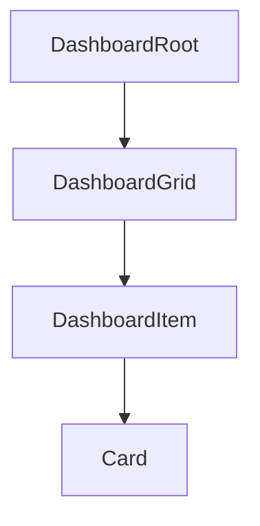

# Dashboard Design Spec

## Metadata

| Property | Value |
|---|---|
| Component | Dashboard |
| Design system | IDS |
| Spec pattern | `ids-native` (composition wrapper) |
| Category | Patterns |
| Status | draft |
| Version | 1.0.0 |
| Description | Wrapper surface for a responsive grid of IDS Cards (1 → 2 → 3 columns by viewport); optional card drag-reorder. Page title and page-level actions (including any kebab) are owned by the host layout — **not** Dashboard. |
| Theme CSS | `components/ids-theme.css` |
| Figma | _Canonical Dashboard page:_ https://www.figma.com/design/0bHk3XhrjFhowgFkz9yLr4/IDS-Design-Library?node-id=44523-285905&m=dev — **`44523:285905`** |
| Page title (out of scope) | **`44523:285919`** — Header 5; rendered by page shell, **not** a Dashboard prop |
| Card title / secondary | **`14093:123116`** Dashboard-Element-Card — Title Content **`14093:123118`** |
| Verification method | Figma MCP (`get_screenshot`, `get_metadata`, `get_design_context`, `get_variable_defs`) — **2026-07-14** |
| Nested specs | [`components/ids/card/design-spec.md`](../card/design-spec.md) |
| Storybook | `storybook/src/components/IdsDashboard.stories.tsx` — **`Spec Generated/IDS/Dashboard`** |
| Reference implementation | `storybook/src/components/Dashboard.tsx`, `Dashboard.module.css` |

## Anatomy

1. `DashboardRoot` — single wrapper (outer border, square corners)
2. `DashboardGrid` — responsive CSS grid (**1 / 2 / 3** columns by viewport; see breakpoints)
   1. `DashboardItem`×N — each hosts one IDS `Card` (span from Card `size`, remapped per breakpoint)

Page title (`44523:285919`) and page-level overflow actions are **not** part of this anatomy — host / page shell owns them. Per-card kebab remains on Card.



## Layout & Measurements

| Region | Contract |
|---|---|
| Root | `width: 100%`; padding `16px 24px` (tighter padding below `sm`); outer border `var(--color-border-accessible)`; **`border-radius: 0`**; fill `var(--color-background-surface-1)` |
| Grid | Responsive tracks (IDS breakpoints from `config/design_systems/ids.yaml`): see below; gap `16px` |
| Item span | Card `size` maps to tracks; on fewer columns, oversized spans clamp to full row |

### Responsive breakpoints

| Viewport | Columns | Span behavior |
|---|---|---|
| `< md` (`< 768px`) | **1** | `span-1` / `span-2` / `span-3` → full width (`1 / -1`) |
| `md`–`lg` (`768px`–`991px`) | **2** | `span-1` → 1 col; `span-2` and `span-3` → full row (2 cols) |
| `≥ lg` (`≥ 992px`) | **3** | `span-1` → 1; `span-2` → 2; `span-3` → 3 (Figma desktop) |

Grid uses `minmax(0, 1fr)` so cards shrink with the viewport. Card `--card-min-width` (`430px`) is a **preferred** desktop floor (`min(100%, var(--card-min-width))`) and is **intentionally overridable** in later iterations without API changes.

### Slot geometry (Figma-verified)

| Slot / layer | Property | Token / contract | Figma node | Live evidence |
| --- | --- | --- | --- | --- |
| `DashboardRoot` | `border-radius` | `0` / `var(--corner-radius-radius-none)` | TBD | Draft — pending Dashboard Figma; square matches IDS Card shell |
| `DashboardRoot` | `border` | `var(--border-width-border-default)` × `var(--color-border-accessible)` | TBD | Same accessible border as Card |
| Nested Card shells | — | See Card Slot geometry | Card nodes | Card design-spec |

## Tokens

### Colors and surfaces

| Use | Token |
|---|---|
| Dashboard root fill | `var(--color-background-surface-1)` |
| Outer border | `var(--color-border-accessible)` |
| Nested Card | See Card Tokens (`surface-2` body, etc.) |

### Spacing

| Use | Token |
|---|---|
| Root padding / grid gap | `var(--padding-padding-16)` / `var(--spacing-space-16)` |
| Horizontal padding | `var(--padding-padding-24)` |

## States (Light Theme)

| Area | State | Background | Border | Text/Icon |
| --- | --- | --- | --- | --- |
| `DashboardRoot` | default | `var(--color-background-surface-1)` | `var(--color-border-accessible)` | — |
| Drag drop target | `enableDragAndDrop` + drag-over | — | dashed brand outline on item | — |

## States (Dark Theme)

Dark theme uses the same semantic tokens as **States (Light Theme)**. Resolved values for `[data-theme="dark"]` / `.ids-theme-dark` live in `components/ids-theme.css`.

## Interactions

| Trigger | Behavior |
|---|---|
| Drag card (when `enableDragAndDrop`) | Card becomes draggable; reorder grid items; fire `onCardsReorder(orderedKeys)` |
| Nested Card kebab / actions | Owned by Card — not intercepted by Dashboard |

### Accessibility

- Root: `section` + `aria-label="Dashboard"` (page title lives outside this component)
- Drag: pointer/keyboard alternatives should be added when promoting Status → active (draft: pointer drag only)

## Composition & API (runtime)

### Runtime API

| Prop | Type | Default | Description |
|---|---|---|---|
| `children` | `Card[]` | **required** | IDS Card elements (responsive grid) |
| `enableDragAndDrop` | `boolean` | `false` | When `true`, nested Cards are draggable (HTML5 reorder) |
| `onCardsReorder` | `(orderedKeys: string[]) => void` | — | After drop |

Page title and dashboard-level kebab are **not** Dashboard props — render them in the page shell when needed (Figma page title **`44523:285919`**).

### Spec Accurate Design story defaults

| Arg | Value |
|---|---|
| Cards | Mix of `span-1` / `span-2` / `span-3` with optional `secondaryTitle` |
| `enableDragAndDrop` | `false` |
| Theme | `components/ids-theme.css` only |

## Codegen Contract (Framework-Agnostic Blueprint)

### Deterministic structure

```
DashboardRoot
└── DashboardGrid (1 / 2 / 3 columns by viewport)
    └── DashboardItem+ → Card (size span-1|2|3)
```

### Variant matrix

| `enableDragAndDrop` | Result |
|---|---|
| false | Grid of static responsive cards |
| true | Nested Cards are draggable / reorderable |

### Per-slot style contract

| Slot | Styles |
|---|---|
| `DashboardRoot` | surface-1; accessible border; radius 0; padding 16/24 |
| `DashboardGrid` | 1 / 2 / 3 equal columns by breakpoint; gap 16; `minmax(0, 1fr)` |
| `DashboardItem` | applies Card `size` → `grid-column` with clamp-to-full-row on smaller breakpoints |

### Behavior contract

1. Mount grid of Cards (no page title or dashboard kebab inside Dashboard).
2. Optional drag (`enableDragAndDrop`): nested Cards become draggable; reorder item keys without changing Card identity.
3. Card size controls column span at `≥ lg`; smaller viewports reflow per **Responsive breakpoints**.
4. `--card-min-width` preferred floor may change later — prefer theme override over hardcoding.

### Accessibility contract

- Root uses `aria-label="Dashboard"` (page title outside this component).
- Promote to active only after keyboard reorder path is documented.

### Asset resolution + bundling contract

No Dashboard-owned assets. Nested Card icons / kebab follow Card design-spec.

### Fallback/error rules

| Condition | Behavior |
|---|---|
| Unknown Card `size` | Treat as `span-1` |
| Non-Card children | Still grid-wrapped; span defaults to 1 |

### Validation checklist

- [ ] Dashboard is grid-only; no `title` or kebab / overflow-menu props
- [ ] Cards reflow on resize; no horizontal overflow forced by min-width below `lg`
- [ ] Card `span-1`/`span-2`/`span-3` map to grid tracks at desktop; clamp on smaller breakpoints
- [ ] `enableDragAndDrop` optional and off by default; when true, Cards are draggable
- [ ] Nested Cards follow Card design-spec (including per-card kebab when used)
- [ ] Spec Accurate Design under `Spec Generated/IDS/Dashboard`
- [ ] Live Figma URL recorded when available (Status remains **draft** until then)

## Source Mapping

| Bucket | Status |
|---|---|
| Main / Elements / States | Pending Figma intake — update map + re-verify before **active** |

- Component map entry: `data/component-figma-map.json` → `"Dashboard"`
- Nested Card: IDS Design Library Card nodes per Card Source Mapping
