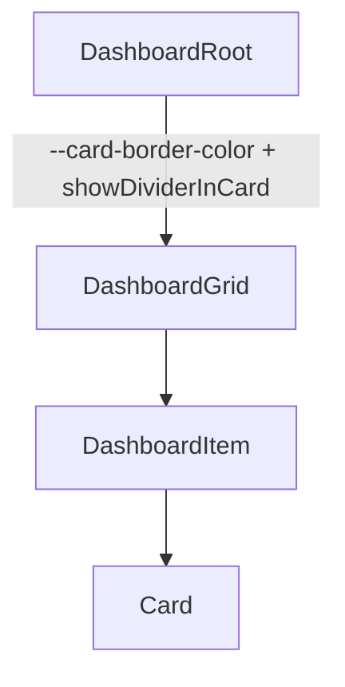

# Dashboard Design Spec

## Metadata

| Property | Value |
|---|---|
| Component | Dashboard |
| Design system | IDS |
| Spec pattern | `ids-native` (composition wrapper) |
| Category | Patterns |
| Status | draft |
| Version | 1.1.0 |
| Description | Wrapper surface for a responsive grid of IDS Cards (1 → 2 → 3 columns by viewport); optional card drag-reorder. Sets nested Card border color (`--card-border-color` → `--color-border-gray-neutral-light`) and injects `showDivider` via `showDividerInCard`. Page title and page-level actions are owned by the host layout — **not** Dashboard. |
| Theme CSS | `components/ids-theme.css` |
| Updated | 2026-07-14 — nested Card border + divider injection anti-drift |
| Figma | _Canonical Dashboard page:_ https://www.figma.com/design/0bHk3XhrjFhowgFkz9yLr4/IDS-Design-Library?node-id=44523-285905&m=dev — **`44523:285905`** |
| Page title (out of scope) | **`44523:285919`** — Header 5; rendered by page shell, **not** a Dashboard prop |
| Card title / secondary | **`14093:123116`** Dashboard-Element-Card — Title Content **`14093:123118`** |
| Verification method | Figma MCP (`get_screenshot`, `get_metadata`, `get_design_context`, `get_variable_defs`) — **2026-07-14** |
| Nested specs | [`components/ids/card/design-spec.md`](../card/design-spec.md) — **must follow Card Border & divider contract** |
| Storybook | `storybook-generated/ids/src/components/Dashboard.stories.tsx` — **`Spec Generated/IDS/Dashboard`** |
| Storybook (Angular) | `storybook-angular/src/components/ids-dashboard/ids-dashboard.stories.js` — **`Spec Generated/IDS/Dashboard`** |
| Reference implementation | `storybook/src/components/Dashboard.tsx`, `Dashboard.module.css` |
| Reference implementation (React lib) | `lib/react/ids/dashboard` (`IdsDashboard`, `IdsDashboardGrid`, `IdsDashboardItem`) |
| Reference implementation (Angular lib) | `lib/angular/ids/dashboard` (`ids-dashboard`, `ids-dashboard-grid`, `ids-dashboard-item`) |
| Nested Card (Angular lib) | `lib/angular/ids/card` — consumes `--card-border-color` + `IDS_DASHBOARD_CARD_OVERRIDE` |
| Deterministic generator | `generation/deterministic_storybook/ids/dashboard.py` (registry key `("ids", "dashboard")`) |

## Anatomy

1. `DashboardRoot` — single wrapper (outer border, square corners); **hosts** Card border cascade + divider injection
2. `DashboardGrid` — responsive CSS grid (**1 / 2 / 3** columns by viewport; see breakpoints)
   1. `DashboardItem`×N — each hosts one IDS `Card` (span from Card `size`, remapped per breakpoint)

**Out of scope (do not generate on Dashboard):**

- Page title (`44523:285919`) — host / page shell
- Dashboard-level kebab / overflow menu / `title` prop — removed; not part of API
- Per-card kebab — remains on **Card** only



## Layout & Measurements

| Region | Contract |
|---|---|
| Root | `width: 100%`; padding `16px 24px` (tighter padding below `sm`); outer border `var(--color-border-gray-neutral-base)`; **`border-radius: 0`**; fill `var(--color-background-surface-primary)`; **sets `--card-border-color: var(--color-border-gray-neutral-light)`** |
| Grid | Responsive tracks (IDS breakpoints from `config/design_systems/ids.yaml`): see below; gap `16px` |
| Item span | Card `size` maps to tracks; on fewer columns, oversized spans clamp to full row |

### Responsive breakpoints

| Viewport | Columns | Span behavior |
|---|---|---|
| `< md` (`< 768px`) | **1** | `span-1` / `span-2` / `span-3` → full width (`1 / -1`) |
| `md`–`lg` (`768px`–`991px`) | **2** | `span-1` → 1 col; `span-2` and `span-3` → full row (2 cols) |
| `≥ lg` (`≥ 992px`) | **3** | `span-1` → 1; `span-2` → 2; `span-3` → 3 (Figma desktop) |

Grid uses `minmax(0, 1fr)` so cards shrink with the viewport. Card `--card-min-width` (`430px`) is a **preferred** desktop floor (`min(100%, var(--card-min-width))`) and is **intentionally overridable** in later iterations without API changes.

### Slot geometry (Figma-verified)

| Slot / layer | Property | Token / contract | Figma node | Live evidence |
| --- | --- | --- | --- | --- |
| `DashboardRoot` | `border-radius` | `0` / `var(--corner-radius-radius-none)` | TBD | Draft — pending Dashboard Figma; square matches IDS Card shell |
| `DashboardRoot` | `border` | `var(--border-width-border-default)` × `var(--color-border-gray-neutral-base)` | TBD | Dashboard chrome only (not nested Card) |
| Nested Card shells + body seams | `border` / body dividers | `var(--color-border-gray-neutral-light)` via `--card-border-color` | Card / Dashboard-Element-Card | Dashboard **must** set `--card-border-color`; Card consumes cascade (see Card Border & divider contract) |

### Nested Card border & divider contract (anti-drift — mandatory)

Dashboard **does not** restyle Card borders in isolation. It **configures** Card via (1) CSS custom property and (2) prop injection. Card design-spec **Border & divider contract** remains authoritative for how Card consumes those inputs.

#### 1. Border color host override (always on)

On `DashboardRoot` stylesheet:

```css
--card-border-color: var(--color-border-gray-neutral-light);
```

| Applies to | Effect |
|---|---|
| Nested `CardRoot` outer border | Resolves to `var(--color-border-gray-neutral-light)` |
| Nested `CardBody` `border-top` / `border-bottom` (when seams shown) | Same light token |

**Do not** set nested Card borders to `var(--color-border-gray-neutral-base)` inside Dashboard. **Do not** hardcode `#c5c5c5`. Dashboard root chrome **keeps** `accessible`; only nested Cards use `light`.

#### 2. Divider injection (`showDividerInCard`)

| Prop | Default | Codegen rule |
|---|---|---|
| `showDividerInCard` | `true` | For **each** child that is an IDS `Card`, clone/map with `showDivider={showDividerInCard}` |

| `showDividerInCard` | Injected Card prop | Body seams (per Card truth table) |
|---|---|---|
| `true` | `showDivider={true}` | Default seams: top always; bottom only if footer |
| `false` | `showDivider={false}` | Body top **and** bottom → `none` (footer may still show) |

**Precedence:** Dashboard injection **wins** over any `showDivider` written on the JSX Card child when that Card is rendered **inside** Dashboard. Standalone Cards (outside Dashboard) keep their own `showDivider`.

**Non-Card children:** grid-wrap them; do **not** invent border/divider props.

#### 3. Combined matrix (Quick reference)

| Dashboard context | Nested Card outer border | Nested body seams |
|---|---|---|
| Always (any `showDividerInCard`) | `--color-border-gray-neutral-light` via `--card-border-color` | Color also light when seams show |
| `showDividerInCard=true`, no footer | light outer | light `border-top` only |
| `showDividerInCard=true`, with footer | light outer | light top + bottom |
| `showDividerInCard=false`, any footer | light outer | **no** body seams |

#### 4. Forbidden / drift patterns

| Forbidden | Required |
|---|---|
| Dashboard `title` / kebab / overflow-menu props | Omit — host owns page chrome |
| Nested Cards with accessible borders inside Dashboard | Set `--card-border-color: var(--color-border-gray-neutral-light)` |
| Assuming Card default dividers without injection when `showDividerInCard=false` | Always inject `showDivider` onto Card children |
| Painting Dashboard-level internal card dividers as separate CSS (duplicate Card seams) | Rely on Card `showDivider` only |
| Changing Card fill / radius only in Dashboard CSS | Nested visual chrome stays per Card design-spec except color cascade + divider prop |

#### 5. Reference implementation mapping

| Spec concept | Runtime |
|---|---|
| `--card-border-color` | React: `Dashboard.module.css` / `IdsDashboard.module.css` on root; Angular: `ids-dashboard.component.scss` on `.IdsDashboard` / `ids-dashboard` |
| `showDivider` injection | React: `cloneElement(card, { showDivider: showDividerInCard })`; Angular: `IDS_DASHBOARD_CARD_OVERRIDE` → Card `effectiveShowDivider` |
| Data attribute | `data-show-divider-in-card="true"|"false"` on root (QA) |

## Tokens

### Colors and surfaces

| Use | Token | Notes |
|---|---|---|
| Dashboard root fill | `var(--color-background-surface-primary)` | Dashboard chrome |
| Dashboard outer border | `var(--color-border-gray-neutral-base)` | Dashboard chrome only |
| Nested Card outer + body seams | `var(--color-border-gray-neutral-light)` via `--card-border-color` | **Required** host override |
| Nested Card fill / typography / footer | Per Card Tokens | Do not re-token in Dashboard |

### Spacing

| Use | Token |
|---|---|
| Root padding / grid gap | `var(--padding-padding-16)` / `var(--spacing-space-16)` |
| Horizontal padding | `var(--padding-padding-24)` |

## States (Light Theme)

| Area | State | Background | Border | Text/Icon |
| --- | --- | --- | --- | --- |
| `DashboardRoot` | default | `var(--color-background-surface-primary)` | `var(--color-border-gray-neutral-base)` | — |
| Nested `CardRoot` | default (in Dashboard) | per Card | `var(--color-border-gray-neutral-light)` | — |
| Nested `CardBody` seams | `showDividerInCard=true` | per Card | light top (+ bottom if footer) | — |
| Nested `CardBody` seams | `showDividerInCard=false` | per Card | `none` / `none` | — |
| Drag drop target | `enableDragAndDrop` + drag-over | — | dashed brand outline on **item** (not Card border rewrite) | — |

## States (Dark Theme)

Dark theme uses the same semantic tokens as **States (Light Theme)**. Resolved values for `[data-theme="dark"]` / `.ids-theme-dark` live in `components/ids-theme.css` (including `--color-border-gray-neutral-light` dark value).

## Interactions

| Trigger | Behavior |
|---|---|
| Drag card (when `enableDragAndDrop`) | Card becomes draggable; reorder grid items; fire `onCardsReorder(orderedKeys)` |
| Nested Card kebab / actions | Owned by Card — not intercepted by Dashboard |
| Divider / border | Not interactive — driven by props/CSS cascade only |

### Accessibility

- Root: `section` + `aria-label="Dashboard"` (page title lives outside this component)
- Drag: pointer/keyboard alternatives should be added when promoting Status → active (draft: pointer drag only)

## Composition & API (runtime)

### Variants

| Axis | Values | Contract |
|---|---|---|
| `showDividerInCard` | `true` (default) \| `false` | Injected to nested Card as `showDivider` |
| `enableDragAndDrop` | `true` \| `false` | HTML5 reorder of grid items |
| Card `size` (children) | `span-1` \| `span-2` \| `span-3` | Grid column mapping |

### Runtime API

| Prop | Type | Default | Description |
|---|---|---|---|
| `children` | `Card[]` | **required** | IDS Card elements (responsive grid) |
| `showDividerInCard` | `boolean` | `true` | Injects `showDivider={showDividerInCard}` on each nested Card (hides body seams when `false`) |
| `enableDragAndDrop` | `boolean` | `false` | When `true`, nested Cards are draggable (HTML5 reorder) |
| `onCardsReorder` | `(orderedKeys: string[]) => void` | — | After drop |
| `className` | `string` | — | Optional root class |

**Explicitly not props (anti-drift):** `title`, `showOverflowMenu`, `menuOptions`, `onOptionSelected` — do not regenerate these on Dashboard.

Page title and dashboard-level actions — host / page shell (Figma page title **`44523:285919`**).

### Spec Accurate Design story defaults

| Arg | Value |
|---|---|
| Cards | Mix of `span-1` / `span-2` / `span-3` with optional `secondaryTitle` |
| `showDividerInCard` | `true` |
| `enableDragAndDrop` | `false` |
| Theme | `components/ids-theme.css` only |

Story **`showDividerInCard false`** exists under Spec Generated/IDS/Dashboard for seam-off verification.

## Codegen Contract (Framework-Agnostic Blueprint)

### Deterministic structure

```
DashboardRoot
  [--card-border-color: var(--color-border-gray-neutral-light)]
  [data-show-divider-in-card]
└── DashboardGrid (1 / 2 / 3 columns by viewport)
    └── DashboardItem+ → Card (size span-1|2|3, showDivider=showDividerInCard)
```

### Variant matrix

| `showDividerInCard` | `enableDragAndDrop` | Result |
|---|---|---|
| true | false | Grid; nested Cards `showDivider=true`; light borders |
| false | false | Grid; nested Cards `showDivider=false`; light borders; **no** body seams |
| true | true | Same as row 1 + draggable reorder |
| false | true | Same as row 2 + draggable reorder |

### Per-slot style contract

| Slot | Styles |
|---|---|
| `DashboardRoot` | surface-1; **accessible** outer border; radius 0; padding 16/24; **`--card-border-color: var(--color-border-gray-neutral-light)`** |
| `DashboardGrid` | 1 / 2 / 3 equal columns by breakpoint; gap 16; `minmax(0, 1fr)` |
| `DashboardItem` | applies Card `size` → `grid-column` with clamp-to-full-row on smaller breakpoints; drag outline when enabled |
| Nested `Card` | Full Card design-spec **except** border color cascade + forced `showDivider` from Dashboard |

### Behavior contract

1. Mount grid of Cards only (no page title; no dashboard kebab).
2. Always set `--card-border-color: var(--color-border-gray-neutral-light)` on root.
3. Always inject `showDivider={showDividerInCard}` onto each Card child (default `true`).
4. Optional drag (`enableDragAndDrop`): reorder item keys without changing Card identity.
5. Card size controls column span at `≥ lg`; smaller viewports reflow per **Responsive breakpoints**.
6. `--card-min-width` preferred floor may change later — prefer theme override over hardcoding.
7. Nested Card internals (footer, kebab, body templates) follow Card design-spec; do not duplicate.

### Accessibility contract

- Root uses `aria-label="Dashboard"` (page title outside this component).
- Promote to active only after keyboard reorder path is documented.

### Asset resolution + bundling contract

No Dashboard-owned assets. Nested Card icons / kebab follow Card design-spec.

### Fallback/error rules

| Condition | Behavior |
|---|---|
| Unknown Card `size` | Treat as `span-1` |
| Non-Card children | Still grid-wrapped; span defaults to 1; no `showDivider` injection |
| `showDividerInCard` undefined | Treat as `true` |
| Missing theme tokens | Keep `var(--color-border-gray-neutral-light)` / cascade expression — never hex |

### Validation checklist

- [ ] Dashboard is grid-only; **no** `title` or kebab / overflow-menu props
- [ ] `DashboardRoot` sets `--card-border-color: var(--color-border-gray-neutral-light)`
- [ ] Nested Cards use light outer + light body seams (when dividers on) — **not** accessible
- [ ] `showDividerInCard` defaults `true`; when `false`, each Card receives `showDivider={false}`
- [ ] Nested Card with footer + `showDividerInCard=true` → body top **and** bottom light seams
- [ ] Nested Card without footer + `showDividerInCard=true` → body top only (no double bottom border)
- [ ] Cards reflow on resize; no horizontal overflow forced by min-width below `lg`
- [ ] Card `span-1`/`span-2`/`span-3` map to grid tracks at desktop; clamp on smaller breakpoints
- [ ] `enableDragAndDrop` optional and off by default; when true, Cards are draggable
- [ ] Spec Accurate Design under `Spec Generated/IDS/Dashboard` (`storybook-generated/ids/src/components/Dashboard.stories.tsx`; regenerate via gate `--deterministic-story`)
- [ ] Cross-check against Card **Border & divider contract** — zero drift
- [ ] Live Figma URL recorded when available (Status remains **draft** until then)

## Source Mapping

| Bucket | Status |
|---|---|
| Main / Elements / States | Pending Figma intake — update map + re-verify before **active** |

- Component map entry: `data/component-figma-map.json` → `"Dashboard"`
- Nested Card: IDS Design Library Card nodes per Card Source Mapping
- Cross-spec lock: [`card/design-spec.md`](../card/design-spec.md) → **Border & divider contract**
- Runtime contract (React lib): `lib/react/ids/dashboard/`
- Runtime contract (Angular lib): `lib/angular/ids/dashboard/`
- Nested Card runtime (Angular): `lib/angular/ids/card/`
- Storybook Angular: `storybook-angular/src/components/ids-dashboard/`
