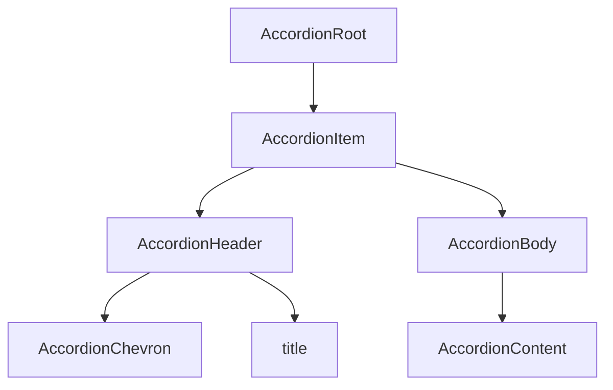

# Accordion Design Spec

## IDS baseline (layout, flow, contracts)

Powerflex **Accordion** is an **ids-fork** of the IDS **Accordion** family. Contiguous item grouping, expand/collapse behavior, chevron placement, form variant, runtime API, accessibility, and asset slug **inherit IDS** unless listed in **Powerflex programme deltas** below.

- **IDS source of truth:** [`components/ids/accordion/design-spec.md`](../../ids/accordion/design-spec.md)
- **Shared implementation:** `storybook/src/components/IdsAccordion.tsx`, `IdsAccordion.module.css`
- **Programme theme:** `components/powerflex-theme.css` (`[data-design-system="powerflex"]`)
- **Runtime contract mirror:** `storybook/src/spec-contracts/ids-accordion.contract.tsx`

**Figma scope (this intake):** IDS Design Library file `0bHk3XhrjFhowgFkz9yLr4` — Main `Accordion-Main` `10962:89111`, Elements `.Accordion-Element-Left` `10962:89124`, `.Accordion-Element-Right` `10962:89134`. States bucket was empty; Expanded/Collapsed × Default/Hover matrices come from the Elements component sets.

## Metadata

| Property | Value |
|---|---|
| Component | Accordion |
| Design system | Powerflex |
| Category | Form |
| Spec pattern | **ids-fork** |
| IDS baseline slug | `accordion` |
| Status | **draft** |
| Version | 1.0.0 |
| Theme CSS | `components/powerflex-theme.css` |
| File key | `0bHk3XhrjFhowgFkz9yLr4` |
| Main (`Accordion-Main`) | https://www.figma.com/design/0bHk3XhrjFhowgFkz9yLr4/IDS-Design-Library?node-id=10962-89111&m=dev — **`10962:89111`** |
| Elements Left | https://www.figma.com/design/0bHk3XhrjFhowgFkz9yLr4/IDS-Design-Library?node-id=10962-89124&m=dev — **`10962:89124`** |
| Elements Right | https://www.figma.com/design/0bHk3XhrjFhowgFkz9yLr4/IDS-Design-Library?node-id=10962-89134&m=dev — **`10962:89134`** |
| Chevron-left sample | `10962:89112` (`Arrow in the Left=Yes, Arrow in the Right=No`) |
| Chevron-right sample | `10962:89118` (`Arrow in the Left=No, Arrow in the Right=Yes`) |
| Verification method | **Figma REST API** (collab server-packaged evidence) — session `oYPFSu4xlT5LGyvVSy2mwuKIamIkT8RP`, 2026-07-27. Client used packaged `tools.get_metadata`, `tools.get_design_context`, `tools.get_variable_defs`, `tools.get_screenshot`, `slotGeometry` only (no client Figma MCP). |
| Storybook | `storybook-generated/powerflex/src/components/Accordion.stories.tsx` — title **`Spec Generated/Powerflex/Accordion`**, story **`Spec Accurate Design`** |
| Deterministic generator | `generation/deterministic_storybook/ids/accordion.py` (registry `("powerflex", "accordion")`) |

### Live verification evidence

| Check | Node(s) | Method | Status |
|---|---|---|---|
| Main component set + screenshot | `10962:89111` | Packaged REST `get_screenshot` + `get_metadata` | **verified (packaged)** |
| Design context (layout/colors/anatomy) | `10962:89111`, `10962:89124`, `10962:89134` | Packaged REST `get_design_context` | **verified (packaged)** |
| Elements Left state matrix | Expanded/Collapsed × Default/Hover | Packaged REST `get_metadata` variants on `10962:89124` | **verified (packaged)** |
| Elements Right state matrix | Expanded/Collapsed × Default/Hover | Packaged REST `get_metadata` variants on `10962:89134` | **verified (packaged)** |
| Slot geometry / radius | Header `10962:89126`, rail `16088:129773`, content card `16122:256765`, sets `10962:89111` / `10962:89124` / `10962:89134` | Packaged `slotGeometry` + `get_design_context`. Packaged `get_variable_defs` returned **empty** bullets — radius/padding cited from slotGeometry + bound VariableIDs | **verified with REST limitation noted** |

### Powerflex programme deltas (vs IDS)

| Topic | IDS | Powerflex |
|---|---|---|
| Trigger height | 40px | **Same** — header/collapsed row **40px** (`10962:89126`, `10962:89131`) |
| Trigger padding | IDS prose `12px 16px` | **Design Library verified:** `10px 16px` (Top/Bottom **10**, L/R **16**) on header Panel — use `var(--padding-padding-10)` when present + `var(--padding-padding-16)`; do not invent a different vertical rhythm |
| Contiguous rows | 1px overlap | **Same** — Main variants `itemSpacing=-1` VERTICAL (`10962:89112`, `10962:89118`) |
| 4px left highlighter | `var(--color-border-brand-base)` | **Same token**; packaged rail fill `#0672cb` on `Rectangle 1` (`16088:129773`) |
| Expanded body padding (chevron left) | `8px 24px 16px 40px` | **Same** — Accordion Content `Top=8 Right=24 Bottom=16 Left=40` (`10962:89129` via design context) |
| Expanded body padding (chevron right) | left inset reduced | **Verified:** Accordion Content `Left=16` (not 40) when chevron is trailing (`10962:89134` design context) |
| Optional content card | brand-lighter + brand-dark L/R/B | **Same** — `.SwapContent` padding **24**; fill `#ebf4fb`; stroke `#055fa9` |
| Chevron slug | `chev-down-thick` (rotate 180° when open; Figma also shows `chev-up-thick` on expanded) | **Same** runtime slug `chev-down-thick` via shared Icon; expanded = CSS rotate |
| Theme scope | `components/ids-theme.css` | **`components/powerflex-theme.css`** / `[data-design-system="powerflex"]` |
| Runtime API | IDS contract | **Same** (inherit IDS) |

### Spec Accurate Design story defaults

| Prop | Value |
|---|---|
| `items` | Three panels titled `Panel` (Figma sample label); first expanded content includes optional inner content-card treatment |
| `multiple` | `false` |
| `defaultValue` | `["panel-1"]` |
| `chevronPosition` | `"left"` |
| `variant` | `"default"` |

## Anatomy

**Explicit inventory count (Main chevron-left sample `10962:89112`):** AccordionRoot + AccordionItems slot + **5** × AccordionItem (each: AccordionHeader/Panel text + AccordionChevron) = **1 + 1 + 5×(header+chevron+title)** locked to Figma. Expanded Elements add AccordionBody (`Accordion Content`) + optional content card (`.SwapContent`) + **4px** `Rectangle 1` rail — not present on collapsed Main instances.

Deterministic render order (locked to Figma + IDS):

1. **`AccordionRoot`** — component set / list container
2. **`AccordionItem`** — repeated row (contiguous)
3. **`AccordionHeader`** — interactive trigger surface (title + chevron); single public header slot
4. **`AccordionChevron`** — leading (`left`) or trailing (`right`); slug `chev-down-thick`
5. **`AccordionBody`** — expanded region only (`Accordion Content` slot)
6. **`AccordionContent`** — consumer content / optional content card
7. Optional **`AccordionMetaSlot`**, **`AccordionFormSlot`** (IDS form variant — inherit)



## Layout & Measurements

| Region | Figma evidence | Runtime |
|---|---|---|
| Component set board | `Accordion-Main` **538×488**; cornerRadius **5**; stroke `#9747ff` | Docs board only — **not** runtime chrome |
| List / Main variant | **480×196**; VERTICAL `itemSpacing=-1` | `width: 100%`; contiguous rows (1px overlap / no gap) |
| Header / collapsed row | **480×40**; padding **16 / 16 / 10 / 10**; Left gap **8**; Right gap sample **353** (space-between) | Height **40px**; padding `10px 16px`; `box-sizing: border-box` |
| Chevron | **16×16** `chev-down-thick` / `chev-up-thick` | Fixed; rotate **180deg** when expanded |
| Accordion Content (left) | padding **40 / 24 / 8 / 16** (L/R/T/B) | `padding: 8px 24px 16px 40px` via spacing tokens |
| Accordion Content (right) | padding **16 / 24 / 8 / 16** | `padding: 8px 24px 16px 16px` when `chevronPosition=right` |
| Content card `.SwapContent` | **416×153** (left) / **440×153** (right); padding **24** | Optional inner card; `border-top: none` |
| Left rail `Rectangle 1` | **4×~216** | Continuous **4px** `var(--color-border-brand-base)` on open header+body |

### Slot geometry (Figma-verified)

| Slot / layer | Property | Token / contract | Figma node | Live evidence |
| --- | --- | --- | --- | --- |
| `Accordion-Main` (docs set) | `border-radius` | **5px** docs-only (not runtime shell) | `10962:89111` | Packaged REST `slotGeometry.borderRadius=5` + `get_design_context` `cornerRadius=5.0` |
| `.Accordion-Element-Left` (docs set) | `border-radius` | **5px** docs-only | `10962:89124` | Packaged REST `slotGeometry.borderRadius=5` |
| `.Accordion-Element-Right` (docs set) | `border-radius` | **5px** docs-only | `10962:89134` | Packaged REST `slotGeometry.borderRadius=5` |
| `AccordionHeader` / Panel frame | size | **480×40** | `10962:89126` | Packaged REST `slotGeometry` + `get_metadata` |
| `AccordionHeader` / Panel frame | padding | **16 / 16 / 10 / 10** → `var(--padding-padding-16)` + `var(--padding-padding-10)` | `10962:89126` | Packaged REST `slotGeometry.padding` + bound VariableIDs `…/46922:293`, `…/46922:290` |
| `AccordionHeader` / Panel frame | `border-radius` | **0px / square** (no radius on interactive shell) | `10962:89126` | Packaged REST `slotGeometry` omits `borderRadius` on Panel; stroke-only chrome. Packaged `get_variable_defs` empty |
| `AccordionHeader` gap (left) | `itemSpacing` | **8** → `var(--spacing-space-8)` | `10962:89126` | Packaged REST `slotGeometry.itemSpacing=8` |
| `AccordionChevron` | size | **16×16** | `10962:89127` / `I10962:89113;10962:89132` | Packaged REST `get_metadata` |
| Left brand rail | width | **4px** → `var(--color-border-brand-base)` fill | `16088:129773` | Packaged REST `slotGeometry` 4×216 + design context fill `#0672cb`; bound VariableID `…/47290:25` |
| `.SwapContent` content card | padding | **24** → `var(--padding-padding-24)` | `16122:256765` | Packaged REST `slotGeometry.padding` all sides 24 |
| `.SwapContent` content card | `border-radius` | **0px / square** unless theme alias added later | `16122:256765` | Packaged REST `slotGeometry` — no `borderRadius`; stroke brand-dark L/R/B only per IDS |
| Accordion Content (left) | padding | **8 / 24 / 16 / 40** | `10962:89129` | Packaged REST `get_design_context` layout bullets |
| Accordion Content (right) | padding | **8 / 24 / 16 / 16** | Right element Accordion Content | Packaged REST `get_design_context` on `10962:89134` |
| Contiguous list | vertical gap | **-1** overlap | `10962:89112`, `10962:89118` | Packaged REST `slotGeometry.itemSpacing=-1` |

**Geometry authoring rules (mandatory):**
- Document **each** interactive shell separately: header row, body, content card, brand rail.
- Radius rows cite packaged REST `slotGeometry` / `get_design_context` on the node. Packaged `get_variable_defs` was empty — re-verify with live MCP when available.
- Theme aliases document **implementation wiring** after Figma numeric evidence.

## Tokens

Resolved light hex from packaged `get_design_context` colors (evidence only). Semantic `var(--...)` are codegen contracts via `components/powerflex-theme.css`.

### Colors and surfaces

| Use | Token | Light resolved (packaged) |
|---|---|---|
| Collapsed / component surface | `var(--color-background-component)` | `#ffffff` |
| Expanded header / hover collapsed | `var(--color-background-brand-lighter)` | `#ebf4fb` |
| Expanded header hover (when distinct) | `var(--color-background-brand-light)` | inherit IDS; packaged Expanded Hover header uses brand-lighter panel fill `#ebf4fb` |
| Content card fill | `var(--color-background-brand-lighter)` | `#ebf4fb` |
| Row / item border | `var(--color-border-accessible)` | `#757575` |
| Brand rail | `var(--color-border-brand-base)` | `#0672cb` |
| Content card stroke (L/R/B) | `var(--color-border-brand-dark)` | `#055fa9` |
| Title text | `var(--color-text-neutral-strong)` | `#252525` |
| Body / meta text | `var(--color-text-neutral)` | `#252525` / `#4d4d4d` samples |
| Link in content | `var(--color-text-link-brand-base)` | `#055fa9` |
| Chevron default | `var(--color-icon-neutral)` | `#757575` / `#4d4d4d` |
| Chevron hover / strong | `var(--color-icon-neutral-strong)` | `#252525` |

### Typography

| Slot | Style / tokens | Evidence |
|---|---|---|
| Header title `Panel` | Roboto **14 / 20 / 400** → `var(--font-size-body-2)` / `var(--font-line-height-line-height-20)` / `var(--font-weight-font-weight-regular)` | Packaged typography on Main + Elements |

### Spacing / borders

| Use | Token |
|---|---|
| Header horizontal padding | `var(--padding-padding-16)` |
| Header vertical padding | `var(--padding-padding-10)` (Design Library verified **10**; delta vs IDS prose 12) |
| Header chevron gap (left) | `var(--spacing-space-8)` |
| Content card padding | `var(--padding-padding-24)` |
| Body padding left (chevron left) | `var(--padding-padding-40)` or `calc(var(--padding-padding-32) + var(--padding-padding-8))` |
| Item stroke width | `var(--border-width-border-1)` |
| Focus ring width | `var(--border-width-border-2)` + `var(--color-border-brand-base)` |

### Assets

| Slug | File | Notes |
|---|---|---|
| `chev-down-thick` | `assets/icons/chev-down-thick.svg` | Canonical chevron; rotate 180° when expanded. Prefer shared `Icon` primitive. |

## States (Light Theme)

| Slot | State | Background | Border | Text/Icon |
|---|---|---|---|---|
| trigger | default (collapsed) | `var(--color-background-component)` | item divider `var(--color-border-accessible)` | title `var(--color-text-neutral-strong)`, chevron `var(--color-icon-neutral)` |
| trigger | hover (collapsed) | `var(--color-background-brand-lighter)` | unchanged divider | title `var(--color-text-neutral-strong)`, chevron `var(--color-icon-neutral-strong)` |
| trigger | expanded (open) | `var(--color-background-brand-lighter)` | left **4px** brand strip; no trigger-only bottom border seam | title `var(--color-text-neutral-strong)`, chevron `var(--color-icon-neutral)` (rotated) |
| trigger | hover (expanded) | `var(--color-background-brand-light)` or packaged brand-lighter panel | same expanded chrome | chevron `var(--color-icon-neutral-strong)` |
| trigger | focus-visible | same as current open/closed | outer focus ring `var(--border-width-border-2)` `var(--color-border-brand-base)` | unchanged |
| trigger | disabled | same as base | unchanged | reduced emphasis + non-interactive |
| panel/content | expanded | `var(--color-background-component)` | perimeter `var(--color-border-accessible)`; left **4px** brand strip; **no** `border-top` on body wrapper | body `var(--color-text-neutral)`, link `var(--color-text-link-brand-base)` |
| content-card | expanded (optional) | `var(--color-background-brand-lighter)` | L/R/B `var(--color-border-brand-dark)`; **no** top stroke | heading/body per content |

Element-set evidence (Left `10962:89124` / Right `10962:89134`):

| Panel Type | State | Node (Left) | Packaged header fill |
|---|---|---|---|
| Expanded | Default | `10962:89125` | header `#ebf4fb` |
| Expanded | Hover | `16088:129765` | header hover chrome |
| Collapsed | Default | `10962:89131` | `#ffffff` |
| Collapsed | Hover | `16088:129730` | `#ebf4fb` |

## States (Dark Theme)

Dark theme uses the same semantic tokens as **States (Light Theme)**. Resolved values for `[data-theme="dark"]` / programme dark scope live in theme CSS:

- `components/powerflex-theme.css`

Duplicate the full state matrix in this section only when a dark row genuinely uses different `var(--...)` references than the corresponding light row.

*(When Light and Dark tables would list identical `var(--...)` cells, keep the matrix under **States (Light Theme)** only and use this pointer section instead of a second table.)*

## Interactions

| Trigger | Behavior |
|---|---|
| Pointer click / Enter / Space on header | Toggle item expanded |
| `multiple=false` | Opening one item closes the previously open item |
| `multiple=true` | Items toggle independently |
| Disabled item | Non-interactive; skip in keyboard roving |
| Chevron | Rotates **180deg** when expanded (left or right position) |
| ArrowUp / ArrowDown | Roving focus between triggers |
| Home / End | First / last trigger |
| Focus-visible | Brand focus ring; must not clip |

Forced `data-state` / Storybook visual overrides are **demo/QA only** and must not block runtime interaction.

### Accessibility

- Focusable header control: `aria-expanded`, `aria-controls`
- Panel: `role="region"`, `aria-labelledby`
- Keyboard: Enter, Space, ArrowUp, ArrowDown, Home, End

## Composition & API (runtime)

### IDS inheritance resolution

Codegen **MUST** resolve props from IDS **Composition & API** / `storybook/src/spec-contracts/ids-accordion.contract.tsx`.

### Runtime API

| Input | Type | Default | Description |
|---|---|---|---|
| `items` | `AccordionItemInput[]` | (required) | Ordered panels |
| `multiple` | `boolean` | `false` | Multi-expand mode |
| `defaultValue` | `string[]` | — | Initially open item values |
| `chevronPosition` | `"left" \| "right"` | `"left"` | Chevron placement axis from Main variants |
| `variant` | `"default" \| "form"` | `"default"` | Form enables `formSlot` |

Per-item: `value` (required), `title` (required), `content` (required), `disabled?`, `meta?`, `formSlot?`.

| Output | Payload |
|---|---|
| `onValueChange?` | `openValues: string[]` |

### Powerflex-only runtime flags

None.

### Spec Accurate Design story defaults

See Metadata — `chevronPosition: "left"`, `multiple: false`, `defaultValue: ["panel-1"]`, `variant: "default"`.

## Codegen Contract (Framework-Agnostic Blueprint)

### IDS baseline resolution

Generators **MUST** load and merge the IDS baseline contract from [`components/ids/accordion/design-spec.md`](../../ids/accordion/design-spec.md) before applying Powerflex deltas (trigger vertical padding **10**, theme CSS path, right-chevron body left padding **16**).

### Deterministic structure

```
AccordionRoot
  └─ AccordionItem[] (contiguous)
       ├─ AccordionHeader (trigger surface)
       │    ├─ AccordionChevron? (left)
       │    ├─ title
       │    └─ AccordionChevron? (right)
       └─ AccordionBody (when expanded)
            ├─ AccordionContent (+ optional content card)
            ├─ AccordionMetaSlot?
            └─ AccordionFormSlot?
```

### Variant matrix

| Axis | Values | Evidence |
|---|---|---|
| `chevronPosition` | `left` \| `right` | Main variants `10962:89112` / `10962:89118` |
| `variant` | `default` \| `form` | IDS inherit |
| expand behavior | `single` \| `multiple` | Runtime (`multiple` prop) |
| item Panel Type | `Collapsed` \| `Expanded` | Elements sets |
| item State | `Default` \| `Hover` (+ focus-visible, disabled runtime) | Elements sets |

### Per-slot style contract

| Slot | Style contract |
|---|---|
| `AccordionRoot` | `width: 100%`; no docs purple stroke |
| `AccordionItem` | Contiguous borders; `-1` overlap model |
| `AccordionHeader` | 40px; padding 10×16; state fills from **States (Light Theme)** |
| `AccordionChevron` | 16×16; slug `chev-down-thick`; token colors from states |
| Open header + body | Continuous **4px** left rail `var(--color-border-brand-base)`; **no** body `border-top` |
| Content card | `var(--color-background-brand-lighter)`; L/R/B `var(--color-border-brand-dark)` |

### Behavior contract

- Inherit IDS single/multi toggle, disabled blocking, chevron rotation, border continuity.
- Unknown `chevronPosition` → `"left"`; unknown `variant` → `"default"`.
- Missing/duplicate `value` → validation error.

### Accessibility contract

Inherit IDS roles/ARIA/keyboard model.

### Asset resolution + bundling contract

Slug `chev-down-thick` → `assets/icons/chev-down-thick.svg` via Icon primitive when available.

### Fallback/error rules

Inherit IDS fallbacks; theme must be `components/powerflex-theme.css` for Powerflex targets.

### Validation checklist

- [x] IDS contract referenced; programme deltas table complete
- [x] **Slot geometry (Figma-verified)** table complete (docs radius + interactive shells)
- [x] Packaged REST evidence on Main + both Elements URLs (States bucket empty — element sets cover state matrix)
- [x] Semantic `var(--...)` only in codegen guidance
- [x] Runtime API inherits IDS; Storybook Spec Accurate Design uses Powerflex theme import
- [ ] Live MCP `get_variable_defs` re-check when client Figma available (packaged defs empty)
- [ ] Spec Accurate Design under Spec Generated/Powerflex/Accordion

## Source Mapping

| Source | Location |
|---|---|
| IDS baseline | `components/ids/accordion/design-spec.md` |
| Theme CSS | `components/powerflex-theme.css` |
| Root spec | `components/powerflex/root-spec.md` |
| Component map | `data/powerflex-component-figma-map.json` → Accordion |
| Registry | `data/programme-inheritance-registry.json` → powerflex / accordion |
| Main | `0bHk3XhrjFhowgFkz9yLr4` / `10962:89111` |
| Elements | `10962:89124`, `10962:89134` |
| Verification | Figma REST API (packaged collab evidence), session `oYPFSu4xlT5LGyvVSy2mwuKIamIkT8RP`, 2026-07-27 |
| Shared implementation | `storybook/src/components/IdsAccordion.tsx` |
| Storybook | `storybook-generated/powerflex/src/components/Accordion.stories.tsx` |
| Screenshots (packaged) | Main `10962:89111` → S3 image URL in session evidence `tools.get_screenshot` |
