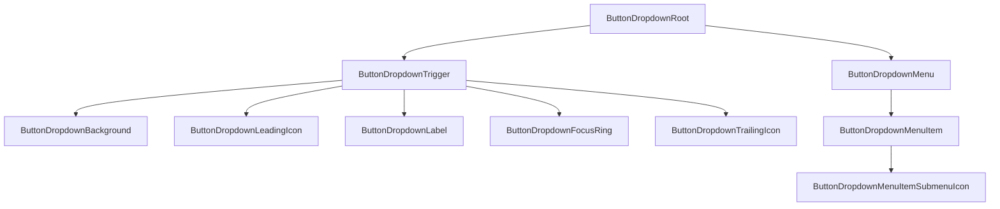

# Button-Dropdown Design Spec

## Metadata

| Property | Value |
|---|---|
| Component | Button-Dropdown |
| Design system | Powerflex |
| Category | Form |
| Spec pattern | **standalone** |
| Status | **draft** |
| Version | 1.0.0 |
| Theme CSS | `components/powerflex-theme.css` |
| Spec path | `components/powerflex/button-dropdown/design-spec.md` |
| Figma file key | `82bDP05ESsiiGe38p5TEQJ` |
| Main component set | `button-dropdown-icon` **`2591:1696`** |
| Figma URL | https://www.figma.com/design/82bDP05ESsiiGe38p5TEQJ/PowerFlex-MCP-Design-System?node-id=2591-1696&m=dev |
| Elements / States URLs | _(none collected — variant matrix lives on Main component set)_ |
| Verification method | **Figma REST API** (collab server-packaged evidence) — session `yT-UahwkDDffyvkwLfjlOOp7VenSN5pk`, 2026-07-27. Client used packaged `tools.get_metadata`, `tools.get_design_context`, `tools.get_variable_defs`, `tools.get_screenshot`, `slotGeometry` only (no client Figma MCP). |
| Storybook | `storybook-generated/powerflex/src/components/ButtonDropdown.stories.tsx` — title **`Spec Generated/Powerflex/Button-Dropdown`**, story **`Spec Accurate Design`** |
| Deterministic generator | `generation/deterministic_storybook/powerflex/button_dropdown.py` (registry `("powerflex", "button-dropdown")`) |
| Runtime | `storybook/src/components/ButtonDropdown.tsx` |

### Live verification evidence

| Check | Node(s) | Method | Status |
|---|---|---|---|
| Main component set + screenshot | `2591:1696` | Packaged REST `get_screenshot` + `get_metadata` | **verified (packaged)** |
| Design context (layout/colors/anatomy/typography) | `2591:1696` | Packaged REST `get_design_context` | **verified (packaged)** |
| Variant axes (Variant × Size × State) | 12 children returned; `childrenTruncated: 15` → **27** expected | Packaged REST `get_metadata` + anatomy fragment | **verified with truncation noted** |
| Slot geometry / radius | Trigger `button-icon` `2591:1698`, background `I2591:1698;2540:2019`, focus-ring `I2591:1698;2540:2021`, menu `2591:1701` | Packaged `slotGeometry` + bound VariableIDs. Packaged `get_variable_defs` returned **empty** bullets — radius/padding cited from `slotGeometry` + design-context cornerRadius | **verified with REST limitation noted** |

### Spec Accurate Design story defaults

| Prop | Value |
|---|---|
| `label` | `"button"` (Figma TEXT sample) |
| `variant` | `"primary"` |
| `size` | `"lg"` |
| `open` | `true` (shows Figma `State=open` + dropdown menu sample) |
| `disabled` | `false` |
| `leadingIconSlug` | `"settings-gear-detailed"` |
| `trailingIconSlug` | `"arrow-tri-down-solid"` |
| `items` | Two actions labeled `"Action"` (Figma menu-item sample), second with `hasSubmenu: true` |

## Anatomy

**Explicit inventory count (primary / lg / default `2591:1697`):** 1 root variant + `button-icon` shell + `background` + `icon-leading` + leading `icon` + `label` + `focus-ring` + `icon-trailing` + `arrow-tri-down-solid` = **9** visible layers (vectors under icons truncated in metadata).

**Open inventory add-on (`2591:1699`):** + `dropdown-menu` + `items` slot + **2** × `dropdown-menu-item` (each: `background` + `label` + optional `icon-toggle` / `arrow-tri-right-solid`).

Deterministic render order (locked to Figma):

1. **`ButtonDropdownRoot`** — positioning wrapper (closed: trigger only; open: VERTICAL stack `itemSpacing=1`)
2. **`ButtonDropdownTrigger`** — `button-icon` interactive control
3. **`ButtonDropdownBackground`** — fill rectangle inside trigger
4. **`ButtonDropdownLeadingIcon`** — optional `icon-leading` / `icon` (present on all Main variants in this set)
5. **`ButtonDropdownLabel`** — TEXT (`button`)
6. **`ButtonDropdownFocusRing`** — outer focus frame (visible on `focus-visible`)
7. **`ButtonDropdownTrailingIcon`** — `icon-trailing` / `arrow-tri-down-solid`
8. **`ButtonDropdownMenu`** — `dropdown-menu` (only when `open`)
9. **`ButtonDropdownMenuItem`** — repeated `dropdown-menu-item` rows
10. Optional **`ButtonDropdownMenuItemSubmenuIcon`** — `icon-toggle` / `arrow-tri-right-solid`



## Layout & Measurements

| Region | Figma evidence | Runtime |
|---|---|---|
| Docs component set | `button-dropdown-icon` **1435×500**; cornerRadius **5**; stroke `#8a38f5` | Docs board only — **not** runtime chrome |
| Trigger (`button-icon`) | WIDTH sample **113** (content-driven); HORIZONTAL; padding L/R **16**; gap **8**; cornerRadius **2** | `width: fit-content`; `box-sizing: border-box`; padding `0 var(--padding-padding-16)`; gap `var(--spacing-space-8)` |
| Size `lg` | height **40** (`2591:1697`) | height `40px` |
| Size `md` | height **32** (`2591:1704`) | height `32px` |
| Size `sm` | height **24** (`2591:1711`) | height `24px` |
| Leading icon | **16×16** | Fixed `16×16` |
| Trailing caret | **8×~4.25** `arrow-tri-down-solid` | Slug `arrow-tri-down-solid`; keep intrinsic aspect |
| Focus ring | `lg` **117×44** (≈ trigger + **2px** each side); `md` **117×36**; `sm` **117×28**; cornerRadius **4** | Offset `var(--button-focus-ring-offset)`; radius `var(--button-focus-ring-radius)` |
| Open stack | VERTICAL `itemSpacing=1` between trigger and menu | `1px` gap (`var(--spacing-space-minus-1)` absolute value **1**) |
| Menu | sample **77×72**; padding **2 / 2 / 4 / 4**; VERTICAL | `min-width: max(trigger, content)`; padding `var(--padding-padding-4) var(--padding-padding-2)` |
| Menu item | **73×32**; padding L/R **16**; gap **8** | height `32px`; padding `0 var(--padding-padding-16)`; gap `var(--spacing-space-8)` |
| Label typography | Roboto **14 / 20**, weight **500** (trigger), **400** (menu “Action”) | `var(--font-size-body-2)` / `var(--font-line-height-line-height-20)`; trigger weight **500**; menu item weight **400** |

### Slot geometry (Figma-verified)

| Slot / layer | Property | Token / contract | Figma node | Live evidence |
| --- | --- | --- | --- | --- |
| `button-dropdown-icon` (docs set) | `border-radius` | **5px** docs-only (not runtime shell) | `2591:1696` | Packaged REST `slotGeometry.borderRadius=5` + design-context `cornerRadius=5.0` |
| `ButtonDropdownTrigger` / `button-icon` | `border-radius` | `var(--button-control-radius)` → **2px** | `2591:1698` | Packaged REST `slotGeometry.borderRadius=2` + bound VariableIDs `2454:2` / `2454:3` / `2521:3`. Packaged `get_variable_defs` empty |
| `ButtonDropdownBackground` | `border-radius` | `var(--button-control-radius)` → **2px** | `I2591:1698;2540:2019` | Packaged REST `slotGeometry.borderRadius=2` + bound `VariableID:2453:26` |
| `ButtonDropdownFocusRing` | `border-radius` | `var(--button-focus-ring-radius)` → **4px** | `I2591:1698;2540:2021` | Packaged REST `slotGeometry.borderRadius=4` + bound `VariableID:2453:30` |
| `ButtonDropdownTrigger` | padding L/R | `var(--padding-padding-16)` | `2591:1698` | Packaged REST `slotGeometry.padding Left/Right=16` |
| `ButtonDropdownTrigger` | `itemSpacing` | `var(--spacing-space-8)` | `2591:1698` | Packaged REST `slotGeometry.itemSpacing=8` HORIZONTAL |
| `ButtonDropdownMenu` | padding | `var(--padding-padding-4)` vertical / `var(--padding-padding-2)` horizontal | `2591:1701` | Packaged REST `slotGeometry.padding Top/Bottom=4, Left/Right=2` + bound VariableIDs `2521:5` / `2521:6` / `2453:4` / `2453:7` / `2451:133` |
| `ButtonDropdownMenu` | `border-radius` | `var(--dropdown-menu-radius)` → **0px / square** | `2591:1701` | Packaged REST `slotGeometry` omits `borderRadius` on menu; treat as square. Packaged `get_variable_defs` empty |
| `ButtonDropdownMenuItem` | height / padding | **32px**; L/R `var(--padding-padding-16)` | `I2591:1701;2557:1870` | Packaged REST `slotGeometry` 73×32 + padding 16 |

**Geometry authoring rules:** radius rows cite packaged `slotGeometry` / design-context on the listed nodes. Theme aliases (`--button-control-radius`, `--button-focus-ring-radius`, `--dropdown-menu-radius`) are implementation wiring after Figma values are verified.

## Tokens

Semantic `var(--...)` only for codegen. Figma REST color bullets resolve slightly differently from current Powerflex/IDS donor hex (e.g. primary fill `#0076ce` vs theme `#0672cb`) — **tokens remain authoritative**; hex is evidence only.

### Layout aliases

| Alias | Powerflex / IDS resolution |
|---|---|
| `--button-control-radius` | `var(--corner-radius-radius-2)` (2px) |
| `--button-focus-ring-radius` | `var(--corner-radius-radius-4)` (4px) |
| `--button-focus-ring-offset` | `3px` |
| `--dropdown-menu-radius` | `var(--corner-radius-radius-none)` (0px) |

### Colors

| Role | Token | Figma evidence (light sample) |
|---|---|---|
| Primary fill (default) | `var(--color-background-controls-brand-base)` | `#0076ce` on `background` |
| Primary fill (open) | `var(--color-background-controls-brand-stronger)` | `#00447c` on open `background` |
| Primary text/icon | `var(--color-text-white)` / `var(--color-icon-white)` | `#ffffff` |
| Secondary/tertiary border / text | `var(--color-border-brand-base)` / `var(--color-text-brand-strong)` / `var(--color-icon-brand-base)` | stroke/text `#0076ce`; open tertiary text `#00447c` |
| Secondary/tertiary open fill | `var(--color-background-controls-brand-light)` | `#d2e7f8` |
| Disabled fill | `var(--color-background-gray-lighter)` | `#eeeeee` |
| Disabled text/icon/border | `var(--color-text-disabled)` / `var(--color-icon-disabled)` / `var(--color-border-disabled)` | `#bbbbbb` |
| Focus ring stroke | `var(--color-border-brand-base)` | `#0076ce` |
| Menu surface | `var(--color-background-white)` | `#ffffff` |
| Menu border | `var(--color-border-lighter)` | `#e4e4e4` |
| Menu item text/icon | `var(--color-text-neutral-strong)` / `var(--color-icon-brand-strong)` mapped to neutral | `#333333` |
| Transparent control border (primary) | `var(--color-border-transparent-brand)` | primary default has no visible stroke in samples |

### Typography / spacing / borders

- Font size / line-height: `var(--font-size-body-2)` / `var(--font-line-height-line-height-20)`
- Border width: `var(--border-width-border-1)`
- Spacing: `var(--spacing-space-8)`, `var(--padding-padding-16)`, `var(--padding-padding-4)`, `var(--padding-padding-2)`
- Shadows: **none** observed in packaged evidence — omit elevation tokens

## States (Light Theme)

Figma component-set axis **`State`** = `default | open | disabled`. Document `focus-visible` as keyboard modality overlay (focus-ring layer present on trigger instances).

| Variant | State | Background | Border | Text/Icon |
|---|---|---|---|---|
| primary | default | `var(--color-background-controls-brand-base)` | `var(--color-border-transparent-brand)` | `var(--color-text-white)` / `var(--color-icon-white)` |
| primary | open | `var(--color-background-controls-brand-stronger)` | `var(--color-border-transparent-brand)` | `var(--color-text-white)` / `var(--color-icon-white)` |
| primary | disabled | `var(--color-background-gray-lighter)` | `var(--color-border-disabled)` | `var(--color-text-disabled)` / `var(--color-icon-disabled)` |
| primary | focus-visible | same as current non-disabled base (`default` or `open`) | unchanged + outer `var(--color-border-brand-base)` focus ring | unchanged |
| secondary | default | transparent | `var(--color-border-brand-base)` | `var(--color-text-brand-strong)` / `var(--color-icon-brand-base)` |
| secondary | open | `var(--color-background-controls-brand-light)` | `var(--color-border-brand-base)` | `var(--color-text-brand-strong)` / `var(--color-icon-brand-base)` |
| secondary | disabled | transparent | `var(--color-border-disabled)` | `var(--color-text-disabled)` / `var(--color-icon-disabled)` |
| secondary | focus-visible | same as current non-disabled base | brand border + outer brand focus ring | unchanged |
| tertiary | default | transparent | transparent | `var(--color-text-brand-strong)` / `var(--color-icon-brand-base)` |
| tertiary | open | `var(--color-background-controls-brand-light)` | `var(--color-border-brand-base)` | `var(--color-text-brand-strong)` / `var(--color-icon-brand-stronger)` |
| tertiary | disabled | transparent | transparent | `var(--color-text-disabled)` / `var(--color-icon-disabled)` |
| tertiary | focus-visible | same as current non-disabled base | by-state border + outer brand focus ring | unchanged |

**Menu (when `open`):** surface `var(--color-background-white)`; border `var(--color-border-lighter)`; item text `var(--color-text-neutral-strong)`; item background default transparent / `var(--color-background-white)` (bound `VariableID:2557:1002` on item background).

## States (Dark Theme)

Dark theme uses the same semantic tokens as **States (Light Theme)**. Resolved values for `[data-theme="dark"]` / programme dark scope live in theme CSS:

- `components/powerflex-theme.css`

Duplicate the full state matrix in this section only when a dark row genuinely uses different `var(--...)` references than the corresponding light row.

*(When Light and Dark tables would list identical `var(--...)` cells, keep the matrix under **States (Light Theme)** only and use this pointer section instead of a second table.)*

## Interactions

| Trigger | Behavior |
|---|---|
| Pointer click / `Enter` / `Space` on trigger | Toggle `open` (controlled or uncontrolled). Disabled blocks toggle. |
| Pointer click outside / `Escape` | Close menu (`open → false`). |
| Pointer click / `Enter` / `Space` on menu item | Emit `onSelect(item)`; close menu unless item declares `keepOpen`. |
| Hover | No dedicated Figma `State=hover` on this set — do not invent hover chrome beyond optional product-level feedback that stays within documented tokens. |
| Focus-visible | Show `ButtonDropdownFocusRing` (brand stroke, radius `var(--button-focus-ring-radius)`, offset `var(--button-focus-ring-offset)`). |
| Disabled | `aria-disabled` / native `disabled`; no open, no select events. |

### Accessibility

- Trigger: native `button` with `aria-haspopup="menu"` and `aria-expanded={open}`.
- Menu: `role="menu"`; items `role="menuitem"`.
- Keyboard: `ArrowDown`/`ArrowUp` move among items when open; `Home`/`End` jump; `Escape` closes; focus returns to trigger on close.
- Leading/trailing icons are decorative when `label` is present (`aria-hidden`); icon-only requires `ariaLabel`.

### Behavior & guidelines

- Runtime default is interactive (`open` starts `false` unless controlled).
- `data-state` / `forceOpen` are Storybook/QA overrides only and must not replace runtime interaction.
- Trailing caret uses slug `arrow-tri-down-solid`; submenu indicator uses `arrow-tri-right-solid`.
- Do not invent UI beyond Main Figma slots (no extra badges, dividers, or search fields).

## Composition & API (runtime)

### Variants

| Axis | Values | Source |
|---|---|---|
| `variant` | `primary` \| `secondary` \| `tertiary` | Component-set property **Variant** |
| `size` | `lg` \| `md` \| `sm` | Component-set property **Size** |
| `open` / State | `default` (closed) \| `open` \| `disabled` | Component-set property **State** (+ runtime `disabled`) |

Verified node ids (packaged metadata children):

| Variant | Size | State | Node |
|---|---|---|---|
| primary | lg | default | `2591:1697` |
| primary | lg | open | `2591:1699` |
| primary | lg | disabled | `2591:1702` |
| primary | md | default | `2591:1704` |
| primary | md | open | `2591:1706` |
| primary | md | disabled | `2591:1709` |
| primary | sm | default | `2591:1711` |
| primary | sm | open | `2591:1713` |
| primary | sm | disabled | `2591:1716` |
| secondary | lg | default | `2591:1718` |
| secondary | lg | open | `2591:1720` |
| secondary | lg | disabled | `2591:1723` |

Remaining **15** truncated children (secondary md/sm + tertiary × sizes × states) are named in packaged anatomy/layout fragments; treat as same geometry/token contracts as the verified siblings.

### Runtime API

**Inputs**

| Prop | Type | Default | Description |
|---|---|---|---|
| `label` | `string` | — | Trigger label (Figma sample `"button"`) |
| `variant` | `"primary" \| "secondary" \| "tertiary"` | `"primary"` | Visual variant |
| `size` | `"lg" \| "md" \| "sm"` | `"lg"` | Control height axis |
| `open` | `boolean` | uncontrolled `false` | Controlled open state |
| `defaultOpen` | `boolean` | `false` | Uncontrolled initial open |
| `disabled` | `boolean` | `false` | Maps to Figma `State=disabled` |
| `leadingIconSlug` | `string` | — | Optional; resolve `/assets/icons/<slug>.svg` |
| `trailingIconSlug` | `string` | `"arrow-tri-down-solid"` | Caret |
| `items` | `ButtonDropdownItem[]` | `[]` | Menu rows |
| `ariaLabel` | `string` | — | Required when label omitted |
| `dataState` | `"default" \| "open" \| "disabled" \| "focus-visible"` | — | Demo/QA override only |

`ButtonDropdownItem`: `{ id: string; label: string; disabled?: boolean; hasSubmenu?: boolean; keepOpen?: boolean }`

**Outputs**

| Event | Payload |
|---|---|
| `onOpenChange` | `(open: boolean) => void` |
| `onSelect` | `(item: ButtonDropdownItem) => void` |

### Spec Accurate Design story defaults

See Metadata table — primary / lg / open with two `"Action"` items (second `hasSubmenu: true`).

## Codegen Contract (Framework-Agnostic Blueprint)

### Deterministic structure

```
ButtonDropdownRoot
├── ButtonDropdownTrigger
│   ├── ButtonDropdownBackground
│   ├── ButtonDropdownLeadingIcon? (icon-leading > icon)
│   ├── ButtonDropdownLabel?
│   ├── ButtonDropdownFocusRing
│   └── ButtonDropdownTrailingIcon (arrow-tri-down-solid)
└── ButtonDropdownMenu? (when open)
    └── ButtonDropdownMenuItem[] (label + optional submenu caret)
```

### Variant matrix

- `variant` ∈ {primary, secondary, tertiary}
- `size` ∈ {lg, md, sm}
- interactive state ∈ {default, open, disabled, focus-visible}
- leading icon: present | absent (Main set samples always include leading icon; runtime may omit)
- menu items: 0..n; submenu caret when `hasSubmenu`

Valid: any variant × size × (default|open|disabled). `focus-visible` only when not disabled. `open` ignored when `disabled`.

### Per-slot style contract

| Slot | Contract |
|---|---|
| `ButtonDropdownTrigger` | Size height; padding/gap/radius from Layout; colors from States table |
| `ButtonDropdownLeadingIcon` / trailing | Mask icons; color from States Text/Icon column |
| `ButtonDropdownLabel` | Body 2 14/20 weight 500 |
| `ButtonDropdownFocusRing` | Shown on focus-visible; brand stroke; radius alias |
| `ButtonDropdownMenu` | White surface; lighter border; square radius alias; padding from geometry |
| `ButtonDropdownMenuItem` | 32px row; Body 2 weight 400; optional `arrow-tri-right-solid` |

### Behavior contract

- Toggle open on trigger activation; close on outside/`Escape`/select (unless `keepOpen`).
- Disabled blocks all emissions.
- Controlled `open` + `onOpenChange` take precedence over uncontrolled `defaultOpen`.

### Accessibility contract

- Roles/ARIA as in Interactions.
- Keyboard parity required.
- Visible focus-visible treatment required.

### Asset resolution + bundling

| Slug | Path | Usage |
|---|---|---|
| `arrow-tri-down-solid` | `assets/icons/arrow-tri-down-solid.svg` | Trailing caret |
| `arrow-tri-right-solid` | `assets/icons/arrow-tri-right-solid.svg` | Submenu indicator |
| `settings-gear-detailed` | `assets/icons/settings-gear-detailed.svg` | Spec Accurate Design leading demo icon |
| `{leadingIconSlug}` | `assets/icons/{leadingIconSlug}.svg` | Consumer leading icon |

Unknown slug → hide that icon slot; keep label/menu.

### Fallback / error rules

- Unknown `variant` → `primary`
- Unknown `size` → `lg`
- Missing `items` → render empty menu when open
- Missing `label` and missing `ariaLabel` → validation error
- `disabled=true` → force closed; ignore open attempts

### Validation checklist

- [x] Spec pattern standalone; no IDS baseline section
- [x] All required `##` sections present
- [x] **Slot geometry (Figma-verified)** with node + packaged REST evidence for radius rows
- [x] Variant × size × state matrix documented; truncated nodes noted
- [x] States Light full; Dark dedupe boilerplate
- [x] Runtime API + Spec Accurate Design defaults
- [x] Codegen Contract concrete (structure, matrix, per-slot, a11y, assets, fallbacks)
- [x] Storybook Spec Accurate Design imports `components/powerflex-theme.css`
- [ ] Status may move to `active` after geometry gate / Storybook visual QA

## Source Mapping

| Field | Value |
|---|---|
| Map file | `data/powerflex-component-figma-map.json` → slug `button-dropdown` |
| File key | `82bDP05ESsiiGe38p5TEQJ` |
| Main node | `2591:1696` (`button-dropdown-icon` COMPONENT_SET) |
| Bucket | Main only (Elements/States empty at intake) |
| Verification | Figma REST API via Design Spec Collab packaged evidence |
| Session | `yT-UahwkDDffyvkwLfjlOOp7VenSN5pk` |
| Screenshot | packaged `tools.get_screenshot` image for `2591:1696` |
| Tools used | `get_metadata`, `get_design_context`, `get_variable_defs` (empty), `get_screenshot`, `slotGeometry` |
| Limitations | `get_variable_defs` empty; metadata `childrenTruncated: 15`; anatomy fragment ends mid tertiary/sm/open list |

### Extraction path (reproducible)

1. Resolve map entry `button-dropdown` → fileKey + `mainComponentSetNodeId`.
2. Load packaged or live REST: metadata → structure/variants; design_context → layout/colors/anatomy/typography; slotGeometry → radius/padding.
3. Lock inventory → Anatomy → Codegen deterministic structure.
4. Map fills/strokes to Powerflex theme semantic vars; record Figma hex as evidence only.
