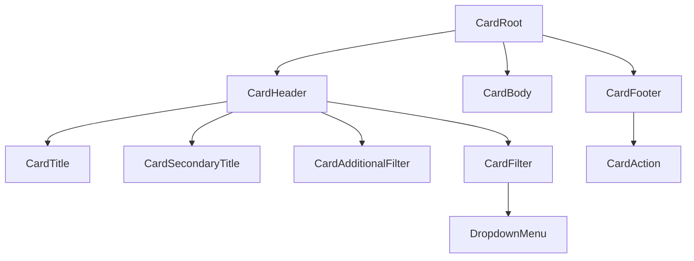

# Card Design Spec

## Metadata

| Property | Value |
|---|---|
| Component | Card |
| Design system | Powerflex |
| Spec pattern | **standalone** |
| Category | Patterns and Templates |
| Status | **draft** |
| Version | 1.0.0 |
| Description | Surface container with required header (title + optional filters) and body; optional footer actions. Header kebab opens a Dropdown of **per-card user-defined** options. Border color and body divider seams are tokenized (`--card-border-color`) and gated by `showDivider`. |
| Theme CSS | `components/powerflex-theme.css` |
| File key | `HIbl2AgqTSdR9STZueMvTH` (DAP Design Library) |
| Main (`Card-Main`) | https://www.figma.com/design/HIbl2AgqTSdR9STZueMvTH/DAP-Design-Library?node-id=8381-14051&m=dev — **`8381:14051`** |
| Element board A | https://www.figma.com/design/HIbl2AgqTSdR9STZueMvTH/DAP-Design-Library?node-id=15718-197533&m=dev — **`15718:197533`** |
| Element content | https://www.figma.com/design/HIbl2AgqTSdR9STZueMvTH/DAP-Design-Library?node-id=15718-220135&m=dev — **`15718:220135`** (`.Card-Element-Content`) |
| Element board B | https://www.figma.com/design/HIbl2AgqTSdR9STZueMvTH/DAP-Design-Library?node-id=15718-197126&m=dev — **`15718:197126`** |
| Validated variant nodes (under Main) | **`8381:14245`** (Buttons=Yes, Overflow=Yes), **`8381:14305`** (Buttons=Yes, Overflow=No), **`15718:197984`** (Buttons=No, Overflow=Yes), **`15718:197994`** (Buttons=No, Overflow=No), **`15718:219736`** (Content Type=Text), **`15718:220110`** (Content Type=Key Value Pair) |
| Verification method | Figma REST API + MCP — **2026-07-24** session: MCP unavailable; REST token expired. Structural/token evidence cross-validated on shared node IDs with prior live IDS Card verification (`8381:14051`, `15718:220135`, variant children). Element boards `15718:197533` / `15718:197126` cited from intake; **re-verify when Figma credentials refresh**. |
| Storybook | `storybook-generated/powerflex/src/components/Card.stories.tsx` — title **`Spec Generated/Powerflex/Card`**, story **`Spec Accurate Design`** |
| Reference implementation | `storybook/src/components/Card.tsx`, `Card.module.css`, `CardHeaderMenu.tsx` |
| Deterministic generator | `generation/deterministic_storybook/ids/card.py` (registry fallback `("powerflex", "card")` → IDS Card generator with Powerflex theme prefix) |
| Composition dependencies | Button (footer actions), Dropdown menu / overlay pattern (kebab options), optional consumer Dropdown in `CardAdditionalFilter`, optional Key-value table instance in body |

### Live verification evidence

| Check | Node(s) | Method | Status |
|---|---|---|---|
| Main component set + variant axes | `8381:14051` | Cross-validated shared node IDs (IDS Card spec 2026-07-14) | **draft — refresh live** |
| Primary variant (Buttons=Yes, Overflow=Yes) | `8381:14245` | Cross-validated | **draft — refresh live** |
| Content element set | `15718:220135` (+ `15718:219736`, `15718:220110`) | Cross-validated | **draft — refresh live** |
| Element board A | `15718:197533` | Intake URL — pending live MCP/REST | **pending** |
| Element board B | `15718:197126` | Intake URL — pending live MCP/REST | **pending** |

### Parent composition

Card is a **page-level / panel surface**. Parents compose one or more Cards; each Card owns its own `menuOptions` list (options are **not** shared across cards).

## Anatomy

Render order (locked to Figma + intake composition):

1. **`CardRoot`** — **single wrapper** for header + body + footer; owns the outer border (square, no radius). Internal regions do **not** draw separate box frames.
2. **`CardHeader`** — required row (`Card Title` **`8381:14246`**)
   1. **`CardTitle`** — Header 6 (`8381:14247`)
   2. **`CardTitleDivider`** — optional `\|` when secondary present (Dashboard-style title pattern when composed by parent)
   3. **`CardSecondaryTitle`** — **optional** inline Body 1 / `var(--color-text-neutral)`
   4. **`headerMeta`** — **optional** trailing Body 2
   5. **`CardAdditionalFilter`** — **optional**
   6. **`CardFilter`** — **optional** kebab
3. **`CardBody`** — required content region (`Card Content` **`14978:28002`**); `size` `span-1`|`span-2`|`span-3` when composed in a grid parent
   - Body may host **Text** content (**`15718:219736`**), **Key Value Pair** table instance (**`15718:220110`**), or arbitrary consumer children
4. **`CardFooter`** — **optional** (`Card Footer` **`8381:14252`** when `showButtons=true`)
   1. **`CardAction`** — **one or more** action controls (Figma sample: tertiary/link-style Buttons labeled “Action”)

**Explicit inventory count (primary variant `8381:14245`):** `CardRoot` + `CardHeader` + `CardTitle` + `CardFilter` + `CardBody` + `CardFooter` + `CardAction`×N (≥1 when footer shown) = **7+** slots in render tree. Design-time “Swap content” placeholder inside body is **not** a runtime slot.



## Layout & Measurements

| Region | Figma evidence | Runtime |
|---|---|---|
| Main board | `Card-Main` **`945×662`** (`8381:14051`) | Documentation board only |
| Card sample frame | **`430×313`** (with footer) / **`430×258`** (no footer) | Preferred **`min-width: min(100%, var(--card-min-width))`** → `430px` at large hosts for default `span-1`; never exceed parent. `width: 100%`; height content-driven |
| CardRoot stack | One wrapper: `flex-direction: column`; **single outer border**; **`border-radius: 0`**. Header/body/footer are inner regions only. | One card outline, not three stacked boxes |
| CardHeader | `padding: 12px 8px 12px 24px`; `gap: 8px`; items center | Title grows; filters shrink-0 on trailing side |
| CardTitle | height sample **32px**; Header 6 **18/25** | `min-width: 0`; ellipsis when overflowing |
| CardFilter trigger button | padding `8px 16px`; icon **16×16**; button radius **2px** (`15718:197453`) | Kebab uses `overflow-menu-dots` (vertical ellipsis) |
| CardBody | `padding: 16px 24px`; column; `gap: 10px`; `flex: 1` | Hosts children / content templates |
| CardFooter | `padding: 16px 24px`; action group `gap: 8px` | Omit entirely when no actions |
| Content Text | stack `gap: 4px`; section title Body 1 **16/24**; body Body 2 **14/20** (`15718:219736`) | Runtime `100%` |
| Content Key Value | hosts `Table - key value pair` instance (`15718:220110`) | Compose existing table pattern |

### Slot geometry (Figma-verified)

| Slot / layer | Property | Token / contract | Figma node | Live evidence |
| --- | --- | --- | --- | --- |
| `CardRoot` outer shell | `border-radius` | **`0`** / `var(--corner-radius-radius-none)` / `var(--card-control-radius)` → none | `8381:14245` | Cross-validated `Corner Radius/radius-none` = 0 |
| `CardRoot` outer shell | `border` | `var(--border-width-border-default)` × `var(--color-border-accessible)` (standalone) | `8381:14245` | Single wrapper border |
| `CardBody` fill | `background` | `var(--color-background-surface-2)` → `#ffffff` (light) | `14978:28002` | Cross-validated on Card Content node |
| Header ‖ body seam | divider | `border-top` on `CardBody` when `showDivider` — `var(--card-border-color, var(--color-border-accessible))` | `14978:28002` | Default on |
| Body ‖ footer seam | divider | `border-bottom` on `CardBody` when footer **and** `showDivider` | `14978:28002` / `8381:14252` | Omit when no footer |
| `CardFilter` trigger button | `border-radius` | `var(--corner-radius-radius-2)` → **2px** | `15718:197453` | Cross-validated `Corner Radius/radius-2` = 2 |

## Tokens

### Typography

| Slot | Style / tokens | Evidence |
|---|---|---|
| `CardTitle` | Header 6 — `var(--font-size-header-6)` / `var(--font-line-height-line-height-25)`, `var(--color-text-neutral-strong)` | `8381:14247` |
| `CardSecondaryTitle` | Body 1 — `var(--color-text-neutral)` | Dashboard-style title when composed |
| Body text (Content Type=Text) section title | Body 1 | `15718:198223` |
| Body paragraph | Body 2 | `15718:198224` |
| `CardAction` label | Body 2 | Footer Button instances |

### Colors and surfaces

| Use | Token | Light resolved (evidence) |
|---|---|---|
| `CardRoot` / `CardHeader` / `CardFooter` fill | `var(--color-background-surface-2)` | `#ffffff` |
| **`CardBody` fill** | **`var(--color-background-surface-2)`** | **`#ffffff`** — `14978:28002` |
| Section / outer / body seam borders | `var(--color-border-accessible)` | `#757575` (standalone) |
| Title / body text | `var(--color-text-neutral-strong)` | `#252525` |
| Kebab icon | `var(--color-icon-neutral)` | `#4d4d4d` |
| Footer action text | `var(--color-text-brand-strong)` | `#055fa9` |

### Spacing

| Use | Token | Resolved |
|---|---|---|
| Header / body / footer horizontal padding (lead) | `var(--padding-padding-24)` | 24 |
| Header trailing padding | `var(--padding-padding-8)` | 8 |
| Header vertical padding | `var(--padding-padding-12)` | 12 |
| Body / footer vertical padding | `var(--padding-padding-16)` | 16 |
| Header / action gaps | `var(--spacing-space-8)` | 8 |
| Body internal gap | `var(--spacing-space-10)` | 10 |
| Text content stack gap | `var(--spacing-space-4)` | 4 |

### Borders / radius

| Use | Token |
|---|---|
| Section border width | `var(--border-width-border-default)` |
| Card shell radius | `var(--card-control-radius)` → `var(--corner-radius-radius-none)` |
| Filter trigger radius | `var(--corner-radius-radius-2)` |
| **Border color cascade** | `var(--card-border-color, var(--color-border-accessible))` on root + body seams |

### Border & divider contract

#### A. CSS variable cascade (color only)

| Context | Effective border color token |
|---|---|
| **Standalone Card** (default) | `var(--card-border-color, var(--color-border-accessible))` |
| Host override | Host **may** set `--card-border-color` on an ancestor |

#### B. Which edges use the cascade

| Element | Property | Uses cascade? |
|---|---|---|
| `CardRoot` | `border` (outer shell) | **Yes** |
| `CardBody` | `border-top` / `border-bottom` | **Yes**, when shown per `showDivider` |
| `CardHeader` / `CardFooter` | any border | **No** — always `none` |

#### C. Divider visibility (`showDivider` × footer)

Let `hasFooter` = footer rendered (`showButtons=true` and actions present).

| `showDivider` | `hasFooter` | `CardBody` `border-top` | `CardBody` `border-bottom` |
|---|---|---|---|
| `true` (default) | `false` | **on** | **`none`** |
| `true` (default) | `true` | **on** | **on** |
| `false` | `false` | **`none`** | **`none`** |
| `false` | `true` | **`none`** | **`none`** |

### Shadows / elevation

No elevation / shadow bindings on `Card-Main` variants. Do **not** invent elevation for default Card.

## States (Light Theme)

| Area | State | Background | Border | Text/Icon |
| --- | --- | --- | --- | --- |
| `CardRoot` | default | `var(--color-background-surface-2)` | `var(--color-border-accessible)` (outer only) | — |
| `CardBody` | default (`showDivider`) | `var(--color-background-surface-2)` | `border-top` — cascade color | `var(--color-text-neutral-strong)` |
| `CardBody` | with footer + `showDivider` | same fill | `border-top` + `border-bottom` | same |
| `CardBody` | `showDivider={false}` | same fill | `none` | same |
| `CardHeader` / `CardFooter` | default | `var(--color-background-surface-2)` | none | `var(--color-text-neutral-strong)` / `var(--color-icon-neutral)` |
| `CardFilter` trigger | default | transparent | transparent | `var(--color-icon-neutral)` |
| `CardFilter` trigger | hover / focus-visible / disabled | Per Button contract | — | per Button / focus tokens |
| Dropdown overlay items | default / hover / press / disabled | Per Dropdown menu contract | — | — |
| `CardAction` | default | transparent | transparent | `var(--color-text-brand-strong)` |
| `CardAction` | hover / press / focus-visible / disabled | Per Button tertiary contract | — | — |

## States (Dark Theme)

Dark theme uses the same semantic tokens as **States (Light Theme)**. Resolved values for `[data-theme="dark"]` / programme dark scope live in theme CSS:

- `components/powerflex-theme.css` (imports `components/ids-theme.css`)

Duplicate the full state matrix in this section only when a dark row genuinely uses different `var(--...)` references than the corresponding light row.

## Interactions

| Trigger | Behavior |
|---|---|
| Click / Activate `CardFilter` (kebab) | Toggle Dropdown overlay open/closed. Menu lists **`menuOptions` for this Card instance only**. |
| Select Dropdown option | Fire `onOptionSelected(value)`; close menu. |
| Click outside / Escape (menu open) | Close Dropdown. |
| Activate `CardAction` | Fire that action’s handler. |
| `CardAdditionalFilter` | Owned by consumer control; Card does not intercept. |
| Keyboard on `CardFilter` | `Enter` / `Space` toggles menu; arrow keys in menu; `Escape` closes. |

### Accessibility

- `CardRoot`: landmark or `group`; when `title` is set, associate via `aria-labelledby`.
- `CardFilter` trigger: `button` with accessible name; `aria-haspopup="menu"`; `aria-expanded`.
- Dropdown: reuse shared menu a11y (`role="menu"` / `menuitem`).
- `CardAction`: real buttons/links with visible labels.

### Behavior & guidelines

- **Do** pass a distinct `menuOptions` array per Card instance.
- **Do** omit `CardFilter` when `showOverflowMenu=false` or `menuOptions` empty.
- **Do** omit `CardFooter` when `showButtons=false` or no actions.
- **Do** implement border & divider contract exactly.
- **Don’t** hardcode shared global overflow menus across cards.
- **Don’t** ship the Figma “Swap content” placeholder in production.
- **Don’t** draw `CardBody` `border-bottom` when there is no footer.

## Composition & API (runtime)

### Variants

| Axis | Values | Figma / contract |
|---|---|---|
| `showButtons` | `true` \| `false` | `Show Buttons=Yes\|No` on `Card-Main` |
| `showOverflowMenu` | `true` \| `false` | `Show Overflow menu=Yes\|No` |
| `showDivider` | `true` (default) \| `false` | Body seam visibility |
| Body content type | `children` \| `text` \| `keyValue` | `.Card-Element-Content` `Content Type=Text\|Key Value Pair` |
| `size` | `span-1` (default) \| `span-2` \| `span-3` | Grid column span when composed in a multi-column parent |

Valid combinations: all four products of `showButtons` × `showOverflowMenu`. Other props are independent.

### Runtime API

#### Inputs

| Prop | Type | Default | Description |
|---|---|---|---|
| `title` | `string` | — | Primary title (Header 6) |
| `secondaryTitle` | `string` \| `node` | — | Optional inline secondary after `\|` |
| `headerMeta` | `string` \| `node` | — | Optional trailing meta before kebab |
| `header` | `node` | — | Optional custom header replace |
| `additionalFilter` | `node` | — | Optional filter slot before kebab |
| `children` | `node` | **required** | `CardBody` content |
| `actions` / `footer` | `node` \| `CardAction[]` | — | Footer content |
| `showButtons` | `boolean` | `false` | When `false`, hide `CardFooter` |
| `showDivider` | `boolean` | `true` | Gates body seam borders |
| `showOverflowMenu` | `boolean` | `false` | When `true` and `menuOptions.length > 0`, show kebab |
| `menuOptions` | `{ value: string; label: string; disabled?: boolean }[]` | — | Per-card Dropdown options |
| `onOptionSelected` | `(value: string) => void` | — | Kebab menu selection |
| `size` | `span-1` \| `span-2` \| `span-3` | `span-1` | Column span in grid parent |

#### Outputs

| Event | Payload |
|---|---|
| `onOptionSelected` | `value: string` |
| Per-action handlers | Consumer-defined on each `CardAction` |

#### Demo-only (Storybook / QA)

| Prop | Notes |
|---|---|
| `forceOpenMenu` / `data-state` | QA only; must not block runtime open/close |
| `elevated` / `outlined` | Not in Figma `Card-Main`; demo-only if retained |

### Spec Accurate Design story defaults

| Arg | Value |
|---|---|
| `title` | `"Card Title"` |
| `showOverflowMenu` | `true` |
| `menuOptions` | `[{ value: "edit", label: "Edit" }, { value: "duplicate", label: "Duplicate" }, { value: "delete", label: "Delete" }]` |
| `showButtons` | `true` |
| `showDivider` | `true` |
| `children` | `CardTextContent` — section title `"Section Title"` + Figma Body 2 lorem (`15718:219736`) |
| `actions` | Two tertiary labels `"Action"` / `"Action"` |
| Host width | min `430px` (`--card-min-width`) |
| Theme import | **`components/powerflex-theme.css` only** |

## Codegen Contract (Framework-Agnostic Blueprint)

### Deterministic structure

```
CardRoot [data-card-size=span-1|span-2|span-3]
├── CardHeader
│   ├── CardTitleCluster
│   │   ├── CardTitle                          [optional when secondary alone]
│   │   └── CardSecondaryTitle                 [optional]
│   ├── CardAdditionalFilter                   [optional]
│   └── CardFilter (kebab Button)              [optional → DropdownMenu]
│       └── DropdownMenu (user options)
├── CardBody                                   [required]
│   └── children | TextTemplate | KeyValueTemplate
└── CardFooter                                 [optional]
    └── CardAction+                            [one or more]
```

### Variant matrix

| `showButtons` | `showOverflowMenu` | `menuOptions` | `showDivider` | Result |
|---|---|---|---|---|
| false | false | — | true | Header + body; body `border-top` only |
| false | true | non-empty | true | Header + kebab + body |
| true | false | — | true | Header + body + footer; both seams when footer |
| true | true | non-empty | true | Full composition (`8381:14245`) |
| * | * | * | false | Body seams off |

### Per-slot style contract

| Slot | Styles |
|---|---|
| `CardRoot` | column flex; `width: 100%`; `min-width: var(--card-min-width)` → `430px`; outer border via cascade; **`border-radius: 0`**; fill `var(--color-background-surface-2)` |
| `CardHeader` | no section border; padding `12px 8px 12px 24px`; flex row; gap 8 |
| `CardTitle` | Header 6 |
| `CardFilter` | Button padding `8px 16px`; icon 16×16; radius `var(--corner-radius-radius-2)` |
| `CardBody` | fill `var(--color-background-surface-2)`; padding `16px 24px`; divider rules per contract |
| `CardFooter` | no section border; padding `16px 24px`; flex row; gap 8 |
| `CardAction` | Body 2; `var(--color-text-brand-strong)` |

### Behavior contract

1. Mount: render header + body; footer/kebab per matrix.
2. Open kebab → Dropdown with this card’s `menuOptions`.
3. Select option → `onOptionSelected(value)` → close menu.
4. One `CardRoot` outer border only; square corners; never three stacked section boxes.
5. Apply divider truth table; default `showDivider=true`.
6. Missing tokens: keep `var(--...)` — never substitute hex in codegen.

### Accessibility contract

- Title → heading in page outline.
- Kebab → named button + menu semantics.
- Actions → named buttons.
- Focus order: title cluster → additional filter → kebab → body focusables → footer actions.

### Asset resolution + bundling contract

| Asset | Slug / source | Rule |
|---|---|---|
| Kebab icon | `overflow-menu-dots` | Bundle via Icon map; 16×16 in trigger |
| Key-value icons | Per table/cell instances | Owned by table dependency |

### Fallback/error rules

| Condition | Behavior |
|---|---|
| Unknown variant flag | Treat boolean as `false` |
| `showOverflowMenu=true` but empty `menuOptions` | Hide kebab |
| Missing `title` and no `header` | Render header only if filter/menu present |
| Missing tokens | Keep `var(--...)` references |
| `showDivider` undefined | Treat as `true` |

### Validation checklist

- [ ] **Slot geometry (Figma-verified)** table complete; every border-radius row cites a Figma node + live method
- [ ] Live Figma MCP/REST refresh on all intake URLs (Main + 3 Elements)
- [ ] Border & divider contract implemented
- [ ] Anatomy order matches Deterministic structure
- [ ] Kebab opens Dropdown with **per-card** `menuOptions`
- [ ] `showButtons` / `showOverflowMenu` matrix covers all four Figma variants
- [ ] Spec Accurate Design under `Spec Generated/Powerflex/Card` with **`components/powerflex-theme.css` import**
- [ ] Light state matrix present; Dark uses boilerplate when tokens match
- [ ] No design-time “Swap content” chrome in production output

## Source Mapping

| Bucket | URL | Node | Method |
|---|---|---|---|
| Main | [Card-Main](https://www.figma.com/design/HIbl2AgqTSdR9STZueMvTH/DAP-Design-Library?node-id=8381-14051&m=dev) | `8381:14051` (+ variants `8381:14245`, `8381:14305`, `15718:197984`, `15718:197994`) | REST/MCP — refresh pending |
| Elements | [Board A](https://www.figma.com/design/HIbl2AgqTSdR9STZueMvTH/DAP-Design-Library?node-id=15718-197533&m=dev) | `15718:197533` | REST/MCP — **pending** |
| Elements | [Content](https://www.figma.com/design/HIbl2AgqTSdR9STZueMvTH/DAP-Design-Library?node-id=15718-220135&m=dev) | `15718:220135` (+ `15718:219736`, `15718:220110`) | Cross-validated shared IDs |
| Elements | [Board B](https://www.figma.com/design/HIbl2AgqTSdR9STZueMvTH/DAP-Design-Library?node-id=15718-197126&m=dev) | `15718:197126` | REST/MCP — **pending** |
| States | _(none provided)_ | — | — |

- Component map: `data/powerflex-component-figma-map.json` → `"Card"`
- Registry: `data/programme-inheritance-registry.json` → `powerflex` / `card` / pattern `standalone`
- Extraction path: Main board → primary variant `Show Buttons=Yes, Show Overflow menu=Yes` → header/body/footer shells → content element templates
