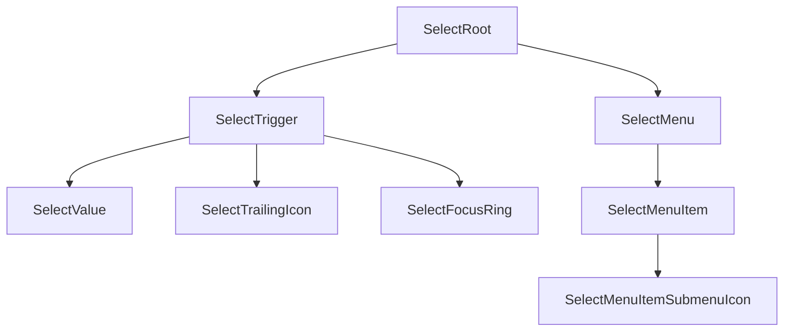

# Select Design Spec

## Metadata

| Property | Value |
|---|---|
| Component | Select |
| Design system | Powerflex |
| Category | Form |
| Spec pattern | **standalone** |
| Status | **draft** |
| Version | 1.0.0 |
| Theme CSS | `components/powerflex-theme.css` |
| Spec path | `components/powerflex/select/design-spec.md` |
| Figma file key | `82bDP05ESsiiGe38p5TEQJ` |
| Main component set | `select` **`3022:1260`** |
| Figma URL | https://www.figma.com/design/82bDP05ESsiiGe38p5TEQJ/PowerFlex-MCP-Design-System?node-id=3022-1260&m=dev |
| Elements / States URLs | _(none collected — variant matrix lives on Main component set)_ |
| Verification method | **Figma REST API** (collab server-packaged evidence) — session `etPr1HEi0UHa6F5sTXWlLRX5sDkEB0T-`, 2026-07-27. Client used packaged `tools.get_metadata`, `tools.get_design_context`, `tools.get_variable_defs`, `tools.get_screenshot`, `slotGeometry` only (no client Figma MCP). |
| Storybook | `storybook-generated/powerflex/src/components/Select.stories.tsx` — title **`Spec Generated/Powerflex/Select`**, story **`Spec Accurate Design`** |
| Deterministic generator | `generation/deterministic_storybook/powerflex/select.py` (registry `("powerflex", "select")`) |
| Runtime | `storybook/src/components/Select.tsx` |

### Live verification evidence

| Check | Node(s) | Method | Status |
|---|---|---|---|
| Main component set + screenshot | `3022:1260` | Packaged REST `get_screenshot` + `get_metadata` | **verified (packaged)** |
| Design context (layout/colors/anatomy/typography) | `3022:1260` | Packaged REST `get_design_context` | **verified (packaged)** |
| Variant axes (State × Content state × Size) | 12 children returned; `childrenTruncated: 33` → **45** expected | Packaged REST `get_metadata` + layout/anatomy fragments | **verified with truncation noted** |
| Slot geometry / radius | Control `3020:1206`, menu `3023:1260`, focus-ring `3023:1278` | Packaged `slotGeometry` + bound VariableIDs. Packaged `get_variable_defs` returned **empty** bullets — radius/padding cited from `slotGeometry` / design-context | **verified with REST limitation noted** |

### Spec Accurate Design story defaults

| Prop | Value |
|---|---|
| `value` | `"Option"` (Figma TEXT sample for Content state=filled) |
| `placeholder` | `"Placeholder"` |
| `size` | `"lg"` |
| `open` | `true` (shows embedded `dropdown-menu` anatomy sample) |
| `disabled` | `false` |
| `trailingIconSlug` | `"arrow-tri-down-solid"` |
| `items` | Two options labeled `"Action"` (Figma menu-item sample), each with `hasSubmenu: true` as in packaged item instances |

## Anatomy

**Explicit inventory count (default / filled / sm `3020:1206`):** 1 root variant + `value` TEXT + `icon-trailing` + trailing `icon` + `vector` + `dropdown-menu` + `items` slot + **2** × `dropdown-menu-item` (each: `background` + `label` + `icon-toggle` / `arrow-tri-right-solid`) + `focus-ring` = **locked** to Figma tree (vectors under icons count as icon internals, not separate anatomy slots).

Deterministic render order (locked to Figma):

1. **`SelectRoot`** — positioning wrapper (field + optional menu)
2. **`SelectTrigger`** — interactive control shell (HORIZONTAL; padding L/R **8**; gap **16**)
3. **`SelectValue`** — TEXT (`Option` / `Placeholder` / empty)
4. **`SelectTrailingIcon`** — `icon-trailing` / caret (`arrow-tri-down-solid` / 8×5 vector)
5. **`SelectFocusRing`** — outer focus frame (visible on `focus-visible`)
6. **`SelectMenu`** — `dropdown-menu` (runtime only when `open`)
7. **`SelectMenuItem`** — repeated `dropdown-menu-item` rows
8. Optional **`SelectMenuItemSubmenuIcon`** — `icon-toggle` / `arrow-tri-right-solid` when item `hasSubmenu`



## Layout & Measurements

| Dimension | Figma evidence | Runtime |
|---|---|---|
| Docs component set | `select` **2212×428**; cornerRadius **5**; stroke `#8a38f5` | Docs board only — **not** runtime chrome |
| Trigger / field | WIDTH sample **220**; HORIZONTAL; padding L/R **8**; gap **16**; stroke **1** | Sample width **220** is docs-only; runtime `width: 100%` (container-driven) with `box-sizing: border-box`; padding `0 var(--padding-padding-8)`; gap `var(--spacing-space-16)` |
| Size `sm` | height **24** (`3020:1206`) | height `24px` |
| Size `md` | height **32** (`3020:1211`) | height `32px` |
| Size `lg` | height **40** (`3020:1216`) | height `40px` |
| Trailing caret | **8×5** | Slug `arrow-tri-down-solid`; keep intrinsic aspect |
| Focus ring | `sm` **226×30**; `md` **226×38**; `lg` **226×46` (≈ field + **3px** each side) | Offset `var(--select-focus-ring-offset)` (**3px**); radius `var(--select-focus-ring-radius)` |
| Menu | sample **220×72**; padding **4 / 2**; VERTICAL | `min-width: max(trigger, content)`; width stretch to trigger; padding `var(--padding-padding-4) var(--padding-padding-2)` |
| Menu item | **73×32** sample; padding L/R **16**; gap **8** | height `32px`; padding `0 var(--padding-padding-16)`; gap `var(--spacing-space-8)` |
| Value typography | Roboto **14 / 20**, weight **400** (`Option` / `Placeholder` / menu `Action`) | `var(--font-size-body-2)` / `var(--font-line-height-line-height-20)`; weight **400** |

### Slot geometry (Figma-verified)

| Slot / layer | Property | Token / contract | Figma node | Live evidence |
| --- | --- | --- | --- | --- |
| `select` (docs set) | `border-radius` | **5px** docs-only (not runtime shell) | `3022:1260` | Packaged REST `slotGeometry.borderRadius=5` + design-context `cornerRadius=5.0` |
| `SelectTrigger` (default/filled/sm) | padding L/R | `var(--padding-padding-8)` | `3020:1206` | Packaged REST `slotGeometry.padding Left/Right=8` + bound VariableIDs `2453:4` / `2453:8` |
| `SelectTrigger` | `itemSpacing` | `var(--spacing-space-16)` | `3020:1206` | Packaged REST `slotGeometry.itemSpacing=16` HORIZONTAL |
| `SelectTrigger` | `border-width` | `var(--border-width-border-1)` | `3020:1206` | Packaged REST `slotGeometry.strokeWeight=1` |
| `SelectTrigger` | `border-radius` | `var(--select-control-radius)` → **0px / square** (no `borderRadius` on control nodes) | `3020:1206` | Packaged REST `slotGeometry` omits `borderRadius` on control variants; treat as square. Packaged `get_variable_defs` empty |
| `SelectFocusRing` | `border-radius` | `var(--select-focus-ring-radius)` → **4px** | `3023:1278` | Packaged REST bound `VariableID:2453:30` (same binding as Powerflex button focus-ring radius). Packaged `get_variable_defs` empty |
| `SelectFocusRing` | offset | `var(--select-focus-ring-offset)` → **3px** | `3023:1278` | Geometry **226×30** vs field **220×24** ⇒ +3px each side |
| `SelectMenu` | padding | `var(--padding-padding-4)` vertical / `var(--padding-padding-2)` horizontal | `3023:1260` | Packaged REST `slotGeometry.padding Top/Bottom=4, Left/Right=2` + bound VariableIDs `2521:5` / `2521:6` / `2453:4` / `2453:7` / `2451:133` |
| `SelectMenu` | `border-radius` | `var(--select-menu-radius)` → **0px / square** | `3023:1260` | Packaged REST `slotGeometry` omits `borderRadius` on menu; treat as square |
| `SelectMenuItem` | height / padding | **32px**; L/R `var(--padding-padding-16)` | `I3023:1260;2557:1870` | Packaged REST `slotGeometry` 73×32 + padding 16 |

**Geometry authoring rules:** radius rows cite packaged `slotGeometry` / bound VariableIDs on the listed nodes. Theme aliases (`--select-control-radius`, `--select-focus-ring-radius`, `--select-menu-radius`) are implementation wiring after Figma values are verified.

## Tokens

Semantic `var(--...)` only for codegen. Figma REST color bullets resolve slightly differently from current Powerflex/IDS donor hex (e.g. brand stroke `#0076ce` vs theme `#0672cb`; default border `#888888` vs theme border-light `#c5c5c5`) — **tokens remain authoritative**; hex is evidence only.

### Layout aliases

| Alias | Powerflex / IDS resolution |
|---|---|
| `--select-control-radius` | `var(--corner-radius-radius-none)` (0px) |
| `--select-focus-ring-radius` | `var(--corner-radius-radius-4)` (4px) |
| `--select-focus-ring-offset` | `3px` |
| `--select-menu-radius` | `var(--corner-radius-radius-none)` (0px) |

### Colors

| Role | Token | Figma evidence (light sample) |
|---|---|---|
| Field fill (all verified states) | `var(--color-background-component)` | `#ffffff` on control |
| Default border | `var(--color-border-light)` | stroke `#888888` |
| Hover border | `var(--color-border-neutral)` | stroke `#333333` |
| Active / open border | `var(--color-border-brand-base)` | stroke `#0076ce` |
| Filled value text / caret | `var(--color-text-neutral-strong)` / `var(--color-icon-neutral-strong)` | `#333333` |
| Example / placeholder text | `var(--color-text-neutral)` | `#888888` on `value` when Content state=example |
| Empty value | _(no text)_ | empty content — no fill bullet for text |
| Focus ring stroke | `var(--color-border-brand-base)` | `#0076ce` |
| Menu surface | `var(--color-background-white)` | `#ffffff` |
| Menu border | `var(--color-border-lighter)` | `#e4e4e4` |
| Menu item text | `var(--color-text-neutral-strong)` | `#333333` |
| Menu item background | `var(--color-background-white)` | `#ffffff` (bound `VariableID:2557:1002`) |

### Typography / spacing / borders

- Font size / line-height: `var(--font-size-body-2)` / `var(--font-line-height-line-height-20)`
- Border width: `var(--border-width-border-1)`
- Spacing: `var(--spacing-space-16)`, `var(--spacing-space-8)`, `var(--padding-padding-8)`, `var(--padding-padding-16)`, `var(--padding-padding-4)`, `var(--padding-padding-2)`
- Shadows: **none** observed in packaged evidence — omit elevation tokens

## States (Light Theme)

Figma component-set axes:

- **`State`**: verified `default | hover | active` (packaged color bullets). `childrenTruncated: 33` with 12 returned ⇒ **45** total variants ⇒ **5** State values × 3 Content × 3 Size. Two additional State values exist in the set but lack packaged color evidence — **do not invent** their chrome; keep Status **draft** until those nodes are packaged.
- **`Content state`**: `filled | example | empty`
- **`Size`**: `sm | md | lg`

Document `focus-visible` as keyboard modality overlay (focus-ring layer present on verified instances). Map runtime `open` to Figma **`State=active`** (brand border).

| Content / interactive | State | Background | Border | Text/Icon |
|---|---|---|---|---|
| filled | default | `var(--color-background-component)` | `var(--color-border-light)` | `var(--color-text-neutral-strong)` / `var(--color-icon-neutral-strong)` |
| filled | hover | `var(--color-background-component)` | `var(--color-border-neutral)` | `var(--color-text-neutral-strong)` / `var(--color-icon-neutral-strong)` |
| filled | active (open) | `var(--color-background-component)` | `var(--color-border-brand-base)` | `var(--color-text-neutral-strong)` / `var(--color-icon-neutral-strong)` |
| filled | focus-visible | same as current non-disabled base | unchanged + outer `var(--color-border-brand-base)` focus ring | unchanged |
| example | default | `var(--color-background-component)` | `var(--color-border-light)` | `var(--color-text-neutral)` / `var(--color-icon-neutral-strong)` |
| example | hover | `var(--color-background-component)` | `var(--color-border-neutral)` | `var(--color-text-neutral)` / `var(--color-icon-neutral-strong)` |
| example | active (open) | `var(--color-background-component)` | `var(--color-border-brand-base)` | `var(--color-text-neutral)` / `var(--color-icon-neutral-strong)` |
| example | focus-visible | same as current base | unchanged + outer brand focus ring | unchanged |
| empty | default | `var(--color-background-component)` | `var(--color-border-light)` | _(no value text)_ / `var(--color-icon-neutral-strong)` |
| empty | hover | `var(--color-background-component)` | `var(--color-border-neutral)` | _(no value text)_ / `var(--color-icon-neutral-strong)` |
| empty | active (open) | `var(--color-background-component)` | `var(--color-border-brand-base)` | _(no value text)_ / `var(--color-icon-neutral-strong)` |
| empty | focus-visible | same as current base | unchanged + outer brand focus ring | unchanged |

**Menu (when `open`):** surface `var(--color-background-white)`; border `var(--color-border-lighter)`; item text `var(--color-text-neutral-strong)`; item background `var(--color-background-white)`.

**Note:** Packaged colors confirm `State=active` only for Content=filled sm/md; apply the same brand-border contract to remaining active × content × size combinations by axis continuity (layout fragments list active rows). Truncated non-verified State values remain unspecified.

## States (Dark Theme)

Dark theme uses the same semantic tokens as **States (Light Theme)**. Resolved values for `[data-theme="dark"]` / programme dark scope live in theme CSS:

- `components/powerflex-theme.css`

Duplicate the full state matrix in this section only when a dark row genuinely uses different `var(--...)` references than the corresponding light row.

*(When Light and Dark tables would list identical `var(--...)` cells, keep the matrix under **States (Light Theme)** only and use this pointer section instead of a second table.)*

## Interactions

| Trigger | Behavior |
|---|---|
| Pointer click / `Enter` / `Space` on trigger | Toggle `open` (controlled or uncontrolled). Disabled blocks toggle. |
| Pointer click outside / `Escape` | Close list (`open → false`). |
| Pointer click / `Enter` / `Space` on menu item | Emit `onSelect(item)` / update `value`; close unless item declares `keepOpen`. |
| Hover | Apply Figma `State=hover` border (`var(--color-border-neutral)`). |
| Focus-visible | Show `SelectFocusRing` (brand stroke, radius `var(--select-focus-ring-radius)`, offset `var(--select-focus-ring-offset)`). |
| Open / active | Apply Figma `State=active` border (`var(--color-border-brand-base)`); show `SelectMenu`. |
| Type-ahead (optional enhancement) | When open, jump to matching option labels — not required by Figma chrome; allowed if it does not invent UI. |

### Accessibility

- Trigger: native `button` (or combobox pattern) with `aria-haspopup="listbox"` and `aria-expanded={open}`. Prefer **listbox** roles for Select (vs menu for Button-Dropdown).
- List: `role="listbox"`; options `role="option"` with `aria-selected`.
- Keyboard: `ArrowDown`/`ArrowUp` move among options when open; `Home`/`End` jump; `Enter`/`Space` select; `Escape` closes; focus returns to trigger on close.
- Trailing caret is decorative when value/placeholder conveys meaning (`aria-hidden`).

### Behavior & guidelines

- Runtime default is interactive (`open` starts `false` unless controlled).
- `data-state` / `forceOpen` are Storybook/QA overrides only and must not replace runtime interaction.
- Trailing caret uses slug `arrow-tri-down-solid`; submenu indicator on items uses `arrow-tri-right-solid` when `hasSubmenu` (observed on packaged menu-item instances — shared dropdown-menu-item composition).
- Do not invent UI beyond Main Figma slots (no search field, chips, or leading icons — none present on this set).
- Content state is derived: `value` set → `filled`; else if `placeholder` → `example`; else `empty`.

## Composition & API (runtime)

### Variants

| Axis | Values | Source |
|---|---|---|
| `size` | `lg` \| `md` \| `sm` | Component-set property **Size** |
| `contentState` (derived) | `filled` \| `example` \| `empty` | Component-set property **Content state** |
| interactive / `open` | `default` \| `hover` \| `active` (+ `focus-visible` modality) | Component-set property **State** (+ runtime hover/focus) |

Verified node ids (packaged metadata children):

| State | Content | Size | Node |
|---|---|---|---|
| default | filled | sm | `3020:1206` |
| default | filled | md | `3020:1211` |
| default | filled | lg | `3020:1216` |
| default | example | sm | `3020:1221` |
| default | example | md | `3020:1226` |
| default | example | lg | `3020:1231` |
| default | empty | sm | `3020:1236` |
| default | empty | md | `3020:1241` |
| default | empty | lg | `3020:1246` |
| hover | filled | sm | `3020:1251` |
| hover | filled | md | `3020:1256` |
| hover | filled | lg | `3020:1261` |

Remaining **33** truncated children (hover example/empty + all active × content × size + **2** additional State values × content × size) are named partially in packaged layout/anatomy fragments; apply the same geometry/token contracts as verified siblings where evidence exists; leave unverified State chrome unspecified.

### Runtime API

**Inputs**

| Prop | Type | Default | Description |
|---|---|---|---|
| `value` | `string` | — | Selected label; when set → Content state `filled` |
| `placeholder` | `string` | `"Placeholder"` | Shown when no `value` → Content state `example` |
| `size` | `"lg" \| "md" \| "sm"` | `"lg"` | Control height axis |
| `open` | `boolean` | uncontrolled `false` | Controlled open state (Figma `State=active` when true) |
| `defaultOpen` | `boolean` | `false` | Uncontrolled initial open |
| `disabled` | `boolean` | `false` | Blocks open/select (truncated State — no packaged chrome yet) |
| `trailingIconSlug` | `string` | `"arrow-tri-down-solid"` | Caret |
| `items` | `SelectItem[]` | `[]` | Listbox options |
| `ariaLabel` | `string` | — | Accessible name when needed |
| `dataState` | `"default" \| "hover" \| "active" \| "focus-visible" \| "disabled"` | — | Demo/QA override only |

`SelectItem`: `{ id: string; label: string; disabled?: boolean; hasSubmenu?: boolean; keepOpen?: boolean }`

**Outputs**

| Event | Payload |
|---|---|
| `onOpenChange` | `(open: boolean) => void` |
| `onChange` | `(value: string, item: SelectItem) => void` |
| `onSelect` | `(item: SelectItem) => void` |

### Spec Accurate Design story defaults

See Metadata table — filled / lg / open with value `"Option"` and two `"Action"` items (`hasSubmenu: true`).

## Codegen Contract (Framework-Agnostic Blueprint)

### Deterministic structure

```
SelectRoot
├── SelectTrigger
│   ├── SelectValue (Option | Placeholder | empty)
│   ├── SelectTrailingIcon (arrow-tri-down-solid)
│   └── SelectFocusRing
└── SelectMenu? (when open)
    └── SelectMenuItem[] (label + optional submenu caret)
```

### Variant matrix

- `size` ∈ {lg, md, sm}
- `contentState` ∈ {filled, example, empty} (derived from `value` / `placeholder`)
- interactive state ∈ {default, hover, active/open, focus-visible}
- menu items: 0..n; submenu caret when `hasSubmenu`
- trailing caret: required in Main samples

Valid: any size × contentState × (default|hover|active). `focus-visible` overlays non-disabled states. `open` implies active border + menu. Unknown truncated State values are **not** part of the required runtime matrix until packaged.

### Per-slot style contract

| Slot | Contract |
|---|---|
| `SelectTrigger` | Size height; padding/gap/radius from Layout; colors from States table by content + interactive state |
| `SelectValue` | Body 2 14/20 weight 400; filled vs placeholder color per Content state |
| `SelectTrailingIcon` | Mask caret; color from States Text/Icon column |
| `SelectFocusRing` | Shown on focus-visible; brand stroke; radius/offset aliases |
| `SelectMenu` | White surface; lighter border; square radius alias; padding from geometry |
| `SelectMenuItem` | 32px row; Body 2 weight 400; optional `arrow-tri-right-solid` |

### Behavior contract

- Toggle open on trigger activation; close on outside/`Escape`/select (unless `keepOpen`).
- Selecting an item sets `value` to item label (or id mapping left to implementer) and emits `onChange` / `onSelect`.
- Disabled blocks all emissions.
- Controlled `open` + `onOpenChange` take precedence over uncontrolled `defaultOpen`.
- Controlled `value` takes precedence when provided.

### Accessibility contract

- Roles/ARIA as in Interactions (listbox / option).
- Keyboard parity required.
- Visible focus-visible treatment required.

### Asset resolution + bundling

| Slug | Path | Usage |
|---|---|---|
| `arrow-tri-down-solid` | `assets/icons/arrow-tri-down-solid.svg` | Trailing caret |
| `arrow-tri-right-solid` | `assets/icons/arrow-tri-right-solid.svg` | Optional item submenu indicator |
| `{trailingIconSlug}` | `assets/icons/{trailingIconSlug}.svg` | Consumer caret override |

Unknown slug → hide that icon slot; keep value/menu.

### Fallback / error rules

- Unknown `size` → `lg`
- Missing `items` → render empty listbox when open
- Missing `value` + missing `placeholder` → Content state `empty`
- `disabled=true` → force closed; ignore open attempts
- Unknown truncated Figma State → do not invent; fall back to default/hover/active contracts only

### Validation checklist

- [x] Spec pattern standalone; no IDS baseline section
- [x] All required `##` sections present
- [x] **Slot geometry (Figma-verified)** with node + packaged REST evidence for radius rows
- [x] Variant × content × size matrix documented; truncated nodes noted (45 expected)
- [x] States Light full for verified axes; Dark dedupe boilerplate
- [x] Runtime API + Spec Accurate Design defaults
- [x] Codegen Contract concrete (structure, matrix, per-slot, a11y, assets, fallbacks)
- [x] Storybook Spec Accurate Design imports `components/powerflex-theme.css`
- [ ] Status may move to `active` after truncated State packaging + geometry gate / Storybook visual QA

## Source Mapping

| Field | Value |
|---|---|
| Map file | `data/powerflex-component-figma-map.json` → slug `select` |
| File key | `82bDP05ESsiiGe38p5TEQJ` |
| Main node | `3022:1260` (`select` COMPONENT_SET) |
| Bucket | Main only (Elements/States empty at intake) |
| Verification | Figma REST API via Design Spec Collab packaged evidence |
| Session | `etPr1HEi0UHa6F5sTXWlLRX5sDkEB0T-` |
| Screenshot | packaged `tools.get_screenshot` image for `3022:1260` |
| Tools used | `get_metadata`, `get_design_context`, `get_variable_defs` (empty), `get_screenshot`, `slotGeometry` |
| Limitations | `get_variable_defs` empty; metadata `childrenTruncated: 33`; color bullets stop mid `State=active` filled md; two State axis values lack packaged chrome |

### Extraction path (reproducible)

1. Resolve map entry `select` → fileKey + `mainComponentSetNodeId`.
2. Load packaged or live REST: metadata → structure/variants; design_context → layout/colors/anatomy/typography; slotGeometry → padding/radius bindings.
3. Lock inventory → Anatomy → Codegen deterministic structure.
4. Map fills/strokes to Powerflex theme semantic vars; record Figma hex as evidence only.
