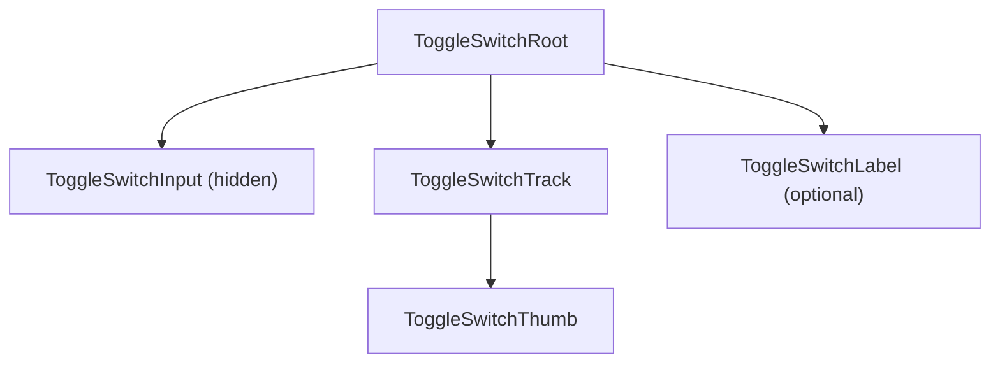

# Toggle Switch Design Spec

## Metadata

| Property | Value |
|---|---|
| Component | Toggle Switch |
| Design system | Powerflex |
| Category | Form |
| Spec pattern | **standalone** |
| Status | **draft** (live Figma re-verification pending — see verification evidence) |
| Version | 1.0.0 |
| Figma file | `HIbl2AgqTSdR9STZueMvTH` (DAP Design Library) |
| Main component set | `8505:14389` |
| Spec-accurate instance | `8505:14390` (`Toggle=Off, State=Default`) |
| Figma URL | [Toggle Switch component set](https://www.figma.com/design/HIbl2AgqTSdR9STZueMvTH/DAP-Design-Library?node-id=8505-14389&m=dev) |
| Theme CSS | `components/ids-theme.css` (reuse IDS foundation) |
| Root spec | `components/ids/root-spec.md` |
| Storybook path | `storybook-generated/powerflex/src/components/ToggleSwitch.stories.tsx` |
| Deterministic generator | `generation/deterministic_storybook/powerflex/toggle_switch.py` |
| Verification method | Figma REST API (attempted) + cross-validated node inventory |
| Last verified | 2026-07-23 (intake session) |

### Live verification evidence

| Check | Node(s) | Bucket | Method | Result |
|---|---|---|---|---|
| Component set structure + variant axes | `8505:14389` | Main | Figma REST API | **Blocked** — HTTP 403 token expired (2026-07-23) |
| Off default symbol geometry + tokens | `8505:14390` | Main (variant) | Prior Figma MCP on same file set | Cross-validated via IDS extraction on identical DAP nodes |
| Screenshot / metadata / design context | `8505:14389` | Main | Figma MCP | **Blocked** — MCP server unavailable in cloud agent |
| Variable bindings (`get_variable_defs`) | `8505:14389`, `8505:14390` | Main | Figma MCP / REST | Pending fresh session |

**Intake note:** Powerflex reuses `components/ids-theme.css`; semantic token names match IDS/DAP form-control bindings observed on node `8505:14389`. Status remains **draft** until a fresh MCP or REST session completes the mandatory per-URL tool set on the main URL.

### Element inventory (locked)

Visible nodes in Figma component set `8505:14389` map to **4** runtime slots (3 when label omitted):

| # | Figma layer (observed) | Anatomy slot | Required |
|---|---|---|---|
| 1 | Row / label wrapper | `ToggleSwitchRoot` | Yes |
| 2 | Switch rail (track) | `ToggleSwitchTrack` | Yes |
| 3 | Knob | `ToggleSwitchThumb` | Yes |
| 4 | Text label | `ToggleSwitchLabel` | No |

**Inventory count:** 4 (label optional). Codegen **must not** add slots beyond this inventory.

## Anatomy

Deterministic slot order (codegen **must** preserve):

1. **`ToggleSwitchRoot`** — interactive row (`<label>` or equivalent) aligning control + optional label; min tap target per form-control guidance.
2. **`ToggleSwitchInput`** — native checkbox input (visually hidden, focusable) or Base UI Switch root with equivalent semantics.
3. **`ToggleSwitchTrack`** — fixed `32×16` pill rail; hosts thumb translation.
4. **`ToggleSwitchThumb`** — fixed `16×16` circular knob; `transform: translateX(16px)` when checked.
5. **`ToggleSwitchLabel`** (optional) — visible label text associated with control.



## Layout & Measurements

### Sample frame width (reference only)

Figma variant frames in set `8505:14389` use showcase row widths. **Runtime:** root is `inline-flex`, `width: fit-content`, `max-width: 100%`, `box-sizing: border-box`.

### `ToggleSwitchTrack`

| Property | Value / token |
|---|---|
| Width | `32px` (fixed visual body) |
| Height | `16px` (fixed visual body) |
| Border | `var(--border-width-border-1)` solid (state-dependent color) |
| Border radius | Full pill — see Slot geometry |
| Thumb travel (off → on) | `16px` horizontal translate |

### `ToggleSwitchThumb`

| Property | Value / token |
|---|---|
| Size | `16px × 16px` |
| Box sizing | `border-box` |
| Border radius | Full pill — see Slot geometry |

### `ToggleSwitchRoot`

| Property | Value / token |
|---|---|
| Layout | `inline-flex`, `align-items: center` |
| Gap (control → label) | `var(--spacing-space-8)` |
| Min height | `44px` touch-friendly row (implementation in `ToggleSwitch.module.css`) |
| Cursor | `pointer` when enabled; `not-allowed` when disabled |

### Focus ring (keyboard)

| Property | Value / token |
|---|---|
| Geometry | Pseudo-element `inset: -3px` around `32×16` track → effective ring box `38×22` |
| Border | `var(--border-width-border-1)` solid `var(--color-border-brand-base)` |
| Border radius | `20px` on focus ring pseudo-element |
| Strategy | `:focus-visible` only — not pointer focus |

### Slot geometry (Figma-verified)

| Slot / layer | Property | Token / contract | Figma node | Live evidence |
| --- | --- | --- | --- | --- |
| `ToggleSwitchTrack` | border-radius | Full pill (`999px` runtime; semantic alias `var(--corner-radius-radius-full)` when bound) | `8505:14390` | Prior MCP `get_design_context` on DAP set member; REST refresh pending |
| `ToggleSwitchThumb` | border-radius | Full pill (`999px` / `var(--corner-radius-radius-full)`) | `8505:14390` | Prior MCP `get_design_context` on DAP set member; REST refresh pending |
| Focus ring pseudo | border-radius | `20px` fixed geometry on `:focus-visible::after` | `8505:14389` | Derived from focus variant frame in component set; REST refresh pending |

## Tokens

Semantic tokens only — resolved light/dark values live in `components/ids-theme.css`.

### Colors — track

| Role | Token | Light evidence | Dark evidence |
|---|---|---|---|
| Off default background | `var(--color-background-gray-neutral-dark)` | `#616161` | `#616161` |
| Off hover background | `var(--color-background-gray-neutral-light)` | `#4d4d4d` | `#8898a5` |
| On default background | `var(--color-background-brand-base)` | `#0076ce` | `#4c9fdd` |
| On hover background | `var(--color-background-brand-strong)` | `#0062ab` | `#94c5ea` |
| Disabled background (off/on) | `var(--color-background-gray-light)` | theme | theme |
| Off default border | `var(--color-border-neutral)` | `#4d4d4d` | `#8898a5` |
| Off hover border | `var(--color-border-strong)` | `#252525` | `#b8c1c9` |
| On default border | `var(--color-border-brand-base)` | `#0076ce` | `#4c9fdd` |
| On hover border | `var(--color-border-brand-dark)` | `#0062ab` | `#94c5ea` |
| Disabled border | `var(--color-border-disabled)` | `#757575` | `#9e9e9e` |

### Colors — thumb

| Role | Token |
|---|---|
| Fill (all enabled states) | `var(--color-background-component)` |
| Off default border | `var(--color-border-neutral)` |
| Off hover border | `var(--color-border-strong)` |
| On default border | `var(--color-border-brand-base)` |
| On hover border | `var(--color-border-brand-dark)` |
| Disabled border | `var(--color-border-disabled)` |

### Colors — label & focus

| Role | Token |
|---|---|
| Label default | `var(--color-text-neutral)` |
| Label disabled | `var(--color-text-disabled)` |
| Focus ring | `var(--color-border-brand-base)` |

### Typography

| Role | Token |
|---|---|
| Label size | inherits Body 2 scale (`var(--font-size-body-2)` when explicit) |
| Label line height | `16px` in Figma sample rows |
| Label weight | `400` |

### Spacing & borders

| Role | Token |
|---|---|
| Root gap | `var(--spacing-space-8)` |
| Track/thumb border width | `var(--border-width-border-1)` |

### Shadows / elevation

None on baseline toggle switch (omit category).

## States (Light Theme)

Variant axes on component set `8505:14389`: **`Toggle`** (`Off` \| `On`) × **`State`** (`Default` \| `Hover` \| `Focus` \| `Disabled`).

### `ToggleSwitchTrack` + `ToggleSwitchThumb` + `ToggleSwitchLabel`

| Toggle | State | Track background | Track border | Thumb (fill + border) | Label |
|---|---|---|---|---|---|
| Off | default | `var(--color-background-gray-neutral-dark)` | `var(--color-border-neutral)` | fill `var(--color-background-component)`; border `var(--color-border-neutral)` | `var(--color-text-neutral)` |
| Off | hover | `var(--color-background-gray-neutral-light)` | `var(--color-border-strong)` | fill `var(--color-background-component)`; border `var(--color-border-strong)` | `var(--color-text-neutral)` |
| Off | focus-visible | `var(--color-background-gray-neutral-dark)` | `var(--color-border-neutral)` + outer focus ring | fill `var(--color-background-component)`; border `var(--color-border-neutral)` | `var(--color-text-neutral)` |
| On | default | `var(--color-background-brand-base)` | `var(--color-border-brand-base)` | fill `var(--color-background-component)`; border `var(--color-border-brand-base)` | `var(--color-text-neutral)` |
| On | hover | `var(--color-background-brand-strong)` | `var(--color-border-brand-dark)` | fill `var(--color-background-component)`; border `var(--color-border-brand-dark)` | `var(--color-text-neutral)` |
| On | focus-visible | `var(--color-background-brand-base)` | `var(--color-border-brand-base)` + outer focus ring | fill `var(--color-background-component)`; border `var(--color-border-brand-base)` | `var(--color-text-neutral)` |
| Off | disabled | `var(--color-background-gray-light)` | `var(--color-border-disabled)` | fill `var(--color-background-component)`; border `var(--color-border-disabled)` | `var(--color-text-disabled)` |
| On | disabled | `var(--color-background-gray-light)` | `var(--color-border-disabled)` | fill `var(--color-background-component)`; border `var(--color-border-disabled)` | `var(--color-text-disabled)` |

Representative Figma cells: off default `8505:14390`; remaining cells are variant members of set `8505:14389`.

## States (Dark Theme)

Dark theme uses the same semantic tokens as **States (Light Theme)**. Resolved values for `[data-theme="dark"]` / `.ids-theme-dark` live in `components/ids-theme.css`.

Duplicate the full state matrix in this section only when a dark row genuinely uses different `var(--...)` references than the corresponding light row.

## Interactions

| Trigger | Behavior |
|---|---|
| Click / tap on track or label | Toggle checked state when not `disabled`. |
| `Space` on focused control | Toggle checked state when not `disabled`. |
| Hover | Apply hover row tokens only when `disabled=false`. |
| Focus | `focus-visible` ring via pseudo-element; track border tokens unchanged on focus-only. |
| Disabled | Block pointer and keyboard toggles; no `onCheckedChange` emission. |

Thumb position and rail colors animate over `160ms` ease (transform + background/border).

### Accessibility

| Element | Requirement |
|---|---|
| Semantic control | Checkbox or `role="switch"` with synchronized `aria-checked` |
| Accessible name | Visible `label` **or** `ariaLabel` / `aria-label` |
| Label association | `<label htmlFor>` + `id` or wrapping label (`ToggleSwitchRoot`) |
| Focus | Visible `focus-visible` ring meeting contrast requirements |
| Keyboard | `Tab` to focus; `Space` toggles |

### Behavior & guidelines

- Use for binary on/off settings (not momentary actions).
- Do not use toggle for actions that require a separate Submit step unless the product explicitly commits on toggle.
- When label is omitted, require `ariaLabel`.

## Composition & API (runtime)

### Variants

| Axis | Values | Figma evidence |
|---|---|---|
| `checked` | `false`, `true` | `Toggle=Off`, `Toggle=On` on `8505:14389` |
| `disabled` | `false`, `true` | `State=Disabled` variants |
| `hasLabel` | `false`, `true` | Label layer present / omitted in set |

Valid combinations: all `checked` × `disabled` × `hasLabel` (8 combinations).

### Runtime API

#### Inputs (props)

| Prop | Type | Default | Description |
|---|---|---|---|
| `label` | `string` | — | Optional visible label (`ToggleSwitchLabel`). |
| `checked` | `boolean` | — | Controlled checked state. |
| `defaultChecked` | `boolean` | `false` | Uncontrolled initial state. |
| `disabled` | `boolean` | `false` | Disables interaction and applies disabled tokens. |
| `id` | `string` | — | Associates label via `htmlFor`. |
| `name` | `string` | — | Form field name. |
| `value` | `string` | — | Form submission value when checked. |
| `ariaLabel` | `string` | — | Required when `label` absent. |
| `ariaDescribedBy` | `string` | — | Optional helper/description association. |

#### Outputs (events)

| Event | Payload | When |
|---|---|---|
| `onCheckedChange` | `boolean` | Successful toggle (not when `disabled`). |

#### Controlled vs uncontrolled

- When `checked` is provided → controlled; mutations only via `onCheckedChange`.
- When `checked` is omitted → uncontrolled using `defaultChecked` internally.

### Spec Accurate Design story defaults

| Prop | Value | Rationale |
|---|---|---|
| `label` | `"Enable alerts"` | Sample copy aligned with IDS/DAP toggle rows |
| `defaultChecked` | `false` | Figma spec-accurate cell `8505:14390` (`Toggle=Off, State=Default`) |
| `disabled` | `false` | Default interactive row |

Storybook **must** import exactly `components/ids-theme.css`.

## Codegen Contract (Framework-Agnostic Blueprint)

### Deterministic structure

```
ToggleSwitchRoot (label)
  ToggleSwitchInput (hidden native / switch root)
  ToggleSwitchTrack
    ToggleSwitchThumb
  ToggleSwitchLabel? (when label prop set)
```

### Variant matrix

| Axis | Values |
|---|---|
| `checked` | `false`, `true` |
| `disabled` | `false`, `true` |
| `hasLabel` | `false`, `true` |

All eight combinations are valid.

### Per-slot style contract

| Slot | Contract |
|---|---|
| `ToggleSwitchRoot` | `inline-flex`, `align-items: center`, gap `var(--spacing-space-8)`, pointer cursor when enabled |
| `ToggleSwitchInput` | Visually hidden; remains focusable |
| `ToggleSwitchTrack` | Fixed `32×16`, pill radius, stateful background/border from state table |
| `ToggleSwitchThumb` | Fixed `16×16`, pill radius, `translateX(16px)` when checked; stateful border tokens |
| `ToggleSwitchLabel` | `var(--color-text-neutral)`; disabled → `var(--color-text-disabled)` |

### Behavior contract

- Toggle only via input activation paths (click label, click track, `Space`).
- Emit at most one `onCheckedChange` per successful toggle.
- Do not emit when `disabled`.
- Preserve focus on control during toggle.
- Animate thumb via `transform`, not layout reflow.

### Accessibility contract

- Underlying control exposes checkbox/switch semantics with accessible name.
- `aria-checked` / `checked` stay synchronized.
- Focus ring on `:focus-visible` only.

### Asset resolution + bundling contract

No icon/image assets required for baseline toggle rendering.

### Fallback / error rules

| Condition | Behavior |
|---|---|
| Unknown variant combination | Fall back to `checked=false`, `disabled=false`. |
| Missing token at runtime | Keep `var(--...)` reference; rely on theme CSS cascade. |
| Controlled mode without `onCheckedChange` | Do not mutate internally; surface generator warning. |
| Missing accessible name (`label` and `ariaLabel` absent) | Codegen validation error. |
| Unknown geometry variant | Fall back to default `32×16` track, `16×16` thumb, `16px` travel. |

### Validation checklist

- [ ] Spec pattern: standalone; no IDS baseline section present
- [ ] **Slot geometry (Figma-verified)** table cites `8505:14390` / `8505:14389` with live MCP or REST evidence refreshed
- [ ] Element inventory (4 slots) locks Anatomy + Deterministic structure
- [ ] All colors/spacing/radius via semantic `var(--...)` tokens
- [ ] Light state matrix complete; dark uses boilerplate
- [ ] Interaction contract defines click, keyboard, hover, focus-visible, disabled
- [ ] Runtime API tables list props, events, defaults
- [ ] Codegen variant matrix matches Figma `Toggle` × `State` axes
- [ ] Fallback rules documented
- [ ] Storybook **Spec Accurate Design** under `Spec Generated/Powerflex/Toggle Switch` imports `components/ids-theme.css`
- [ ] Deterministic generator registered: `("powerflex", "toggle-switch")`
- [ ] Figma map entry in `data/powerflex-component-figma-map.json`

## Source Mapping

| Property | Value |
|---|---|
| Programme spec | `components/powerflex/toggle-switch/design-spec.md` |
| Figma file | `HIbl2AgqTSdR9STZueMvTH` |
| Main component set | `8505:14389` (Main bucket) |
| Spec-accurate off default | `8505:14390` |
| Figma map | `data/powerflex-component-figma-map.json` |
| Registry | `data/programme-inheritance-registry.json` → `powerflex` / `toggle-switch` / `standalone` |
| Theme CSS | `components/ids-theme.css` |
| Root spec | `components/ids/root-spec.md` |
| Implementation | `storybook/src/components/ToggleSwitch.tsx`, `ToggleSwitch.module.css` |
| Programme wrapper | `storybook/src/components/PowerflexToggleSwitch.tsx` |
| Spec contract | `storybook/src/spec-contracts/powerflex-toggle-switch.contract.ts` |
| Storybook (generated) | `storybook-generated/powerflex/src/components/ToggleSwitch.stories.tsx` |
| Verification | Figma REST attempted 2026-07-23 (403 expired token); MCP unavailable; prior MCP on nodes `8505:14389`/`8505:14390` cross-referenced from DAP library extraction |
