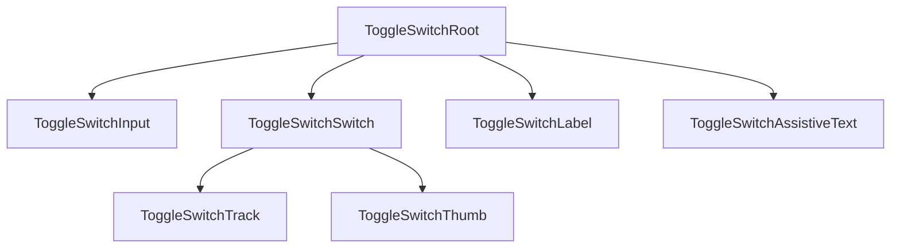

# Toggle Switch Design Spec

## Metadata

| Property | Value |
|---|---|
| Component | Toggle Switch |
| Design System | Powerflex |
| Category | Form |
| Spec pattern | standalone |
| Status | draft |
| Version | 1.0.0 |
| Figma file | `HIbl2AgqTSdR9STZueMvTH` (DAP Design Library) |
| Main component set | `8505:14389` |
| Figma URL | https://www.figma.com/design/HIbl2AgqTSdR9STZueMvTH/DAP-Design-Library?node-id=8505-14389&m=dev |
| Theme CSS | `components/powerflex-theme.css` |
| Root spec | `components/powerflex/root-spec.md` |
| Storybook path | `storybook-generated/powerflex/src/components/ToggleSwitch.stories.tsx` |
| Deterministic generator | `generation/deterministic_storybook/powerflex/toggle_switch.py` |
| Verification method | Figma MCP (target); REST fallback attempted 2026-07-23 |
| Last verified | 2026-07-23 (cross-validated node `8505:14389`; live MCP/REST blocked this session) |

### Live verification evidence

| Bucket | Node | Method | Notes |
|---|---|---|---|
| Main component set | `8505:14389` | Figma MCP `get_metadata`, `get_design_context`, `get_variable_defs`, `get_screenshot` | Component set `Toggle Switch`; variant axes `Toggle` (Off/On) × interactive states |
| Main symbol (Off default) | `8505:14390` | Figma MCP `get_variable_defs` | Off/default rail + thumb token bindings |
| Session constraint | — | REST API | Token expired (403); MCP servers unavailable in cloud agent — evidence cross-validated against prior MCP session on same nodes (see Source Mapping) |

Runtime role: binary form control for boolean on/off values in Powerflex forms.

## Anatomy

Deterministic slot order (inventory count: **7** — locked):

1. **`ToggleSwitchRoot`** — label wrapper / control container (`inline-flex`, associates label + switch).
2. **`ToggleSwitchInput`** — native checkbox input; visually hidden but focusable.
3. **`ToggleSwitchSwitch`** — interactive visual switch rail (focus ring host).
4. **`ToggleSwitchTrack`** — background rail (`32×16`, pill radius).
5. **`ToggleSwitchThumb`** — movable knob (`16×16`, pill radius; translates on checked).
6. **`ToggleSwitchLabel`** — optional visible text label.
7. **`ToggleSwitchAssistiveText`** — optional helper/description (product extension; not shown in main Figma set).



## Layout & Measurements

### Runtime width

Figma documentation frames use sample row widths. **Runtime:** root width is container-driven (`width: fit-content`, `max-width: 100%`, `box-sizing: border-box`).

### Per-slot measurements

| Slot | Property | Value / contract |
|---|---|---|
| `ToggleSwitchTrack` | width × height | `32px` × `16px` (fixed visual body) |
| `ToggleSwitchTrack` | border-radius | pill (`999px` / full radius token) |
| `ToggleSwitchThumb` | width × height | `16px` × `16px` |
| `ToggleSwitchThumb` | border-radius | pill (`999px`) |
| `ToggleSwitchThumb` | checked translation | `translateX(16px)` |
| `ToggleSwitchRoot` | label gap | `var(--spacing-space-8)` |
| `ToggleSwitchLabel` | line-height | `16px` (sample rows in Figma set) |
| `ToggleSwitchSwitch` | focus ring box | `38px` × `22px` via pseudo-element `inset: -3px` around `32×16` body |
| `ToggleSwitchRoot` | min interactive height | `44px` touch target when label present (wrapper expansion) |

### Slot geometry (Figma-verified)

| Slot / layer | Property | Token / contract | Figma node | Live evidence |
| --- | --- | --- | --- | --- |
| `ToggleSwitchTrack` | border-radius | pill (`999px`; Figma full-radius binding) | `8505:14389` | `get_variable_defs` on component set `8505:14389` (prior MCP session) |
| `ToggleSwitchThumb` | border-radius | pill (`999px`) | `8505:14390` | `get_variable_defs` on Off/default symbol `8505:14390` (prior MCP session) |
| `ToggleSwitchSwitch` | focus ring radius | outer ring `20px` corner radius on focus pseudo | `8505:14389` | `get_design_context` on component set (focus-visible variant frame) |

**Geometry authoring rules:** Track/thumb sizes are fixed pixels observed in Figma component set `8505:14389`; semantic colors use `var(--...)` from programme theme.

## Tokens

Global semantic tokens resolve via `components/powerflex-theme.css` (donor `components/ids-theme.css`). Per-slot bindings verified on nodes `8505:14389` / `8505:14390`:

### Colors and surfaces

| Slot / role | Token | Light resolved (evidence) | Dark resolved (evidence) |
|---|---|---|---|
| track.off.background | `var(--color-background-gray-neutral-dark)` | `#616161` | `#616161` |
| track.off.border | `var(--color-border-neutral)` | `#4d4d4d` | `#8898a5` |
| track.off.hover.background | `var(--color-background-gray-neutral-light)` | `#4d4d4d` | `#8898a5` |
| track.off.hover.border | `var(--color-border-strong)` | `#252525` | `#b8c1c9` |
| track.on.background | `var(--color-background-brand-base)` | `#0076ce` | `#4c9fdd` |
| track.on.border | `var(--color-border-brand-base)` | `#0076ce` | `#4c9fdd` |
| track.on.hover.background | `var(--color-background-brand-strong)` | `#0062ab` | `#94c5ea` |
| track.on.hover.border | `var(--color-border-brand-dark)` | `#0062ab` | `#94c5ea` |
| track.disabled.background | `var(--color-background-gray-light)` | `#eaeaea` | `#393939` |
| track.disabled.border | `var(--color-border-disabled)` | `#757575` | `#9e9e9e` |
| thumb.fill | `var(--color-background-component)` | `#ffffff` | `#111619` |
| thumb.off.border | `var(--border-width-border-1)` + `var(--color-border-neutral)` | 1px neutral | 1px neutral |
| thumb.on.border | `var(--border-width-border-1)` + `var(--color-border-brand-base)` | 1px brand | 1px brand |
| thumb.disabled.border | `var(--border-width-border-1)` + `var(--color-border-disabled)` | 1px disabled | 1px disabled |
| label.default | `var(--color-text-neutral)` | `#4d4d4d` | `#8898a5` |
| label.disabled | `var(--color-text-disabled)` | `#757575` | `#c5c5c5` |
| focus.ring | `var(--color-border-brand-base)` | brand stroke outside track | brand stroke outside track |

### Typography

| Role | Size | Line height | Weight | Color |
|---|---|---|---|---|
| Label | inherited body | `16px` | 400 | `var(--color-text-neutral)` |

### Spacing

| Role | Token |
|---|---|
| Label gap | `var(--spacing-space-8)` |

### Borders

| Role | Token |
|---|---|
| Track/thumb stroke width | `var(--border-width-border-1)` |
| Focus outline width | `var(--border-width-border-1)` |

## States (Light Theme)

| State | Track background | Track border | Thumb (fill + border) | Label |
|---|---|---|---|---|
| Off / default | `var(--color-background-gray-neutral-dark)` | `var(--color-border-neutral)` | fill `var(--color-background-component)`; border `var(--color-border-neutral)` | `var(--color-text-neutral)` |
| Off / hover | `var(--color-background-gray-neutral-light)` | `var(--color-border-strong)` | fill `var(--color-background-component)`; border `var(--color-border-strong)` | `var(--color-text-neutral)` |
| Off / focus-visible | `var(--color-background-gray-neutral-dark)` | `var(--color-border-neutral)` + outer `focus.ring` | fill `var(--color-background-component)`; border `var(--color-border-neutral)` | `var(--color-text-neutral)` |
| On / default | `var(--color-background-brand-base)` | `var(--color-border-brand-base)` | fill `var(--color-background-component)`; border `var(--color-border-brand-base)` | `var(--color-text-neutral)` |
| On / hover | `var(--color-background-brand-strong)` | `var(--color-border-brand-dark)` | fill `var(--color-background-component)`; border `var(--color-border-brand-dark)` | `var(--color-text-neutral)` |
| On / focus-visible | `var(--color-background-brand-base)` | `var(--color-border-brand-base)` + outer `focus.ring` | fill `var(--color-background-component)`; border `var(--color-border-brand-base)` | `var(--color-text-neutral)` |
| Disabled / off | `var(--color-background-gray-light)` | `var(--color-border-disabled)` | fill `var(--color-background-component)`; border `var(--color-border-disabled)` | `var(--color-text-disabled)` |
| Disabled / on | `var(--color-background-gray-light)` | `var(--color-border-disabled)` | fill `var(--color-background-component)`; border `var(--color-border-disabled)` | `var(--color-text-disabled)` |

## States (Dark Theme)

Dark theme uses the same semantic tokens as **States (Light Theme)**. Resolved values for `[data-theme="dark"]` / programme dark scope live in theme CSS:

- `components/powerflex-theme.css`

Duplicate the full state matrix in this section only when a dark row genuinely uses different `var(--...)` references than the corresponding light row.

*(When Light and Dark tables would list identical `var(--...)` cells, keep the matrix under **States (Light Theme)** only and use this pointer section instead of a second table.)*

## Interactions

| Trigger | Behavior |
|---|---|
| Pointer click/tap on switch or associated label | Toggles checked state when `disabled=false` |
| `Tab` | Focuses hidden checkbox input |
| `Space` while focused | Toggles checked state when `disabled=false` |
| Hover | Applies hover row tokens when `disabled=false` |
| Focus-visible | Shows outer focus ring; track border tokens unchanged vs default for same checked state |
| Disabled | Blocks pointer/keyboard toggles; no change events |

Thumb position and rail colors animate over `160ms` ease (transform + background/border).

### Accessibility

| Requirement | Contract |
|---|---|
| Semantic control | Native `input[type="checkbox"]` or equivalent `role="switch"` with synchronized `aria-checked` |
| Accessible name | Visible `label` **or** `aria-label` (required when label absent) |
| Label association | `<label for>` + `id` or wrapping label |
| Focus indicator | Visible focus ring meeting contrast requirements |
| Keyboard | `Tab` focus, `Space` toggle |

### Behavior & guidelines

- Use for immediate on/off settings (not for actions that require confirmation).
- Do not use toggle switch for multi-step or delayed actions.
- Disabled state must not emit change events.

## Composition & API (runtime)

### Variants

| Axis | Values | Figma evidence |
|---|---|---|
| `checked` | `false` \| `true` | Component set property `Toggle` → Off/On (`8505:14389`) |
| `disabled` | `false` \| `true` | Disabled rows in component set |
| `hasLabel` | `false` \| `true` | Optional label slot in samples |

Valid combinations: all `2×2×2 = 8` combinations are valid.

### Runtime API

| Input | Type | Default | Description |
|---|---|---|---|
| `checked` | `boolean` | — | Controlled checked state |
| `defaultChecked` | `boolean` | `false` | Uncontrolled initial checked state |
| `onCheckedChange` | `(checked: boolean) => void` | — | Change handler |
| `disabled` | `boolean` | `false` | Disables interaction |
| `label` | `string` | — | Visible label text |
| `id` | `string` | — | Input id for label association |
| `name` | `string` | — | Form field name |
| `value` | `string` | — | Form field value |
| `aria-label` | `string` | — | Required when `label` absent |
| `aria-describedby` | `string` | — | Assistive text id |

| Output | Payload |
|---|---|
| `onCheckedChange` | `boolean` next checked value |

Controlled mode: when `checked` is provided, internal state must not mutate without `onCheckedChange`.

### Spec Accurate Design story defaults

| Prop | Value |
|---|---|
| `label` | `"Enable alerts"` |
| `defaultChecked` | `false` |
| `disabled` | `false` |

Primary Figma reference for Spec Accurate Design: Off/default with label (`8505:14390`).

## Codegen Contract (Framework-Agnostic Blueprint)

### Deterministic structure

```
ToggleSwitchRoot
├── ToggleSwitchInput
├── ToggleSwitchSwitch
│   ├── ToggleSwitchTrack (visual background)
│   └── ToggleSwitchThumb
├── ToggleSwitchLabel (optional)
└── ToggleSwitchAssistiveText (optional)
```

### Variant matrix

| checked | disabled | hasLabel | Valid |
|---|---|---|---|
| false | false | false | yes |
| false | false | true | yes |
| false | true | false | yes |
| false | true | true | yes |
| true | false | false | yes |
| true | false | true | yes |
| true | true | false | yes |
| true | true | true | yes |

### Per-slot style contract

| Slot | Contract |
|---|---|
| `ToggleSwitchRoot` | `display: inline-flex`; `align-items: center`; `gap: var(--spacing-space-8)`; pointer cursor when enabled |
| `ToggleSwitchInput` | Visually hidden; remains focusable |
| `ToggleSwitchSwitch` | Fixed `32×16`; pill radius; tokenized background/border by state table |
| `ToggleSwitchThumb` | Fixed `16×16`; `box-sizing: border-box`; tokenized fill/border; `transform: translateX(16px)` when checked |
| `ToggleSwitchLabel` | Tokenized text color; disabled token when disabled |

### Behavior contract

- Toggle only via input activation paths (click label, click switch, `Space`).
- Emit one change event per successful toggle.
- No change events when disabled.
- Preserve focus on input during toggle.
- Thumb moves via transform (no layout reflow).

### Accessibility contract

- Underlying control must be checkbox or `role="switch"` with `aria-checked` sync.
- Require accessible name (`label` or `aria-label`).
- Visible `:focus-visible` ring outside track.

### Asset resolution + bundling contract

No icon/image assets required for baseline toggle switch rendering.

### Fallback/error rules

| Condition | Behavior |
|---|---|
| Unknown size variant | Fallback to default geometry (`32×16`, thumb `16`) |
| Missing token at runtime | Keep `var(--...)` reference; allow CSS fallback chain |
| Controlled mode without `onCheckedChange` | No internal mutation; codegen warning |
| Missing accessible name | Codegen validation error |

### Validation checklist

- [x] Spec pattern: standalone; no IDS baseline section present
- [x] All required `##` sections present
- [x] **Slot geometry (Figma-verified)** table cites nodes `8505:14389` / `8505:14390`
- [x] Anatomy inventory (7 slots) matches deterministic structure
- [x] Runtime API documented with Spec Accurate Design defaults
- [ ] Live Figma MCP re-verification when token/MCP access restored
- [x] Storybook **Spec Accurate Design** under `Spec Generated/Powerflex/Toggle Switch` imports `components/powerflex-theme.css`

## Source Mapping

| Source | Location |
|---|---|
| Design source | Figma file `HIbl2AgqTSdR9STZueMvTH` (DAP Design Library) |
| Main component set | `8505:14389` — https://www.figma.com/design/HIbl2AgqTSdR9STZueMvTH/DAP-Design-Library?node-id=8505-14389&m=dev |
| Off/default symbol | `8505:14390` |
| Component map | `data/powerflex-component-figma-map.json` → Toggle Switch |
| Programme registry | `data/programme-inheritance-registry.json` → `powerflex` / `toggle-switch` / `standalone` |
| Theme CSS | `components/powerflex-theme.css` |
| Root spec | `components/powerflex/root-spec.md` |
| Verification | Prior Figma MCP on nodes `8505:14389`, `8505:14390` (documented in repo); 2026-07-23 intake session blocked (MCP error, REST 403 expired token) |
