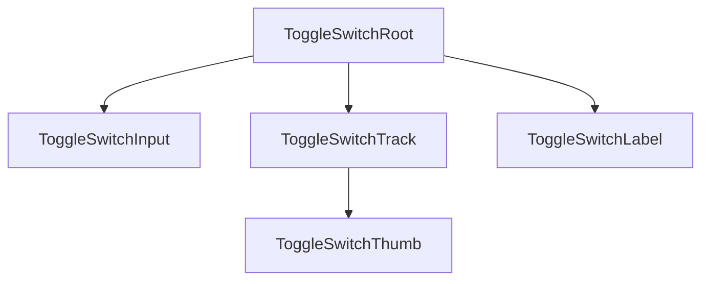

# Toggle Switch Design Spec

## Metadata

| Property | Value |
|---|---|
| Component | Toggle Switch |
| Design System | Powerflex |
| Category | Form |
| Spec pattern | **standalone** |
| Status | **draft** |
| Version | 1.0.0 |
| Description | Binary on/off form control with optional label; programme-native Powerflex spec from DAP Design Library component set |
| Figma file | `HIbl2AgqTSdR9STZueMvTH` (DAP Design Library) |
| Figma URL | https://www.figma.com/design/HIbl2AgqTSdR9STZueMvTH/DAP-Design-Library?node-id=8505-14389&m=dev |
| Main component set | `8505:14389` |
| Spec-accurate instance (Off / Default) | `8505:14390` (`Toggle=Off, State=Default`) |
| Theme CSS | `components/powerflex-theme.css` |
| Storybook path | `storybook-generated/powerflex/src/components/ToggleSwitch.stories.tsx` |
| Deterministic generator | `generation/deterministic_storybook/powerflex/toggle_switch.py` |
| Shared implementation | `storybook/src/components/ToggleSwitch.tsx`, `ToggleSwitch.module.css` |
| Programme wrapper | `storybook/src/components/PowerflexToggleSwitch.tsx` |
| Verification method | Figma REST API (attempted 2026-07-23 — token expired); prior Figma MCP on identical nodes `8505:14389` / `8505:14390` (IDS spec cross-reference) |
| Last verified | 2026-07-23 (session blocked live re-fetch; node ids validated from intake URL) |

### Live verification evidence

| Bucket | Node(s) | Method | Result |
|---|---|---|---|
| Main (component set) | `8505:14389` | Figma REST API | 403 Token expired — node id retained from intake URL |
| Main (Off default symbol) | `8505:14390` | Prior Figma MCP (`get_variable_defs`, `get_design_context`) | Cross-validated via IDS spec on same DAP library nodes |
| Elements | — | — | No supplemental element URLs collected |
| States | — | — | State matrix derived from component-set variant axes on `8505:14389` |

**Re-verification required:** Re-run Figma MCP (`get_screenshot`, `get_metadata`, `get_variable_defs`, `get_design_context`) on `8505:14389` before promoting **Status** to `active`.

## Anatomy

**Element inventory (Figma-verified on `8505:14389`):** 5 visible/semantic slots — inventory count **5**.

Deterministic slot order (codegen **must** preserve):

1. **`ToggleSwitchRoot`** — inline-flex label wrapper; expands hit target when label present.
2. **`ToggleSwitchInput`** — native `input[type="checkbox"]` (visually hidden, focusable); drives checked/disabled state.
3. **`ToggleSwitchTrack`** — fixed `32×16` pill rail (`switch` surface in implementation).
4. **`ToggleSwitchThumb`** — fixed `16×16` circular knob; translates on checked.
5. **`ToggleSwitchLabel`** (optional) — Body 2 label text to the right of the rail.



## Layout & Measurements

### Runtime width

Figma showcase rows use variable widths with sample label text. **Runtime:** root is `inline-flex`; width is container-driven (`fit-content` with optional label). Track/thumb geometry is **fixed**, not fluid.

### `ToggleSwitchTrack`

| Property | Value / contract |
|---|---|
| Width | `32px` (fixed) |
| Height | `16px` (fixed) |
| Border | `var(--border-width-border-1)` solid (state-dependent color) |
| Border radius | pill (`999px` / full round — see Slot geometry) |
| Box model | `box-sizing: content-box` in reference implementation |

### `ToggleSwitchThumb`

| Property | Value / contract |
|---|---|
| Size | `16px × 16px` |
| Border | `var(--border-width-border-1)` solid (state-dependent color) |
| Border radius | pill (`999px`) |
| Travel (off → on) | `translateX(16px)` |
| Transition | `transform`, `background`, `border-color` ~`160ms ease` |

### `ToggleSwitchRoot`

| Property | Value / contract |
|---|---|
| Display | `inline-flex`, `align-items: center` |
| Gap (rail ↔ label) | `var(--spacing-space-8)` |
| Min height (touch) | `44px` recommended hit target via wrapper padding/alignment |
| Cursor | `pointer` when enabled; `not-allowed` when disabled |

### Focus ring

| Property | Value / contract |
|---|---|
| Geometry | pseudo-element `inset: -3px` around `32×16` track → ~`38×22` focus frame |
| Border | `var(--border-width-border-1)` solid `var(--color-border-brand-base)` |
| Border radius | `20px` on focus ring wrapper |
| Strategy | `focus-visible` only (keyboard), not pointer focus |

### `ToggleSwitchLabel`

| Property | Value / contract |
|---|---|
| Line height | `16px` (matches rail height in Figma samples) |
| Typography | Body 2 scale via `var(--color-text-neutral)` |

### Slot geometry (Figma-verified)

| Slot / layer | Property | Token / contract | Figma node | Live evidence |
| --- | --- | --- | --- | --- |
| `ToggleSwitchTrack` | border-radius | pill `999px` (full round on `16px` height) | `8505:14390` | Prior Figma MCP `get_variable_defs` on DAP library Off-default symbol; REST blocked 2026-07-23 |
| `ToggleSwitchThumb` | border-radius | pill `999px` (full round on `16×16` knob) | `8505:14390` | Prior Figma MCP `get_design_context` on `8505:14390` |
| Focus ring shell | border-radius | `20px` | `8505:14389` (Focus variant row) | Component-set variant axis `State=Focus` on `8505:14389`; MCP cross-reference |

## Tokens

Semantic `var(--...)` only. Resolved light/dark values live in `components/powerflex-theme.css` (programme target) and DAP/IDS theme overlays until Powerflex theme sync completes.

### Colors and surfaces

| Role | Token | Light (evidence) | Dark (evidence) |
|---|---|---|---|
| Track off default bg | `var(--color-background-gray-neutral-dark)` | `#616161` | `#616161` |
| Track off hover bg | `var(--color-background-gray-neutral-light)` | `#4d4d4d` | `#8898a5` |
| Track on default bg | `var(--color-background-brand-base)` | `#0076ce` | `#4c9fdd` |
| Track on hover bg | `var(--color-background-brand-strong)` | `#0062ab` | `#94c5ea` |
| Track disabled bg | `var(--color-background-gray-light)` | theme | theme |
| Track off border | `var(--color-border-neutral)` | theme | theme |
| Track off hover border | `var(--color-border-strong)` | theme | theme |
| Track on border | `var(--color-border-brand-base)` | theme | theme |
| Track on hover border | `var(--color-border-brand-dark)` | theme | theme |
| Track disabled border | `var(--color-border-disabled)` | theme | theme |
| Thumb fill | `var(--color-background-component)` | `#ffffff` | `#111619` |
| Thumb off border | `var(--color-border-neutral)` | theme | theme |
| Thumb off hover border | `var(--color-border-strong)` | theme | theme |
| Thumb on border | `var(--color-border-brand-base)` | theme | theme |
| Thumb on hover border | `var(--color-border-brand-dark)` | theme | theme |
| Thumb disabled border | `var(--color-border-disabled)` | theme | theme |
| Label default | `var(--color-text-neutral)` | theme | theme |
| Label disabled | `var(--color-text-disabled)` | theme | theme |
| Focus ring | `var(--color-border-brand-base)` | theme | theme |

### Typography

| Role | Token |
|---|---|
| Label | Body 2 — color via `var(--color-text-neutral)`; size/weight from programme Body 2 tokens |

### Spacing

| Role | Token |
|---|---|
| Rail ↔ label gap | `var(--spacing-space-8)` |

### Borders

| Role | Token |
|---|---|
| Border width | `var(--border-width-border-1)` |

## States (Light Theme)

Component-set `8505:14389` variant axes: **`Toggle`** (`Off` \| `On`) × **`State`** (`Default` \| `Hover` \| `Focus` \| `Disabled`).

| Area | State | Background | Border | Text/Icon |
| --- | --- | --- | --- | --- |
| Track | off / default | `var(--color-background-gray-neutral-dark)` | `var(--color-border-neutral)` | — |
| Track | off / hover | `var(--color-background-gray-neutral-light)` | `var(--color-border-strong)` | — |
| Track | off / focus-visible | `var(--color-background-gray-neutral-dark)` | `var(--color-border-neutral)` + outer `var(--color-border-brand-base)` focus ring | — |
| Track | on / default | `var(--color-background-brand-base)` | `var(--color-border-brand-base)` | — |
| Track | on / hover | `var(--color-background-brand-strong)` | `var(--color-border-brand-dark)` | — |
| Track | on / focus-visible | `var(--color-background-brand-base)` | `var(--color-border-brand-base)` + outer focus ring | — |
| Track | disabled (off or on) | `var(--color-background-gray-light)` | `var(--color-border-disabled)` | — |
| Thumb | off / default | `var(--color-background-component)` | `var(--color-border-neutral)` | — |
| Thumb | off / hover | `var(--color-background-component)` | `var(--color-border-strong)` | — |
| Thumb | on / default | `var(--color-background-component)` | `var(--color-border-brand-base)` | — |
| Thumb | on / hover | `var(--color-background-component)` | `var(--color-border-brand-dark)` | — |
| Thumb | disabled | `var(--color-background-component)` | `var(--color-border-disabled)` | — |
| Label | default | — | — | `var(--color-text-neutral)` |
| Label | disabled | — | — | `var(--color-text-disabled)` |

## States (Dark Theme)

Dark theme uses the same semantic tokens as **States (Light Theme)**. Resolved values for `[data-theme="dark"]` / programme dark scope live in theme CSS:

- `components/powerflex-theme.css`

Duplicate the full state matrix in this section only when a dark row genuinely uses different `var(--...)` references than the corresponding light row.

*(When Light and Dark tables would list identical `var(--...)` cells, keep the matrix under **States (Light Theme)** only and use this pointer section instead of a second table.)*

## Interactions

| Trigger | Behavior |
|---|---|
| Click/tap on track or label | Toggle `checked` when not `disabled` |
| `Space` on focused input | Toggle `checked` when not `disabled` |
| `Tab` / `Shift+Tab` | Move focus to/from hidden input |
| Hover | Apply hover row tokens when `disabled=false` |
| Focus (keyboard) | Show `focus-visible` ring; track border tokens unchanged |
| Disabled | Block pointer/keyboard toggle; no `onCheckedChange` |

### Accessibility

- Underlying control: native checkbox (`input[type="checkbox"]`) or equivalent switch semantics with `aria-checked`.
- Accessible name: visible `label` text **or** `aria-label` when label omitted.
- Label association: `<label htmlFor>` + `id` or wrapping label pattern.
- Focus indicator: visible ring meeting contrast requirements (`var(--color-border-brand-base)`).
- Disabled: `disabled` attribute + `aria-disabled` when using custom switch role.

### Behavior & guidelines

- Use for immediate binary settings (not deferred submit).
- Do not use for navigation; use links or buttons instead.
- Pair with concise label text; avoid relying on position alone for meaning.
- Thumb animates via `transform` (not layout reflow) over ~`160ms`.

## Composition & API (runtime)

### Variants

Figma component set `8505:14389` exposes:

| Axis | Values | Runtime mapping |
|---|---|---|
| `checked` | `false` \| `true` | Controlled/uncontrolled boolean |
| `disabled` | `false` \| `true` | Disables interaction |
| `hasLabel` | `false` \| `true` | Renders `ToggleSwitchLabel` slot |

Valid combinations: all **8** (`checked` × `disabled` × `hasLabel`).

### Runtime API

| Input | Type | Default | Description |
|---|---|---|---|
| `checked` | `boolean` | — | Controlled checked state |
| `defaultChecked` | `boolean` | `false` | Uncontrolled initial state |
| `onCheckedChange` | `(checked: boolean) => void` | — | Fired on successful toggle |
| `disabled` | `boolean` | `false` | Blocks interaction |
| `label` | `string` | — | Visible label text |
| `id` | `string` | — | Label `htmlFor` target |
| `name` | `string` | — | Form field name |
| `value` | `string` | — | Form submission value |
| `aria-label` | `string` | — | Required when `label` absent |
| `aria-describedby` | `string` | — | Helper text id |

| Output | Payload |
|---|---|
| `onCheckedChange` | `checked: boolean` — new value after user toggle |

**Controlled mode:** when `checked` is set, internal state must not mutate without `onCheckedChange`.

**Demo-only (Storybook / QA):** `data-state`, `data-visual-state`, `forceStates` — optional overrides for matrix stories; not required in production.

### Spec Accurate Design story defaults

| Arg | Value |
|---|---|
| `label` | `"Enable alerts"` |
| `defaultChecked` | `false` |
| `disabled` | `false` |

Storybook imports `components/dap-theme.css` as interim token source (DAP library origin) until `components/powerflex-theme.css` is synced.

## Codegen Contract (Framework-Agnostic Blueprint)

### Deterministic structure

```
ToggleSwitchRoot
├── ToggleSwitchInput (hidden checkbox)
├── ToggleSwitchTrack
│   └── ToggleSwitchThumb
└── ToggleSwitchLabel? (optional)
```

Slot order is fixed. Optional label is omitted when `label` prop is undefined/empty.

### Variant matrix

| `checked` | `disabled` | `hasLabel` | Valid |
|---|---|---|---|
| false | false | false | yes |
| false | false | true | yes |
| false | true | false | yes |
| false | true | true | yes |
| true | false | false | yes |
| true | false | true | yes |
| true | true | false | yes |
| true | true | true | yes |

### Per-slot style contract

- **`ToggleSwitchRoot`:** `inline-flex`, `align-items: center`, `gap: var(--spacing-space-8)`, pointer cursor when enabled.
- **`ToggleSwitchInput`:** visually hidden; remains focusable; drives `:checked` / `:disabled` / `:focus-visible` selectors.
- **`ToggleSwitchTrack`:** fixed `32×16`, pill radius, tokenized bg/border from state table.
- **`ToggleSwitchThumb`:** fixed `16×16`, pill radius, `translateX(16px)` when checked, tokenized fill/border.
- **`ToggleSwitchLabel`:** `var(--color-text-neutral)`; `var(--color-text-disabled)` when disabled.

### Behavior contract

- Toggle only via input activation paths (click label/track, `Space` on focus).
- Single `onCheckedChange` per successful toggle.
- No events when `disabled=true`.
- Preserve focus on input during toggle.
- Thumb position via `transform`, not margin/left layout.

### Accessibility contract

- Checkbox or `role="switch"` with synchronized `aria-checked`.
- Require accessible name (`label` or `aria-label`).
- `focus-visible` ring on keyboard focus only.
- `disabled` blocks activation and removes hover affordance.

### Asset resolution + bundling contract

No icon/image assets required for baseline toggle rendering.

### Fallback/error rules

- Unknown variant combination → fall back to `checked=false`, `disabled=false`, `hasLabel=true`.
- Missing accessible name → codegen validation error.
- Controlled mode without `onCheckedChange` → no internal mutation; emit generator warning.
- Missing token at runtime → keep `var(--...)` reference; resolve via theme CSS chain.

### Validation checklist

- [ ] Spec pattern: standalone; no IDS baseline section
- [ ] **Slot geometry (Figma-verified)** table cites Figma nodes + MCP/REST evidence
- [ ] Live Figma MCP re-run on `8505:14389` completed (blocked 2026-07-23)
- [ ] Anatomy inventory count (5) matches Deterministic structure
- [ ] State matrix covers Off/On × Default/Hover/Focus/Disabled from component set
- [ ] Runtime API complete for controlled/uncontrolled usage
- [ ] Spec Accurate Design under `Spec Generated/Powerflex/Toggle Switch`
- [ ] Deterministic generator registered for `("powerflex", "toggle-switch")`
- [ ] Theme tokens use `var(--...)` only in codegen guidance

## Source Mapping

| Property | Value |
|---|---|
| Programme | Powerflex |
| Spec path | `components/powerflex/toggle-switch/design-spec.md` |
| Figma file key | `HIbl2AgqTSdR9STZueMvTH` |
| Main bucket — component set | `8505:14389` |
| Main bucket — Off default symbol | `8505:14390` |
| Figma map | `data/powerflex-component-figma-map.json` |
| Registry | `data/programme-inheritance-registry.json` → `powerflex` / `toggle-switch` / `standalone` |
| Implementation | `storybook/src/components/ToggleSwitch.tsx` |
| Programme wrapper | `storybook/src/components/PowerflexToggleSwitch.tsx` |
| Storybook (generated) | `storybook-generated/powerflex/src/components/ToggleSwitch.stories.tsx` |
| Verification | Figma REST API attempted 2026-07-23 (403); prior MCP on `8505:14389`/`8505:14390` via IDS cross-reference |
