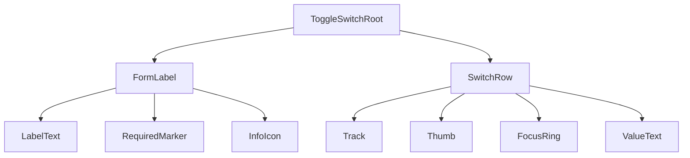

# Toggle Switch Design Spec

## Metadata

| Property | Value |
|---|---|
| Component | Toggle Switch |
| Design system | Powerflex |
| Spec pattern | **standalone** |
| Category | Form |
| Status | **draft** |
| Version | 1.0.0 |
| Description | Binary form control with optional Form Label (text + required marker + info icon), 32×16 track, 16×16 thumb, optional On/Off value text, and Label Position Left \| Top. |
| Theme CSS | `components/powerflex-theme.css` |
| File key | `0bHk3XhrjFhowgFkz9yLr4` (IDS Design Library — Powerflex intake Main URL) |
| Main (`ToggleSwitch` component set) | https://www.figma.com/design/0bHk3XhrjFhowgFkz9yLr4/IDS-Design-Library?node-id=8505-14389&m=dev — **`8505:14389`** |
| Verification method | **Figma REST API** (collab server-packaged evidence) — session `lj7dDIFRcYoQF_OSsqCjvzvndhaX837d`, 2026-07-27. Client used packaged `tools.get_metadata`, `tools.get_design_context`, `tools.get_variable_defs`, `tools.get_screenshot`, `slotGeometry` only (no client Figma MCP). |
| Storybook | `storybook-generated/powerflex/src/components/ToggleSwitch.stories.tsx` — title **`Spec Generated/Powerflex/Toggle Switch`**, story **`Spec Accurate Design`** |
| Reference implementation | `storybook/src/components/ToggleSwitch.tsx`, `ToggleSwitch.module.css` |
| Deterministic generator | `generation/deterministic_storybook/ids/toggle_switch.py` (registry `("powerflex", "toggle-switch")`) |
| Composition dependencies | Form Label instance (label text + optional `*` + `info-circ-solid` 16×16 icon) |

### Live verification evidence

| Check | Node(s) | Method | Status |
|---|---|---|---|
| Main component set + screenshot | `8505:14389` | Packaged REST `get_screenshot` + `get_metadata` | **verified (packaged)** |
| Design context (layout/colors/anatomy) | `8505:14389` | Packaged REST `get_design_context` | **verified (packaged)** |
| Slot geometry / radius | track `14740:117592`, focus `45070:45643`, disabled track `8505:14437` | Packaged `slotGeometry` (+ `get_design_context` cornerRadius). Packaged `get_variable_defs` returned **empty** bullets — radius cited from slotGeometry numeric `borderRadius` + bound VariableIDs on those nodes | **verified with REST limitation noted** |
| Variant children in metadata tree | 12 COMPONENTS under set | Packaged `structure` / `get_metadata` | **partial** — Off Default + Off Hover Left/Top named in `get_design_context` layout bullets (115×40 / 60×56) but **absent** from returned component-set children (see Source Mapping) |

### Parent composition

Toggle Switch is a **form control**. Parents place it in forms/settings rows. Form Label chrome (required `*`, info icon) is optional composition from the Form Label instance — not a separate Powerflex component in this intake.

## Anatomy

**Explicit inventory count (primary On Default Left `8505:14417`):** Root + Form Label + label frame + Label text + Required `*` + Info icon + Switch row + toggle frame + Track (`base`) + Thumb (`switch`) + ValueText (`On`) = **11** top-level visible slots (icon internal vectors are not runtime slots).

Deterministic render order (locked to Figma):

1. **`ToggleSwitchRoot`** — component root; layout axis from `labelPosition`
2. **`FormLabel`** — optional Form Label instance (`14740:117558` on On Default Left)
   1. **`LabelText`** — sample “Label:” (Body 2 / 14/20)
   2. **`RequiredMarker`** — optional `*`
   3. **`InfoIcon`** — optional `info-circ-solid` **16×16**
3. **`SwitchRow`** — horizontal group (`Switch` frame): track + value text, `gap: 8`
4. **`Track`** — `toggle` / `base` **32×16**, radius **8**
5. **`Thumb`** — ellipse **16×16** (`switch` / `Toogle Switch`)
6. **`FocusRing`** — **38×22**, radius **20**, only when `State=Focus` / runtime `focus-visible`
7. **`ValueText`** — “On” \| “Off” beside track (14/16)

## Layout & Measurements

| Region | Figma evidence | Runtime |
|---|---|---|
| Component set board | `ToggleSwitch` **710×347** (`8505:14389`) | Documentation board only; set stroke `#9747ff` is Figma chrome — **not** runtime |
| Root Left | **113×40** On / **115×40** Off (`8505:14417`, `9527:25448`) | `inline-flex`; width content-driven |
| Root Top | **58×56** On / **60×56** Off | `flex-direction: column` |
| Root gap (Left) | `itemSpacing=8` horizontal | `var(--spacing-space-8)` |
| Form Label | **47×40**; padding top/bottom **10**; gap **8** to icon | Optional; omit when no visible form label |
| Label + `*` stack | gap **2** horizontal | `var(--spacing-space-2)` when both present |
| Info icon | **16×16** | Asset slug `info-circ-solid` |
| Switch row | **58×16** On / **60×16** Off; gap **8** | Track + ValueText |
| Track | **32×16**; `borderRadius=8` | Fixed visual body |
| Thumb | **16×16** ellipse | Translate **16px** on checked |
| Focus ring | **38×22**; `borderRadius=20`; ~3px outside track | `focus-visible` only |
| Value text | height **16**; On ~18w / Off ~20w | Show when `showValueText=true` |
| Lo-Res | Axis present; packaged children all **`Lo-Res=False`** | Runtime default `false`; `true` not evidenced in package — do not invent dense geometry |

### Slot geometry (Figma-verified)

| Slot / layer | Property | Token / contract | Figma node | Live evidence |
| --- | --- | --- | --- | --- |
| `Track` (`base`) | `width` × `height` | **32×16** fixed | `14740:117592` (On Focus Left) | Packaged REST `slotGeometry` + `get_metadata` structure |
| `Track` (`base`) | `border-radius` | `var(--toggle-switch-track-radius)` → `var(--corner-radius-radius-8)` → **8px** | `14740:117592` | Packaged REST `get_design_context` `cornerRadius=8.0` + `slotGeometry.borderRadius=8`; bound VariableID `…/47290:25`. Packaged `get_variable_defs` empty. |
| `Track` disabled (`Toggle Base`) | `border-radius` | same **8px** / `var(--corner-radius-radius-8)` | `8505:14437` | Packaged REST `get_design_context` + `slotGeometry.borderRadius=8`; bound vars `…/47290:46`, `…/47323:103` |
| `Thumb` | size / radius | **16×16**; `var(--corner-radius-radius-round)` | `14740:117593` | Packaged REST `get_metadata` + `get_design_context` ELLIPSE 16×16; circular thumb |
| `FocusRing` | size | **38×22** outside track | `45070:45643` | Packaged REST `slotGeometry` + `get_metadata` |
| `FocusRing` | `border-radius` | `var(--toggle-switch-focus-ring-radius)` → **20px** | `45070:45643` | Packaged REST `get_design_context` `cornerRadius=20.0` + `slotGeometry.borderRadius=20`; bound VariableID `…/47290:163` |
| `FocusRing` | stroke | `var(--border-width-border-1)` × `var(--color-border-brand-base)` | `45070:45643` | Packaged REST `get_design_context` colors: focus stroke `#0672cb` |
| Root ↔ FormLabel ↔ Switch | gap | `var(--spacing-space-8)` | `9527:25469` | Packaged REST `get_design_context` `itemSpacing=8` |
| Component set frame | `border-radius` | **5px** (docs board only — not runtime shell) | `8505:14389` | Packaged REST `get_design_context` + `slotGeometry.borderRadius=5` |

**Geometry authoring rules (mandatory):**
- Document **each** interactive shell separately: track, focus ring, thumb.
- Radius rows cite packaged REST `slotGeometry` / `get_design_context` on the node. Packaged `get_variable_defs` was empty — re-verify with live MCP when available.
- Theme aliases document **implementation wiring** after Figma numeric/radius evidence.

## Tokens

### Typography

| Slot | Style / tokens | Evidence |
|---|---|---|
| `LabelText` / `RequiredMarker` | Roboto **14 / 20 / 400** → `var(--font-size-body-2)` / `var(--font-line-height-line-height-20)` / `var(--font-weight-font-weight-regular)` | Packaged typography “Label:” / “*” |
| `ValueText` On/Off | Roboto **14 / 16 / 400** → `var(--font-size-body-2)` / line-height **16px** | Packaged typography “On” / “Off” |

### Colors and surfaces

Resolved light hex from packaged `get_design_context` colors (evidence only). Semantic `var(--...)` are codegen contracts via `components/powerflex-theme.css`.

| Use | Token | Light resolved (packaged) |
|---|---|---|
| Track On default fill | `var(--color-background-brand-base)` | `#0672cb` (also listed `#005ece` on a base fill — prefer control brand-base; `#005ece` = `var(--color-background-alerting-info)` / `--alert-blue-500`) |
| Track On hover fill | `var(--color-background-brand-strong)` | `#055fa9` |
| Track Off default fill | `var(--color-background-gray-neutral-dark)` | `#616161` |
| Track Off hover fill | `var(--color-background-gray-neutral-darker)` | `#252525` (packaged Off hover `base` fill — standalone vs IDS `gray-neutral-light`) |
| Track disabled fill | `var(--color-background-gray-light)` | `#eaeaea` |
| Track / thumb On border | `var(--color-border-brand-base)` | `#0672cb` |
| Track / thumb On hover border | `var(--color-border-brand-dark)` | `#055fa9` |
| Track Off default border | `var(--color-border-neutral)` | aligns with gray rail |
| Track Off hover border | `var(--color-border-strong)` | `#252525` |
| Track / thumb disabled border | `var(--color-border-disabled)` | `#757575` |
| Thumb fill | `var(--color-background-component)` | `#ffffff` |
| Focus ring stroke | `var(--color-border-brand-base)` | `#0672cb` |
| Label / required text | `var(--color-text-neutral-strong)` | `#252525` |
| ValueText default | `var(--color-text-neutral)` | `#4d4d4d` |
| ValueText / label disabled | `var(--color-text-disabled)` | `#757575` |

### Spacing

| Use | Token | Resolved |
|---|---|---|
| Root / Switch row gaps | `var(--spacing-space-8)` | 8 |
| Label ↔ required marker | `var(--spacing-space-2)` | 2 |
| Form Label vertical padding | `var(--padding-padding-10)` when token exists; else document **10px** sample from Form Label instance | 10 |

### Borders / radius

| Use | Token |
|---|---|
| Track / thumb / focus stroke width | `var(--border-width-border-1)` |
| Track radius | `var(--toggle-switch-track-radius)` → `var(--corner-radius-radius-8)` |
| Focus ring radius | `var(--toggle-switch-focus-ring-radius)` → **20px** (Figma; no primitive `radius-20` in theme) |
| Thumb radius | `var(--corner-radius-radius-round)` |

### Shadows / elevation

None observed on Toggle Switch in packaged evidence — omit elevation tokens.

## States (Light Theme)

| State | Track Background | Track Border | Thumb (fill + border) | ValueText / Label |
|---|---|---|---|---|
| Off / default | `var(--color-background-gray-neutral-dark)` | `var(--color-border-neutral)` | fill `var(--color-background-component)`; border `var(--color-border-neutral)` | `var(--color-text-neutral)` / label `var(--color-text-neutral-strong)` |
| Off / hover | `var(--color-background-gray-neutral-darker)` | `var(--color-border-strong)` | fill `var(--color-background-component)`; border `var(--color-border-strong)` | same |
| Off / focus-visible | Off default fills + outer `FocusRing` | Off default border + ring | Off default thumb | same |
| On / default | `var(--color-background-brand-base)` | `var(--color-border-brand-base)` | fill `var(--color-background-component)`; border `var(--color-border-brand-base)` | same |
| On / hover | `var(--color-background-brand-strong)` | `var(--color-border-brand-dark)` | fill `var(--color-background-component)`; border `var(--color-border-brand-dark)` | same |
| On / focus-visible | On default fills + outer `FocusRing` | On default border + ring | On default thumb | same |
| Disabled / off | `var(--color-background-gray-light)` | `var(--color-border-disabled)` | fill `var(--color-background-component)`; border `var(--color-border-disabled)` | `var(--color-text-disabled)` |
| Disabled / on | `var(--color-background-gray-light)` | `var(--color-border-disabled)` | fill `var(--color-background-component)`; border `var(--color-border-disabled)` | `var(--color-text-disabled)` |

Representative nodes: On Default Left `8505:14417`, On Hover Left `8505:14426`, On Focus Left `9527:25469`, On Disabled Left `8505:14435`, Off Focus Left `9527:25448`, Off Disabled Left `8505:14444`. Off Default/Hover colors from packaged color list + layout bullet names (metadata children truncated).

## States (Dark Theme)

Dark theme uses the same semantic tokens as **States (Light Theme)**. Resolved values for `[data-theme="dark"]` / programme dark scope live in theme CSS:

- `components/powerflex-theme.css`

Duplicate the full state matrix in this section only when a dark row genuinely uses different `var(--...)` references than the corresponding light row.

*(When Light and Dark tables would list identical `var(--...)` cells, keep the matrix under **States (Light Theme)** only and use this pointer section instead of a second table.)*

## Interactions

| Trigger | Behavior |
|---|---|
| Pointer click/tap on track, thumb, value text, or associated label | Toggle checked when `disabled=false` |
| Keyboard `Tab` | Focus native switch / checkbox semantics |
| Keyboard `Space` | Toggle checked when focused and enabled |
| Hover | Apply hover tokens only when `disabled=false` |
| `focus-visible` | Show `FocusRing` **38×22** outside track; do not rely on track border alone as focus cue |
| Disabled | Block pointer + keyboard toggles; emit no change |

### Accessibility

- Prefer `role="switch"` (or native checkbox with switch presentation) with `aria-checked` synchronized.
- Accessible name required: `label` / FormLabel text **or** `aria-label`.
- Associate `aria-describedby` when helper/info content is exposed.
- Visible focus indicator must meet contrast (brand focus ring).

### Behavior & guidelines

- Thumb motion via `transform` translate (**16px**), not layout reflow.
- Animate track fill/border and thumb translate ~**120–200ms** ease-out.
- `data-state` / forced visual state attributes are **Storybook / QA only** and must not block runtime interaction.
- Do not invent Lo-Res=True geometry without Figma evidence.

## Composition & API (runtime)

### Variants

| Axis | Values | Figma property | Notes |
|---|---|---|---|
| `checked` | `false` \| `true` | `Toggle=Off` \| `On` | |
| `visualState` | `default` \| `hover` \| `focus-visible` \| `disabled` | `State` | Runtime derives hover/focus; `disabled` prop |
| `loRes` | `false` (evidenced) | `Lo-Res` | Packaged children only `False` |
| `labelPosition` | `left` \| `top` | `Label Position` | Root flex direction |

### Runtime API

| Prop / event | Type | Default | Description |
|---|---|---|---|
| `checked` | `boolean` | — | Controlled value |
| `defaultChecked` | `boolean` | `false` | Uncontrolled initial |
| `onCheckedChange` | `(checked: boolean) => void` | — | Change callback |
| `disabled` | `boolean` | `false` | Blocks interaction |
| `label` | `string` | — | Form label text; omit FormLabel when empty and no required/info |
| `labelPosition` | `'left' \| 'top'` | `'left'` | Layout axis |
| `showValueText` | `boolean` | `true` | Show On/Off beside track (Figma default) |
| `required` | `boolean` | `false` | Show `RequiredMarker` |
| `showInfoIcon` | `boolean` | `false` | Show `info-circ-solid` |
| `id` / `name` / `value` | `string` | — | Form integration |
| `aria-label` | `string` | — | Required when no visible label |
| `aria-describedby` | `string` | — | Optional |

### Spec Accurate Design story defaults

| Arg | Value |
|---|---|
| `label` | `"Label"` |
| `labelPosition` | `"left"` |
| `defaultChecked` | `true` |
| `showValueText` | `true` |
| `required` | `true` |
| `showInfoIcon` | `true` |
| `disabled` | `false` |

Canonical Figma parity target: **Toggle=On, State=Default, Lo-Res=False, Label Position=Left** (`8505:14417`).

## Codegen Contract (Framework-Agnostic Blueprint)

### Deterministic structure

Emit slots in this order (PascalCase ids):

1. `ToggleSwitchRoot`
2. `FormLabel` (optional branch)
3. `LabelText` / `RequiredMarker` / `InfoIcon` (optional under FormLabel)
4. `SwitchRow`
5. `Track`
6. `Thumb`
7. `FocusRing` (conditional on focus-visible)
8. `ValueText` (optional when `showValueText`)

### Variant matrix

Valid combinations (Lo-Res fixed `false` until evidenced):

- `checked` ∈ {false, true}
- `disabled` ∈ {false, true}
- `labelPosition` ∈ {left, top}
- `showValueText` ∈ {false, true}
- `hasLabel` ∈ {false, true} (`label` non-empty)
- `required` / `showInfoIcon` only when `hasLabel=true` (or explicit FormLabel composition)

All enabled×checked×labelPosition×showValueText combinations are valid. Disabled blocks hover/press visuals.

### Per-slot style contract

| Slot | Contract |
|---|---|
| `ToggleSwitchRoot` | `inline-flex`; direction row (`left`) or column (`top`); gap `var(--spacing-space-8)`; cursor pointer unless disabled |
| `FormLabel` | Optional; Body 2 tokens; padding per Form Label instance |
| `Track` | 32×16; radius `var(--toggle-switch-track-radius)`; state fills/borders from **States (Light Theme)** |
| `Thumb` | 16×16; component fill; stateful border; `translateX(16px)` when checked |
| `FocusRing` | 38×22; radius `var(--toggle-switch-focus-ring-radius)`; brand border; keyboard focus only |
| `ValueText` | Body 2 / 16lh; On when checked else Off; disabled text token when disabled |

### Behavior contract

- Toggle only via activation pathways (pointer on control/label, Space).
- One change event per successful toggle; none when disabled.
- Preserve focus on the control during toggle.
- Controlled mode: mutate only through `onCheckedChange`.

### Accessibility contract

- Switch semantics + accessible name required.
- `aria-checked` / checked state synchronized.
- Focus ring visible for keyboard users.

### Asset resolution + bundling contract

| Slug | Size | Rule |
|---|---|---|
| `info-circ-solid` | 16×16 | Bundle from design-system icon set when `showInfoIcon=true`; do not substitute a different glyph |

No other icons/images required for baseline toggle chrome.

### Fallback/error rules

| Condition | Rule |
|---|---|
| Unknown `labelPosition` | Fallback `left` |
| Unknown size / Lo-Res=true without evidence | Keep 32×16 / thumb 16; do not invent denser metrics |
| Missing token | Keep `var(--...)` reference; allow CSS fallback chain — no hex in generated style output |
| Missing accessible name | Generator validation **fail** |
| Controlled without `onCheckedChange` | No internal mutation; diagnostics warn |

### Validation checklist

- [x] All required `##` sections present and non-placeholder
- [x] **Slot geometry (Figma-verified)** table cites nodes for track + focus radius
- [x] Anatomy inventory locked to On Default Left tree
- [x] Variant axes from component set documented
- [x] States matrix covers off/on × default/hover/focus-visible/disabled
- [x] Dark states dedupe boilerplate applied
- [x] Runtime API + Spec Accurate Design defaults documented
- [ ] Packaged `get_variable_defs` empty — refresh with live MCP for codeSyntax names on radius bindings
- [ ] Metadata tree missing Off Default/Hover children — refresh full component-set children
- [x] Spec Accurate Design under `Spec Generated/Powerflex/Toggle Switch` + deterministic gate pass
- [x] Theme import exactly `components/powerflex-theme.css`

## Source Mapping

| Field | Value |
|---|---|
| Design source | Powerflex intake Main URL on file `0bHk3XhrjFhowgFkz9yLr4` |
| Map file | `data/powerflex-component-figma-map.json` → Toggle Switch |
| Primary node | `8505:14389` (`ToggleSwitch` COMPONENT_SET) |
| Screenshot (Main bucket) | Packaged image for `8505:14389` (`https://figma-alpha-api.s3.us-west-2.amazonaws.com/images/a416bf3a-0c27-467a-9ca4-fa850ee13f25`) |
| Verification method | Figma REST API (collab packaged) — session `lj7dDIFRcYoQF_OSsqCjvzvndhaX837d` — 2026-07-27 |
| Tools used (packaged) | `get_screenshot`, `get_metadata`, `get_design_context`, `get_variable_defs` (empty bullets), `slotGeometry` (40 rows) |
| Elements / States buckets | Empty at intake |
| Registry | `data/programme-inheritance-registry.json` → powerflex / `toggle-switch` / `standalone` |
| Theme / root | `components/powerflex-theme.css` + `components/powerflex/root-spec.md` (already on disk; reuse gate — not recreated) |
| Limitation | `get_variable_defs` empty; structure lists **12** variant components while layout bullets also name Off Default/Hover Left+Top — Off default/hover colors from packaged color list (`#616161` / `#252525`) + bullet dimensions |

### Packaged component-set children (12)

| Variant | Node ID | Size |
|---|---|---|
| On / Focus / Left | `9527:25469` | 113×40 |
| On / Focus / Top | `47594:30074` | 58×56 |
| On / Disabled / Left | `8505:14435` | 113×40 |
| On / Disabled / Top | `47594:30081` | 58×56 |
| On / Hover / Left | `8505:14426` | 113×40 |
| On / Hover / Top | `47594:30087` | 58×56 |
| On / Default / Left | `8505:14417` | 113×40 |
| On / Default / Top | `47594:30093` | 58×56 |
| Off / Focus / Left | `9527:25448` | 115×40 |
| Off / Focus / Top | `47594:30067` | 60×56 |
| Off / Disabled / Left | `8505:14444` | 115×40 |
| Off / Disabled / Top | `47594:30061` | 60×56 |

**Layout-only (no child node id in packaged structure):** Off / Default Left+Top (115×40 / 60×56), Off / Hover Left+Top (115×40 / 60×56) — named in `get_design_context` layout bullets only.
