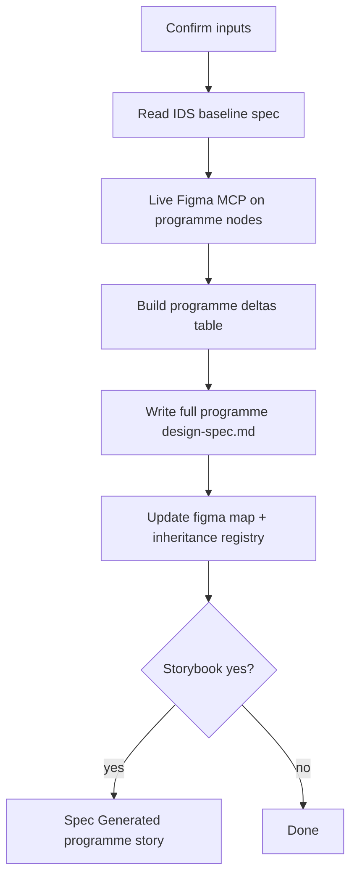

# Programme inheritance design-spec process

Use when a **programme layer** reuses an **IDS** component family in Figma but designers changed tokens, spacing, radius, borders, or slots.

**Output:** a **full** `components/<programme>/<slug>/design-spec.md` with a **baseline pointer + programme deltas table** — not a deltas-only file.

Works in **Cursor** (invoke skill or paste prompt), **Windsurf**, and **Devin** (one-shot after inputs).

**Not for programme-native components** (no IDS counterpart) — use the [intake wizard](design-spec-intake.md) with **`Inherits IDS: no`** → `specPattern: standalone`.

---

## When to use this (not the plain intake wizard)

| Situation | Use |
|-----------|-----|
| New IDS-only component, no programme fork | [design-spec-intake.md](design-spec-intake.md) |
| **Any programme** component inherits IDS anatomy + API | **This process** |
| Programme-native UI (no IDS counterpart) | Plain intake wizard → **standalone** spec |

---

## Programmes (config-driven)

A **programme** is any design system yaml in `config/design_systems/` that layers on IDS (`baseline_components_dir` → `components/ids`, distinct `components_dir`). **IDS itself** is not a programme — use [design-spec-intake.md](design-spec-intake.md).

Load paths via `config/design_system_config.py` → `load_design_system("<slug>")` or read `data/programme-inheritance-registry.json` → `programmes`.

**Registered today** (examples — not an exhaustive allowlist):

| Slug | Spec folder | Figma map | Theme CSS | Storybook group |
|------|-------------|-----------|-----------|-----------------|
| `synapse` | `components/synapse` | `data/synapse-component-figma-map.json` | `components/synapse-theme.css` | `Spec Generated/Synapse/...` |
| `dap` | `components/DAP` | `data/component-figma-map.json` | `components/dap-theme.css` | `Spec Generated/DAP/...` |

New programme: add `config/design_systems/<slug>.yaml`, register in `programme-inheritance-registry.json`, then run this process.

---

## Figma URL intake (your usual pattern)

Provide programme Figma links in **three buckets**. The agent live-verifies **every** URL in all three buckets (MCP: `get_metadata`, `get_design_context`, `get_variable_defs`).

| Bucket | What it is | Required? | Examples |
|--------|------------|-----------|----------|
| **Main component** | Component set, composed instance, or documentation frame | **At least one** | `ModalDialog-Main`, expanded/collapsed rail |
| **Elements** | Sub-component sets, slots, inline actions | Recommended | `.Modal-Element-Content`, primary row set, footer button |
| **States** | Variant rows, state matrices, type axes | Recommended | `Type=Destructive`, hover/selected primary icon |

**Multiple URLs per bucket:** paste several links in one message, or add one at a time until you reply **`done`** for that bucket.

**Parse rule:** `node-id=43461-175960` → `43461:175960` for MCP and the spec.

**Map file:** the first **main** URL’s node becomes `nodeId` / `mainComponentSetNodeId` in the programme figma map; element/state nodes are stored as supplemental `*NodeId` fields.

---

## Base prompt (copy into a new agent chat)

### Wizard mode (agent asks what’s missing)

```text
Run the programme inheritance design-spec process.

Follow docs/design-spec-programme-inheritance.md and docs/design-spec-authoring-contract.md.
Load the design-spec-programme-inheritance skill.

Ask me ONE question per message until you have:
  programme, component name, IDS baseline (if known),
  Main component URL(s), Element URL(s), State URL(s),
  Storybook yes/no.

For Elements and States: repeat “paste another URL or reply done” until I say done for each bucket.
Show a summary (all parsed node IDs by bucket) and wait for my yes before Figma calls or file writes.
```

### Cursor shortcut

```text
@design-spec-programme-inheritance Generate a programme inheritance design-spec. Ask one question at a time, confirm before run.
```

### Expert one-shot — paste all URLs in three blocks (recommended for you)

```text
Run programme inheritance design-spec RUN phase (confirm summary first).

Programme: Synapse
Component display name: Modal Dialog
IDS baseline: Modal — components/ids/modal/design-spec.md
Storybook: no

Main component URL(s):
- https://www.figma.com/design/Td1bnsvRj1PCGs9RVJkIvJ/Synapse-Hi-Fi-components?node-id=43461-175960&m=dev

Element URL(s):
- https://www.figma.com/design/Td1bnsvRj1PCGs9RVJkIvJ/Synapse-Hi-Fi-components?node-id=11348-62999&m=dev
- done

State URL(s):
- https://www.figma.com/design/Td1bnsvRj1PCGs9RVJkIvJ/Synapse-Hi-Fi-components?node-id=43461-175961&m=dev
- https://www.figma.com/design/Td1bnsvRj1PCGs9RVJkIvJ/Synapse-Hi-Fi-components?node-id=43461-176040&m=dev
- done

Rules: full spec with IDS baseline + programme deltas table; live Figma MCP on every URL above; Status draft.
```

### Left Nav example (three buckets)

```text
Programme: Synapse
Component: Left Nav
IDS baseline: Main Menu/Left — components/ids/main-menu-left/design-spec.md

Main component URL(s):
- …?node-id=47807-8153  (MainMenu-Left-Main set)
- …?node-id=47807-8154  (State=Expanded instance, optional)

Element URL(s):
- …?node-id=47807-8058   (primary row set)
- …?node-id=47807-8043   (primary icon collapsed)
- …?node-id=47807-8028   (secondary row)
- …?node-id=50516-35461  (New Chat / Left Nav Button)
- done

State URL(s):
- …?node-id=47807-8054   (collapsed hover)
- …?node-id=47807-8050   (collapsed selected)
- done
```

---

## Interview order (wizard)

| # | Question |
|---|----------|
| 1 | Programme slug (any yaml in `config/design_systems/` except `ids`) |
| 2 | Component display name |
| 3 | IDS baseline component (or `unknown`) |
| 4 | **Main component URL(s)** — one or many; reply `done` when finished |
| 5 | **Element URL(s)** — repeat until `done` |
| 6 | **State URL(s)** — repeat until `done` |
| 7 | Storybook: **yes** / **no** |
| 8 | **Summary** — all node IDs by bucket; reply **`yes`** to run |

If you already paste all three URL blocks in message 1, skip to summary (step 8).

If you omit the IDS baseline, the agent looks up `data/component-figma-map.json` and programme alias files.

---

## What the agent will do (after you reply `yes`)



1. **Classify pattern** — `ids-fork` (same Figma family) vs `standalone`
2. **Read IDS spec** — anatomy, API, states, codegen contract
3. **Live Figma MCP** on **every programme URL** (main → elements → states):
   - **Main:** structure, variant axes, default dimensions
   - **Elements:** per-slot padding, typography, token bindings
   - **States:** state matrix rows; `get_variable_defs` per variant
4. **Delta table** — compare MCP results to IDS spec (layout, chrome, tokens, states, anatomy, API)
5. **Write spec** — all 10 `##` sections; scaffold from `PROGRAMME_IDS_FORK_TEMPLATE` (substitute programme display name, paths, theme CSS from yaml)
6. **Update map** — `designSpecPath`, `specPattern`, `idsBaselineSpecPath`, node IDs
7. **Register** — `data/programme-inheritance-registry.json`
8. **Storybook** (optional) — `Spec Accurate Design` under `Spec Generated/<Programme>/...`

---

## Spec shape (every programme)

```markdown
## <Baseline> baseline (layout, flow, contracts)
… inherits IDS unless programme deltas …

## Metadata
- Spec pattern: ids-fork
- Design System: {display_name from programme yaml}
- IDS baseline slug: …

### {Display name} programme deltas (vs IDS)
| Topic | IDS | {Programme} |
…

## Anatomy … ## Source Mapping
(both IDS parity ref + programme Figma evidence)
```

**Rules**

- Never blind-copy IDS dimensions into the programme spec without programme Figma proof.
- Scenarios **not** in the programme Figma node you verified → inherit IDS section by reference.
- Token **names** in spec; resolved values in programme theme CSS.

---

## Programme config notes (examples)

### synapse

- Walkthrough + verified deltas: [design-spec-synapse-ids-fork.md](design-spec-synapse-ids-fork.md)
- Aliases: `data/synapse-component-aliases.json` (`alias_path` in yaml)

### dap

- Same inheritance rules; deltas may be fewer (`sparse-deltas` / registry `dap-style`).
- Often shares IDS Figma file with DAP theme overlay — still verify live programme nodes when a separate frame exists.

---

## After the spec exists

| Goal | Action |
|------|--------|
| Review deltas | Open `### … programme deltas (vs IDS)` table |
| Mark production-ready | Pass validation checklist → `Status: active` |
| Implementation | Ask explicitly: “implement {programme} {component} with programme flag” |
| Storybook | Ask: “add Spec Generated/{Programme}/{Component} story” |
| Drift check | Re-run Figma MCP after library token changes |

---

## Related artifacts

| Artifact | Path |
|----------|------|
| **This process** | `docs/design-spec-programme-inheritance.md` |
| Agent skill (any programme) | `.cursor/skills/design-spec-programme-inheritance/SKILL.md` |
| Synapse walkthrough (examples) | `docs/design-spec-synapse-ids-fork.md` |
| Authoring contract | `docs/design-spec-authoring-contract.md` |
| Plain new-spec wizard | `docs/design-spec-intake.md` |
| Registry | `data/programme-inheritance-registry.json` |
